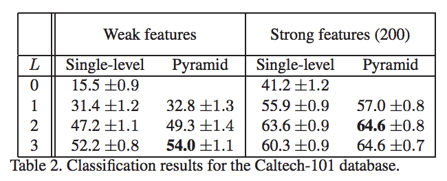

## <BOVW 실험 1차 결과>
#### glee1228@naver.com

- [Beyond Bags of Features: Spatial Pyramid Matching for Recognizing Natural Scene Categories](http://mplab.ucsd.edu/~marni/Igert/Lazebnik_06.pdf), CVPR2006

### 논문의 실험 결과 

---

### 구현한 코드 실험 결과(Best)

Weak Features, M = 2500, Single, Level 0 (1x1),Linear SVM(C=100.0)
### 31%
Strong Feature, M = 600, Single, Level 0 (1x1),Linear SVM(C=200.0 and 250.0)

### 40%

---

### 여기서 부터 BoVW 실험 결과입니다.

Dataset : Caltech101
Train/Test split: 4294/478
SIFT Descriptor : Sparse(weak)
K : 200
Classifier : Rbf SVM

### accuracy : 27%
>SVM Parameter :
>0.041 (+/-0.019) for {'C': 1.0, 'gamma': 1.0}
>0.130 (+/-0.006) for {'C': 1.0, 'gamma': 10.0}
>0.231 (+/-0.014) for {'C': 1.0, 'gamma': 100.0}
>0.075 (+/-0.012) for {'C': 1.0, 'gamma': 1000.0}
>0.134 (+/-0.005) for {'C': 10.0, 'gamma': 1.0}
>0.258 (+/-0.017) for {'C': 10.0, 'gamma': 10.0}
>0.258 (+/-0.017) for {'C': 10.0, 'gamma': 100.0}
>0.088 (+/-0.016) for {'C': 10.0, 'gamma': 1000.0}
>0.252 (+/-0.018) for {'C': 100.0, 'gamma': 1.0}
>0.253 (+/-0.017) for {'C': 100.0, 'gamma': 10.0}
>0.258 (+/-0.017) for {'C': 100.0, 'gamma': 100.0}
>0.088 (+/-0.016) for {'C': 100.0, 'gamma': 1000.0}
>0.248 (+/-0.018) for {'C': 1000.0, 'gamma': 1.0}
>0.253 (+/-0.018) for {'C': 1000.0, 'gamma': 10.0}
>0.259 (+/-0.018) for {'C': 1000.0, 'gamma': 100.0}
>0.088 (+/-0.016) for {'C': 1000.0, 'gamma': 1000.0}

---

Dataset : Caltech101
Train/Test split: 4294/478
SIFT Descriptor : Sparse(weak)
K : 230
Classifier : Rbf SVM

### accuracy : 28%
>SVM Parameter :
>0.121 (+/-0.008) for {'C': 1.0, 'gamma': 10.0}
>0.232 (+/-0.011) for {'C': 1.0, 'gamma': 100.0}
>0.257 (+/-0.016) for {'C': 10.0, 'gamma': 10.0}
>0.261 (+/-0.026) for {'C': 10.0, 'gamma': 100.0}
>0.253 (+/-0.012) for {'C': 100.0, 'gamma': 10.0}
>0.261 (+/-0.023) for {'C': 100.0, 'gamma': 100.0}
>0.254 (+/-0.013) for {'C': 1000.0, 'gamma': 10.0}
>0.260 (+/-0.022) for {'C': 1000.0, 'gamma': 100.0}

---

Dataset : Caltech101
Train/Test split: 3030/303
SIFT Descriptor : Sparse(weak)
K : 600
### accuracy : 27%
Classifier : Linear SVM
>SVM Parameter : 
>0.058 (+/-0.033) for {'C': 0.01}
>0.138 (+/-0.007) for {'C': 0.1}
>0.198 (+/-0.016) for {'C': 1.0}
>0.268 (+/-0.012) for {'C': 10.0}
>0.274 (+/-0.004) for {'C': 100.0}
>0.228 (+/-0.023) for {'C': 1000.0}

---

Dataset : Caltech101
Train/Test split: 3200/356
SIFT Descriptor : Sparse(weak)
K : 100
Classifier : Linear SVM

### accuracy : 18%
> 0.087 (+/-0.020) for {'C': 0.01}
> 0.123 (+/-0.021) for {'C': 0.1}
> 0.188 (+/-0.027) for {'C': 1.0}
> 0.230 (+/-0.028) for {'C': 10.0}
> 0.227 (+/-0.024) for {'C': 100.0}
> 0.138 (+/-0.037) for {'C': 1000.0}

---

Dataset : Caltech101
Train/Test split: 3200/356
SIFT Descriptor : Sparse(weak)
K : 1000
Classifier : Linear SVM
### accuracy : 29%
>SVM Parameter : 
>0.053 (+/-0.027) for {'C': 0.01}
>0.143 (+/-0.025) for {'C': 0.1}
>0.204 (+/-0.024) for {'C': 1.0}
>0.273 (+/-0.022) for {'C': 10.0}
>0.294 (+/-0.036) for {'C': 100.0}
>0.257 (+/-0.064) for {'C': 1000.0}

---

Dataset : Caltech101
Train/Test split: 3200/356
SIFT Descriptor : Sparse(weak)
K : 1200
Classifier : Linear SVM
### accuracy : 28%
> SVM Parameter : 
> 0.055 (+/-0.035) for {'C': 0.01}
> 0.147 (+/-0.021) for {'C': 0.1}
> 0.212 (+/-0.025) for {'C': 1.0}
> 0.289 (+/-0.024) for {'C': 10.0}
> 0.304 (+/-0.023) for {'C': 100.0}
> 0.259 (+/-0.040) for {'C': 1000.0}

---

Dataset : Caltech101
Train/Test split: 3200/356
SIFT Descriptor : Sparse(weak)
K : 1500
Classifier : Linear SVM
### accuracy : 29%
> SVM Parameter : 
> 0.052 (+/-0.039) for {'C': 0.01}
> 0.143 (+/-0.023) for {'C': 0.1}
> 0.212 (+/-0.024) for {'C': 1.0}
> 0.286 (+/-0.024) for {'C': 10.0}
> 0.302 (+/-0.021) for {'C': 100.0}
> 0.258 (+/-0.031) for {'C': 1000.0}

---

Dataset : Caltech101
Train/Test split: 3200/356
SIFT Descriptor : Sparse(weak)
K : 2000
Classifier : Linear SVM
### accuracy : 30%
> SVM Parameter : 
> 0.052 (+/-0.034) for {'C': 0.01}
> 0.144 (+/-0.011) for {'C': 0.1}
> 0.204 (+/-0.017) for {'C': 1.0}
> 0.278 (+/-0.024) for {'C': 10.0}
> 0.314 (+/-0.025) for {'C': 100.0}
> 0.274 (+/-0.038) for {'C': 1000.0}

---

Dataset : Caltech101
Train/Test split: 3200/356
SIFT Descriptor : Sparse(weak)
K : 2500
Classifier : Linear SVM

### accuracy : 31%
> SVM Parameter : 
> 0.288 (+/-0.027) for {'C': 10.0}
> 0.313 (+/-0.016) for {'C': 30.0}
> 0.315 (+/-0.018) for {'C': 50.0}
> 0.318 (+/-0.013) for {'C': 70.0}
> 0.321 (+/-0.020) for {'C': 100.0}
> 0.318 (+/-0.015) for {'C': 150.0}
> 0.318 (+/-0.023) for {'C': 200.0}
> 0.313 (+/-0.018) for {'C': 250.0}
> 0.311 (+/-0.014) for {'C': 300.0}

---

Dataset : Caltech101
Train/Test split: 3200/356
SIFT Descriptor : Sparse(weak)
K : 3000
Classifier : Linear SVM
### accuracy : 29%
> SVM Parameter : 
> 0.044 (+/-0.034) for {'C': 0.01}
> 0.132 (+/-0.018) for {'C': 0.1}
> 0.205 (+/-0.021) for {'C': 1.0}
> 0.277 (+/-0.019) for {'C': 10.0}
> 0.310 (+/-0.010) for {'C': 100.0}
> 0.252 (+/-0.081) for {'C': 1000.0}

---

Dataset : Caltech101
Train/Test split: 3200/356
SIFT Descriptor : Dense(Strong)
K : 600
Classifier : Linear SVM

### accuracy : 40%
> SVM Parameter : 
> 0.400 (+/-0.025) for {'C': 100.0}
> 0.403 (+/-0.014) for {'C': 150.0}
> 0.404 (+/-0.010) for {'C': 200.0}
> 0.404 (+/-0.007) for {'C': 250.0}
> 0.396 (+/-0.022) for {'C': 300.0}

---

Dataset : Caltech101
Train/Test split: 3200/356
SIFT Descriptor : Dense(Strong)
K : 700
Classifier : Linear SVM

### accuracy : 40%
>SVM Parameter : 
>0.399 (+/-0.024) for {'C': 100.0}
>0.407 (+/-0.026) for {'C': 150.0}
>0.405 (+/-0.031) for {'C': 200.0}
>0.411 (+/-0.038) for {'C': 250.0}
>0.405 (+/-0.029) for {'C': 300.0}

---

Dataset : Caltech101
Train/Test split: 3200/356
SIFT Descriptor : Dense(Strong)
K : 800
Classifier : Linear SVM

### accuracy : 40%
>SVM Parameter : 
>0.082 (+/-0.022) for {'C': 0.01}
>0.140 (+/-0.007) for {'C': 0.1}
>0.202 (+/-0.020) for {'C': 1.0}
>0.318 (+/-0.020) for {'C': 10.0}
>0.389 (+/-0.012) for {'C': 100.0}
>0.394 (+/-0.013) for {'C': 100.0}
>0.397 (+/-0.014) for {'C': 150.0}
>0.395 (+/-0.010) for {'C': 200.0}
>0.406 (+/-0.021) for {'C': 250.0}
>0.392 (+/-0.027) for {'C': 300.0}
>0.358 (+/-0.050) for {'C': 1000.0}

---

Dataset : Caltech101
Train/Test split: 3200/356
SIFT Descriptor : Dense(Strong)
K : 200
Classifier : Linear SVM

### accuracy : 38%

> SVM Parameter : 
>
> 0.217 (+/-0.012) for {'C': 1.0}
> 0.320 (+/-0.022) for {'C': 10.0}
> 0.354 (+/-0.015) for {'C': 50.0}
> 0.364 (+/-0.015) for {'C': 70.0}
>
> 0.366 (+/-0.014) for {'C': 100.0}
> 0.366 (+/-0.024) for {'C': 150.0}
> 0.361 (+/-0.017) for {'C': 200.0}
> 0.358 (+/-0.026) for {'C': 250.0}
> 0.354 (+/-0.021) for {'C': 300.0}
> 0.319 (+/-0.038) for {'C': 500.0}

---

Dataset : Caltech101
Train/Test split: 3200/356
SIFT Descriptor : Sparse(Weak)
K : 200
Classifier : Linear SVM

### accuracy : 26%

> SVM Parameter : 
>
> 0.199 (+/-0.016) for {'C': 1.0}
> 0.258 (+/-0.028) for {'C': 10.0}
> 0.251 (+/-0.025) for {'C': 50.0}
> 0.249 (+/-0.019) for {'C': 70.0}
> 0.241 (+/-0.015) for {'C': 100.0}
> 0.232 (+/-0.021) for {'C': 150.0}
> 0.225 (+/-0.025) for {'C': 200.0}
> 0.222 (+/-0.020) for {'C': 250.0}
> 0.215 (+/-0.014) for {'C': 300.0}
> 0.191 (+/-0.013) for {'C': 500.0}