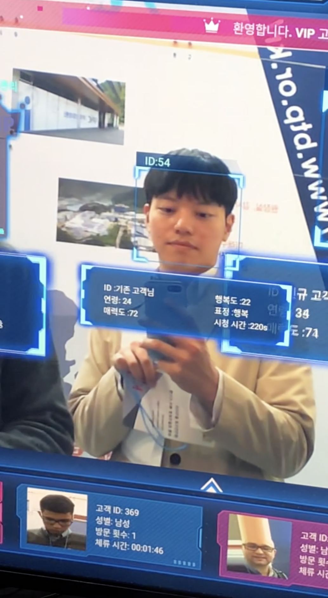
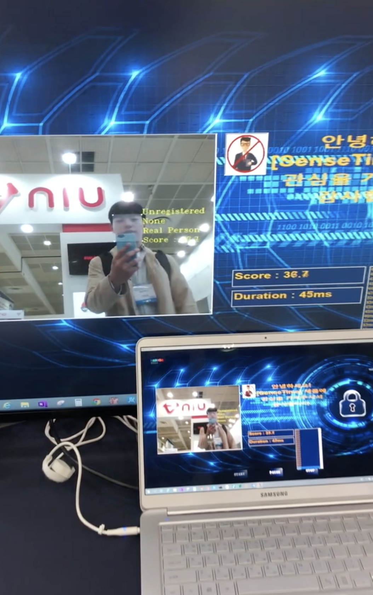

## KES(Korea Electronic Show) 2019 참관기

·       작성자 : glee1228@naver.com

·       2019.10.08 ~ 2019.10.11

·       강남 코엑스 A,B홀

 

## 목차

1. Vision Deep learning기반 얼굴 인식 솔루션

2. 인터뷰 질의응답

3. 얼굴 인식 솔루션 소감

4. 그 외 창의적인 전시

 

 

## 1. Vison Deep learning 기반 얼굴 인식 솔루션

전시 기관 :한글 MDS(한국)

얼굴 인식 솔루션 기술 제공 기관 : sensetime(중국)

SenseTime사의 AI Vision 솔루션

·       얼굴 인증 SenseID : 인증 서비스/ SenseKeeper : 얼굴 인증 단말기

·       운전자 모니터링 시스템 SenseDrive : 운전자 모니터링 시스템, 차선 이탈 경고 시스템, 전방 충돌 경고 및 보행자 감지 경고

·       지능형 통합 관제 SensePortrait-S : 정적 얼굴 인식 서버/ SensePortrait-D : 동적 얼굴 인식 서버/ SenseFace : 얼굴 인식 감시 플랫폼 / SenseTotem : 얼굴 인식 범죄자 수사 시스템 / SenseVideo-A : 얼굴 분석 서버 / SenseClass : 학습 지원 플랫폼 / SenseRemote : 원거리 감지 지능형 솔루션

·       모바일 엔터테인먼트 SenseME : 모바일 엔터테인먼트 / SensePhoto : 모바일 이미지 프로세싱 솔루션

·       스마트 매장 운영 시스템 SenseU : 엔터테인먼트 시스템/ SenseInsight : 지능형 광고 솔루션/ SenseGo : 지능형 비즈니스 솔루션/ SenseParadise : 대규모 테마파크 통합 솔루션

 

 

 

 

 

 

 

 

## 2. 인터뷰 질의응답

**답변자 : 한글MDS 소속 직원(성함과 직책은 여쭤보지 못했습니다.)**

Q1. 이 얼굴 인식 솔루션은 딥러닝을 사용한 기술인가요?  

A1. 딥러닝을 사용해서 얼굴의 특징점 260개를 찾습니다.

Q2. 인증 시스템에서는 등록되지 않은 사람을 잘 찾는게 중요하다고 들었습니다. 등록되지 않은 사람도 정확하게 찾아낼 수 있나요?

A2. 보시는 바와 같이 score로 결과를 보여주고 점수가 낮을 경우 인증이 되지 않습니다. 

Q3 . 제가 경험한 인증 시스템 중 가장 얼굴 인식 기술 성능이 뛰어난 것 같은데 자체적으로 개발하신 딥러닝 엔진을 사용하신건가요? 

A3. 이 기술은 중국의 sensetime이 제공한 엔진입니다. 현재 중국은 얼굴 데이터가 매우 방대하고 이러한 개인 데이터를 사용할 수 있도록 국가가 매우 협조적이기 때문에 이처럼 좋은 얼굴 인식 기술을 갖고 있습니다. 그리고 이렇게 좋은 성능에도 불구하고 최적화가 무척 잘 되어있어 보시는 것과 같이 초당 40프레임 이상의 가까운 결과를 보여줍니다. 옆의 화면에서 얼굴 특징점을 찾아내는 엔진은 핸드폰에서 초당 70프레임을 뽑아낼 수 있습니다. 그리고 사진과 같이 가짜 인증도 분별해내는 기능을 갖고 있습니다.

 

 

 

 

 

## 3. **얼굴 인식 솔루션 소감**

최대 20만 명의 ID를 등록할 수 있다고 하고, 해당 솔루션 성능을 본 결과 유사도는 등록되지 않은 사람들은 일관성이 있게 30점대의 스코어가 나왔고, 등록된 이는 90점대의 스코어가 나왔다. 등록되지 않은 지나가는 10명 정도의 인원이 테스트해보았는데, 등록된 20명의 DB를 바탕으로 테스트한 결과, 연속적으로 모두가 30점대 초반의 스코어가 나왔다. 이 결과는 인증 시스템이 안정적으로 비등록 얼굴과 등록 얼굴을 구분할 수 있다는 뜻이다. 또한, 이 솔루션은 종이나 카메라 사진으로 인증하는 fake를 구분해 내는 기능이 있었다. 어떤 알고리즘인지 정확히 알수는 없지만 해당 엔진을 제작한 회사인 sensetime의 기술이 참 대단하다는 생각을 했다. 

그리고 전시된 3가지의 엔진들은 딥러닝 네트워크를 통해 추출한 랜드마크 기반의 기술인 것 같았다. 그 이유는 랜드마크가 인증을 위한 데이터가 될 수 있고 고유한 얼굴이미지의 fingerprint가 될 수 있기 때문에 그렇게 생각헀다.

3개의 엔진 중 하나는 차량 내의 운전자를 위한 솔루션이었는데, 랜드마크 좌표가 총 260개가 추출이 되고 일부분이 화면상에 표시가 되었다. 현재 Snow 앱에 사용된 엔진과 동일한 엔진이라고 하던데 랜드마크가 매우 정확하게 추출되는 것을 보고 snow의 자연스러운 이미지 overlay가 어떻게 가능했는지 실감이 났다. 

아래 이미지는 휴대폰 단말기에 해당 엔진을 올린 화면이다. 1280x720 사이즈의 화면에서 해당 결과를 73frame/sec로 출력해낼 수 있다니... 최적화가 어느정도까지 이루어졌는지 가늠이 되지 않는 부분이다.

아래 이미지는 위와 다른 엔진인데, ID, 연령, 매력도, 행복도, 표정, 시청 시간을 검출해내는 엔진이다. 테스트해본 결과 ID는 이전에 방문했었던 사람일 경우 비교적 정확하게 기록이 되었고, 행복도는 아마 입과 눈을 기반으로 출력된 결과인것 같다. 웃으니 행복도가 올라가면서 표정이 행복으로 바뀌었는데 그렇게 정확하지는 않았다. 개인적으로 성능에 있어서는 놀랍지 않았지만 꽤 재미있는 엔진이었다고 평가하고 싶다.

마지막 이 엔진이 개인적으로 가장 흥미롭고 놀라웠는데.. 그 이유는 비등록 인물과 등록 인물을 정확하게 검출한다는 것이고, GPU를 사용하지 않은 노트북에서 저정도의 frame 결과가 출력된다는 것이다. 현재 36점대가 기록되어 있는데 이것은 등록 인물인지 여부를 판단하는 score이다. 이미지는 없지만 안내해주셨던 연구원은 저 엔진에 신분증 이미지 1장을 등록했고 그를 바탕으로 테스트한 결과 90점대의 score가 출력되었고, 화사의 풀메이크업 이미지를 등록시키고 다른 노메이크업의 화사 이미지를 핸드폰으로 가져다 댔더니 화사라는 결과가 높은 score와 함께 나오고 fake person으로 인간이 아니라는 것이 정확하게 출력되었다. 

알고리즘을 정확히 알수는 없지만.. 그저 대단하다는 말뿐이 나오지 않았다. 실제 얼굴인식 프로젝트를 진행해본 결과와 그 동안 관련 논문을 자세히는 아니지만 대략 봤고 실험해봤었던 결과로는 one-shot learning으로 해당 결과처럼 정확한 결과는 도출해내기 어려웠을 뿐만아니라, 비등록과 등록 얼굴은 해당 score만큼 정확하게 분류해내는게 쉽지는 않았다. 개인적으로 매우 흥미롭고 놀라웠던 엔진이었다.

## 4. 그 외 창의적인 전시

### 생각만으로 움직이는 보행 외골격 로봇 제어 시스템

KIST 바이오닉스 LAB

·       EEG-based BCI

·       Voluntary Motor Imagery

·       Wearable Robot

 

**BCI(Brain-Computer Interface)** 

인간의 두뇌와의 연결을 통해 컴퓨터를 제어하는 인터페이스 기술로, 생각만으로 외부 기기 제어가 가능한 핵심 미래 기술 중 하나이다. 뇌공학, 인지과학, 의공학, 전기/전자공학 등 제반 과학기술 분야에 관련이 있으므로, 분야를 아우르는 학제적 연구와 융합 기술 연구가 성공에 핵심적인 요소로 작용된다고한다. 

딥러닝을 이용한 BCI 기술의 실용화 및 범용화를 통한 고성능 의도 인식을 목표로 하고 있다고 하는데, 아이디어 자체가 창의적이고 현재 BCI 연구도 활발하게 이루어지고 있다고 하여 관심있게 전시를 보고 인터뷰를 진행하였다. 

**인터뷰 질의응답**

**답변자 : KIST 소속 박사과정 연구원(성함과 직책은 여쭤보지 못했습니다.)**

Q1. KES2019 Best Contest를 수상하셨습니다. 생각만으로 로봇을 제어한다는 아이디어가 신기합니다. 전시에 대한 간략한 소개 말씀 부탁드립니다.  

A1. 보행 보조 기구는 기존에 손으로 제어하는 방식이었습니다. 실제로 장애를 가지신 분들은 손을 사용해서 기구를 제어하는 것이 쉽지 않기 때문에 생각만으로 다리 보조 기구를 제어하는 프로젝트가 의의가 있다고 생각하였고 연구를 진행하였습니다. 구체적으로 말씀드리면, 의도를 가진 생각을 하게 되면 그에 따라 각기 다른 뇌의 전기적 신호를 이용해 이것을 바탕으로 기구를 제어하는 것입니다.

Q2. 이 연구도 딥러닝 기반의 연구인가요?

A2. 해당 연구에 딥러닝은 사용하지 않았습니다. 이 로봇 제어는 SVM 분류를 이용해 뇌신호를 3개의 행동으로 분류합니다. 이 연구가 아닌 다른 실내 로봇팔 제어 연구는 딥러닝을 사용해 연구를 진행하고 있는 것으로 알고 있습니다.

Q3 . 개인적으로 로봇 제어 연구에 관심이 있습니다. 혹시 저도 이런 연구를 하기 위해서 KIST에 들어가고 싶다면 어떤 방법으로 들어갈 수 있나요?

A3. 우선은 학연 과정을 통해 KIST에서 연구를 할 수 있습니다.UST+KIST 학연 과정과 고려대, 연세대, 한양대 등 연계 대학교+KIST의 학연 과정이 있습니다. 후자의 경우 대학교의 교수님께도 컨택 메일을 드려야 할 겁니다. 연구실 마다 분위기가 다르기 때문에 일적인 부분이나 연구적인 부분에 대해서는 자세히 말씀드리기 어려울 것 같네요. 연구를 희망하신다면 대학교 교수님과 KIST소속 연구실의 박사님께 컨택 메일을 드리는 것이 좋을 것 같네요.

 

**전시 및 인터뷰 소감** 

기존 보행 보조 기구는 손으로 제어하는 방식이 주로 있었지만, 실제로 다리가 불편하신 분들은 손으로 다리를 제어하는 것도 쉽지 않아 한다고 한다. 그래서 움직이고자 하는 생각을 할 때 발생하는 뇌파를 통해 외골격 로봇 제어하는 시스템을 만들었다고 설명해주었고, 이 시스템에 사용되는 하드웨어 제품들은 상용화 되고 있는 시중의 제품을 사용하였다고 한다. 

뇌파 수신기, 프로그램, 외골격 로봇이 위의 시중 제품이다. 자세한 알고리즘은 뇌파로 수신한 데이터를 SVM Classifier로 3개의 클래스로 분류하여 로봇을 제어한다고 연구원분께서 말씀해주셨는데 아이디어 자체는 워낙 특이해서 놀라웠지만 알고리즘이 조악하고 실제 영상에서도 썩 좋은 결과를 보여준 것은 아니라서 이 엔진의 성능은 상용화되기는 아직 멀었다고 생각했다. 현재 KIST 뇌공학과 바이오닉스 연구실와 KIST 로봇공학 연구실이 함께 협업하고 연구하고 있는 연구 프로젝트라고 하는데, 약간 실망스러웠지만 석사에 관련한 새로운 대학원 진학 정보를 알게 되어서 좋았고, KIST와 고려대 카이스트 UNIST가 각각 어떤 연구 프로젝트를 수행하고 있는지 알 수 있어 도움이 되었던 것 같다.

 