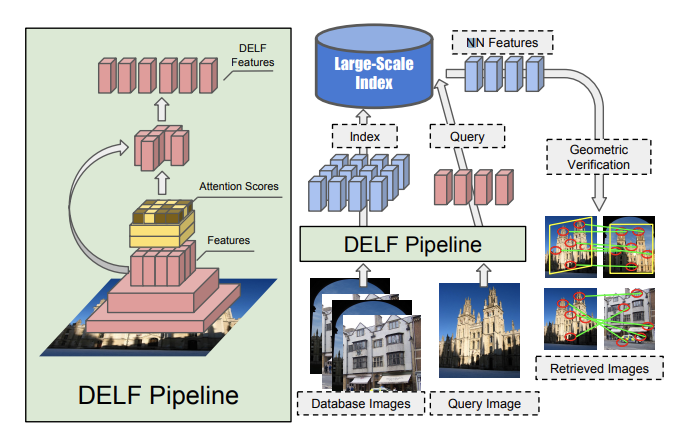

## Large-Scale Image Retrieval with Attentive Deep Local Features 논문 정리

출처 : https://arxiv.org/pdf/1612.06321.pdf

glee1228@naver.com

* DELF로 잘 알려진 논문이고 **포항공대 한보형 교수** 팀과 **구글**이 공동 연구 결과.
* v1는 2016년 12월 공개, 구글 랜드마크 데이터셋 공개와 함께 2018년 2월에 v4

### Abstract

* **DELF**(**DE**ep **L**ocal **F**uture) 깊은 지역 특징이라는 이름의 대규모 이미지 검색에 적합한 local descriptor를 제안
* 유용한 local feature를 식별하기 위해 descriptor와 keypoint 선택에 대한 Attention 매커니즘을 제안
* Google Landmark 데이터셋 공개 
  * Background clutter, partial occlusion, multiple landmarks, variable scales를 가진 쿼리와 DB
* global과 local descriptor의 sota를 outperform함.

### 1. Introduction

* 데이터셋이 중소형일지라도, 다양한 이유로 대규모 데이터셋 with clutter, occlusion, and variations in viewpoint and illumination 에서 성능을 발휘하지 못함
* Global Descriptor들은 이미지 부분 패치에 대한 정보를 가지지 못함
* 최근 CNN을 사용하면서 이미지 패치를 매칭하기 위한 local feature를 제안하는 트렌드가 있지만, 의미있는 특징을 찾는 능력이 부족하고 정확도도 제한되어 있어 이미지 검색에 최적화되어 있다고 보기는 어려움.
  * 대부분 중소규모의 데이터를 사용한 테스트만 하기 때문에 제대로 하려면 대규모 데이터셋을 사용해야함.
* 그래서 포괄적이고 까다로운 예제로 구성된 대규모 데이터셋을 활용해 통계적으로 의미있는 결과를 도출하고자 함.
* 주요 목표는 CNN기반의 feature Descriptor
* Attention을 사용한 CNN 기반 local feature인데, 패치 레벨의 주석없이 이미지 수준의 클래스 레이블만 활용한 weakly supervised learning을 제안
* Attention model은 동일한 CNN 아키텍쳐를 재사용하고 추가계산을 거의 하지 않고 Attention Score를 만든다. 이 Score를 패스시켜 local descriptor와 keypoint를 모두 추출할 수 있고, 이 DELP Pipeline은 Global Descriptor+Local Descriptor를 하는 기존의 방법에 비해서 상당히 좋은 성능을 보여줌

### 2. Related Work

* 기존 데이터 : Oxford5k , Paris6k, Flickr100k, INRIA Holiday 데이터셋
* 검색 시스템 : 
  * 예전에는 KD-Tree 또는 vocabulary tree를 사용한 ANN(Approximate nearest neighbor) 검색 방법
  * 오늘날에는 높은 정밀도로 작동해야 할때는 사용하긴 함.
* Local Feature Aggregation 기법 :
  * VLAD
  * Fisher Vector(FV)
* Global Descriptor : 
  * Pretrained된 CNN 또는 훈련된 네트워크([Deep Image
    Retrieval](https://arxiv.org/pdf/1604.01325.pdf), [NetVLAD](https://arxiv.org/pdf/1511.07247.pdf), [CNN Image Retrieval Learns from BoW](https://arxiv.org/pdf/1604.02426.pdf))
  * 위의 Global Descriptor들은 일반적으로 triplet loss로 훈련
  * CNN기반 Global Descriptor를 사용하는 일부 알고리즘은 VLAD 또는 FV와 같은 기존 Aggregation 기법에서 Hand-craft featrue를 deep local feature로 대체함

### 3. Google-Landmarks Dataset

* 기존 데이터셋(Holidays(1491), Oxford5k(5062), Flickr60k(67714), Flickr1M(1M) )보다 더 큰 대규모 데이터셋
* 12,894 랜드마크로 이루어진 이미지 1,060,709장과  111,036의 추가적인 Query 이미지
* 전 세계에서 촬영된 이미지, GPS 좌표와 연결되어 있음

* 기존 데이터셋 이미지는 랜드마크가 중심에 위치해있어서 global descriptor가 잘 작동함
* Foreground/background clutter, occulusion, 부분적으로 볼 수 없는 오브젝트등을 포함
* Visual feature와 GPS 좌표를 사용하여 클러스터를 구성
  * 검색된 이미지와 연관성 있는 cluster 중심점과 query 이미지의 location이 일정 threshold 이하 이면, 두 이미지는 동일한 랜드마크로 간주
* Ground-truth annotation은 매우 까다로운 이유
  1. 랜드마크가 잘 안보임
  2. GPS 에러가 있음
  3. 랜드마크 주변 거리가 너무 긴 경우(Eiffel Tower, Golden Gate Bridge 처럼)
* 그렇지만 Google-Landarks Datasets은 이런 거리의 threshold를 25km로 두어 잘못된 주석을 매우 작게 줄였음. 약간의 에러가 있을지라도 문제가 되지는 않음

### 4. Image Retrieval with DELF

* 본 논문의 대규모 검색 시스템은 4개의 블락으로 나눌 수 있음
  1. **Dense Localized Feature Extraction**(밀집되어있는 local feature 추출)
  2. **Keypoint Selection**(키포인트 선택)
  3. **Dimensionality reduction**(차원 축소)
  4. **Indexing and Retrieval**(인덱싱 및 검색)
* 이 4번째 섹션에서는 **DELF Feature** 추출 및 **학습 알고리즘**과 **인덱싱** 및 **검색** 절차에 대해 설명한다.

### 4.1. Dense Localized Feature Extraction

* 분류로 학습된 CNN의 특징 추출 레이어로 구성된 Fully Convolutional Network(FCN)을 이용해서 밀집된 특징을 추출한다.(**Backbone Network**)

* ResNet50을 사용(4 번째 conv레이어 아웃풋을 활용)
* Scale Invariant하기 위해 Image Pyramid를 만들어 각 level을 **독립**적으로 FCN에 적용함
  * 한 장의 이미지를 여러 가지 Scale로 변형하고 그 각각의 이미지를 각각의 FCN에 통과시킨 것 같음.
* **BaseLine Backbone**은 **ImageNet으로 학습된 ResNet50 모델**을 사용
* DELF Local Descriptor의 차별성이 부각되도록 하기 위해 **Fine-Tuning**을 시행
  * Fine Tuning 시, 랜드마크 데이터셋을 사용
  * Standard Cross-Entropy 손실 함수를 사용
    * 해당 내용에 대한 설명은 https://curt-park.github.io/2018-09-19/loss-cross-entropy 참고
  * 입력 이미지는 이미지 중심 정사각형 250x250 로 자른 후, 224x224 사이즈로 random Crop하여 사용
  * Object-Level이나, Patch-Level의 레이블은 필요하지 않음. 

### 4.2. Attention-based Keypoint Selection

* 이미지 검색에 조밀하게 추출된 Feature들을 곧바로 사용하지 않고, feature subset을 선택하는 기법을 사용
* 정확도와 계산 효율성을 위해 키포인트를 선택시킴

### 4.2.1 Learning with Weak Supervision

* Local feature Descriptor에 Attention 점수를 매기는 훈련방식을 제안
* Attention Network에 의해 예측된 가중치(Weight)들의 합에 의해 Local feature는 pooling된다
* 

