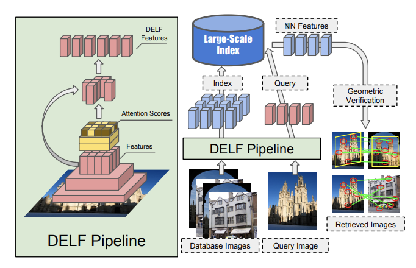
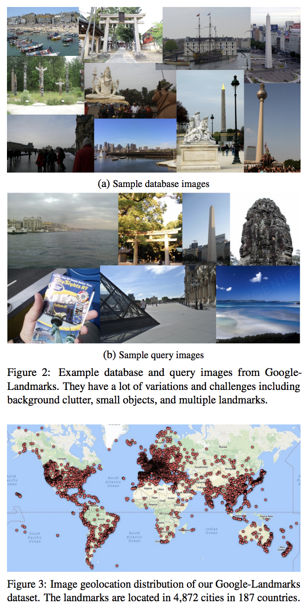
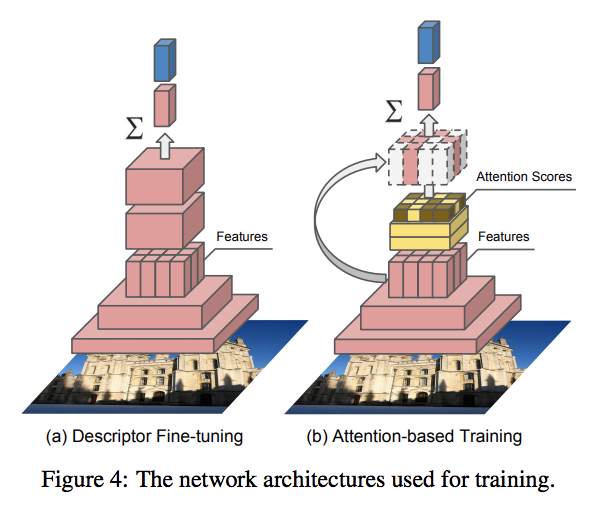
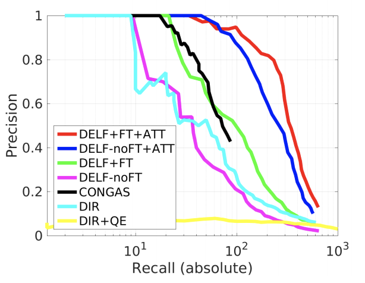
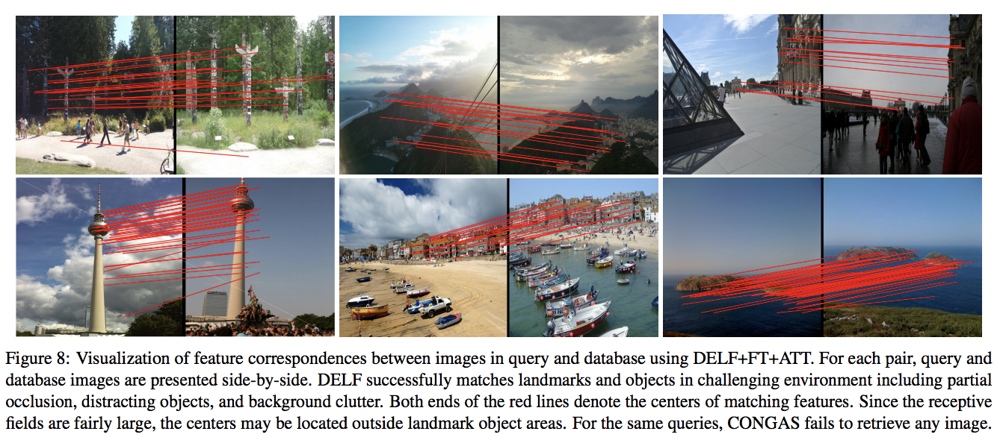
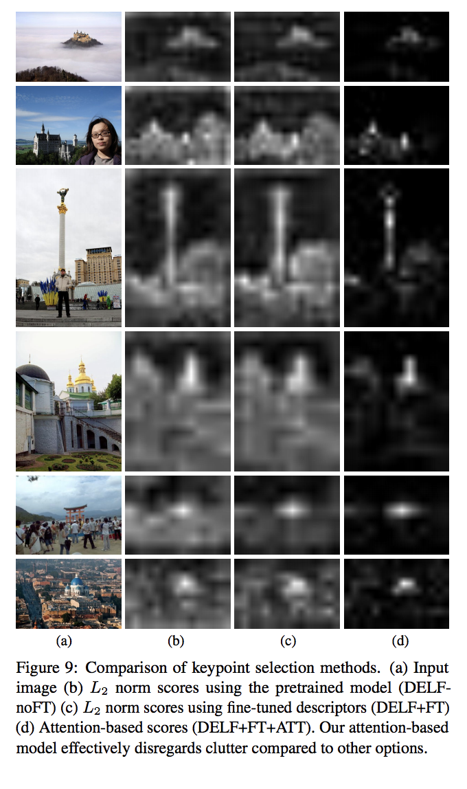

## Large-Scale Image Retrieval with Attentive Deep Local Features

Author : **POSTECH**(Hyeonwoo Now, Bohyung Han) X **Google**(Andre Araujo, Tobias Weyand, Jack Sim)

Link : https://arxiv.org/pdf/1612.06321.pdf

### Abstract 

DELF (DEep Local Feature)라고하는 대규모 이미지 검색에 적합한 세심한 로컬 기능 설명자를 제안합니다. 새로운 기능은 획기적인 신경망을 기반으로하며, 랜드 마크 이미지 데이터 세트에서 이미지 수준 주석으로 만 훈련됩니다. 이미지 검색에 의미 적으로 유용한 로컬 특징을 식별하기 위해 대부분의 네트워크 계층을 설명자와 공유하는 키포인트 선택에 대한 Attention메커니즘을 제안합니다. 이 프레임 워크는 이미지 검색에 다른 키포인트 검출기 및 설명자를 대체하는 대체품으로 사용되어보다 정확한 기능 일치 및 기하학적 검증이 가능합니다. Google 시스템은 신뢰할 수있는 신뢰도 점수를 생성하여 오 탐지를 거부합니다. 특히 데이터베이스에서 정확하게 일치하지 않는 쿼리에 대해 강력합니다. 제안 된 디스크립터를 평가하기 위해 Google-Landmarks 데이터 세트라고하는 새로운 대규모 데이터 세트를 소개합니다. 여기에는 백그라운드 클러 터, 부분 폐색, 다중 랜드 마크, 가변 스케일의 오브젝트 등과 같은 데이터베이스 및 쿼리 모두에 대한 문제가 포함됩니다. DELF가 대규모 설정에서 최첨단 글로벌 및 로컬 디스크립터보다 현저한 마진을 능가 함을 보여줍니다. 

코드 및 데이터 세트는 프로젝트 웹 페이지 (https://github.com/tensorflow/models/tree/master/research/delf)에서 찾을 수 있습니다. 

### 1. Introduction

​	대규모 이미지 검색은 객체 감지, 시각적 장소 인식 및 제품 인식과 같은 다양한 실제 응용 프로그램과 직접 관련되어 있기 때문에 컴퓨터 비전의 기본 작업입니다. 지난 수십 년간 손수 특징과 색인 알고리즘 [22, 33, 27, 16]에서보다 최근에는 글로벌 디스크립터 학습을위한 CNN (convolutional neural network) 기반의 방법에 이르기까지 이미지 검색 시스템이 엄청나게 발전했습니다 [2, 29, 11]. 

​	

그림 1 : DELF (Deep Local Features) 및 Attention 기반 키포인트 선택을 사용하여 이미지 검색 시스템의 전체 아키텍처. 왼쪽에는 DELF 추출 및 선택을위한 파이프 라인이 나와 있습니다. 노란색으로 강조 표시된 부분은 관련 기능에 높은 점수를 할당하고 가장 높은 점수를 가진 기능을 선택하도록 훈련 된 Attention 메커니즘을 나타냅니다. 모델을 사용하여 단일 순방향 패스로 피쳐 추출 및 선택을 수행 할 수 있습니다. 오른쪽에는 대규모 기능 기반 검색 파이프 라인이 나와 있습니다. 데이터베이스 이미지의 DELF는 오프라인으로 색인됩니다. 인덱스는 기하학적으로 확인 된 일치를 기반으로 데이터베이스 이미지의 순위를 지정하는 데 사용할 수있는 가장 가까운 이웃 (NN) 기능을 검색하여 쿼리를 지원합니다. 

​	대규모 이미지 검색은 객체 감지, 시각적 장소 인식 및 제품 인식과 같은 다양한 실제 응용 프로그램과 직접 관련되어 있기 때문에 컴퓨터 비전의 기본 작업입니다. 지난 수십 년간 손수 특징과 색인 알고리즘 [22, 33, 27, 16]에서보다 최근에는 글로벌 디스크립터 학습을위한 CNN (convolutional neural network) 기반의 방법에 이르기까지 이미지 검색 시스템이 엄청나게 발전했습니다 [2, 29, 11]. 중소형 데이터 세트에서 이미지 검색을위한 CNN 기반 글로벌 디스크립터의 최근 발전에도 불구하고 [27, 28], 클러 터, 오 클루 전과 같은 대규모 데이터 세트에서 관찰되는 다양한 까다로운 조건으로 인해 성능이 저하 될 수 있습니다. 및 시점 및 조명의 변화. 글로벌 디스크립터는 이미지간에 패치 레벨 일치를 찾을 수 없습니다. 결과적으로, 폐색 및 배경 혼잡이 존재하는 경우 부분 매칭에 기초하여 이미지를 검색하는 것은 어렵다. 최근의 추세에서 CNN 기반 로컬 기능은 패치 수준 일치를 위해 제안되었습니다 [12, 42, 40]. 그러나 이러한 기술은 의미 적으로 의미있는 기능을 감지 할 수있는 능력이 부족하고 실제로 정확도가 제한되어 있기 때문에 이미지 검색을 위해 특별히 최적화되지 않았습니다.

​	대부분의 기존 이미지 검색 알고리즘은 쿼리 이미지가 거의없는 중소형 데이터 세트에서 평가되었습니다 (예 : [27, 28]의 55 및 [16]의 500 만). 데이터 세트의 이미지는 랜드 마크 측면에서 다양성이 제한적입니다. 위치 및 유형. 따라서 이미지 arXiv : 1612.06321v4 [cs.CV] 2018 년 2 월 3 일 검색 커뮤니티는보다 포괄적이고 까다로운 예제로 구성된 대규모 데이터 세트의 이점을 활용하여보다 통계적으로 의미있는 결과를 도출함으로써 알고리즘 성능 및 평가 방법을 개선 할 수 있다고 생각합니다. . 이 작업의 주요 목표는 새로운 CNN 기반 기능 설명자를 기반으로 대규모 이미지 검색 시스템을 개발하는 것입니다. 이를 위해 먼저 13K 개 고유 랜드 마크의 1M 개 이상의 랜드 마크 이미지가 포함 된 새로운 대규모 데이터 세트 인 Google 랜드 마크를 소개합니다. 이 데이터 세트는 전 세계에서 광범위하게 사용되며 결과적으로 기존 데이터보다 다양하고 포괄적입니다. 쿼리 세트는 다양한 특성을 가진 여분의 100K 이미지로 구성됩니다. 특히 데이터베이스에 일치하지 않는 이미지가 포함되어있어 데이터 세트를 더욱 어렵게 만듭니다. 이를 통해 검색 시스템의 견고성을 평가할 수 있습니다. 쿼리에 랜드 마크가 반드시 필요한 것은 아닙니다. 그런 다음 Attention을 활용한 CNN 기반 로컬 기술자를 제안합니다.이 기능은 객체 수준 및 패치 수준 주석없이 이미지 수준 클래스 레이블 만 사용하여 약한 감독으로 훈련됩니다. 이 새로운 특징 설명자(feature descriptor)를 DELF (DEep Local Feature)라고하며, 그림 1은 특징 추출 및 이미지 검색의 전체 절차를 보여줍니다. 우리의 접근 방식에서 Attention 모델은 제안 된 설명자와 밀접하게 연결되어 있습니다. 동일한 CNN 아키텍처를 재사용하고 추가 계산을 거의 사용하지 않고 특징 점수(feature score)를 생성합니다 (최근 객체 감지의 발전에 따라 [30]). 이를 통해 네트워크를 통한 하나의 전달 패스를 통해 로컬 설명자와 키포인트를 모두 추출 할 수 있습니다. 우리는 DELF 기반의 이미지 검색 시스템이 기존의 글로벌 및 로컬 디스크립터를 기반으로하는 방법에 비해 상당한 마진으로 최첨단 성능을 달성 함을 보여줍니다. 

### 2. Related Work

​	이미지 검색 기술의 평가에 일반적으로 사용되는 표준 데이터 세트가 있습니다. Oxford5k [27]에는 55 개의 쿼리 이미지와 함께 옥스포드에서 캡처 한 5,062 개의 건물 이미지가 있습니다. Paris6k [28]는 파리의 랜드 마크 6,412 개 이미지로 구성되어 있으며 55 개의 쿼리 이미지도 있습니다. 이 두 데이터 세트는 종종 Flickr100k 데이터 세트 [27]의 100K 산만 이미지로 보강되어 옥스포드 105k 및 파리 106k 데이터 세트를 각각 구성합니다. 반면, Holidays 데이터 세트 [16]는 개인 휴가 사진에서 가져온 500 개의 쿼리 이미지를 포함하여 1,491 개의 이미지를 제공합니다. 이 세 가지 데이터 세트는 모두 매우 작으며 특히 쿼리 이미지 수가 매우 적기 때문에 이러한 데이터 세트에서 테스트 된 성능을 일반화하기가 어렵습니다. Pitts250k [35]는 더 크지 만 반복적 인 패턴을 가진 시각적 장소에 특화되어 있으며 일반적인 이미지 검색 작업에 적합하지 않을 수 있습니다. 

​	인스턴스 검색은 10 년 이상 대중적인 연구 문제였습니다. 최근 조사에 대해서는 [43]을 참조하십시오. 초기 시스템은 KD 트리 또는 어휘 트리 [6, 25]를 사용하여 근사치에 가까운 주변 검색 방법과 함께 수작업으로 제작 된 로컬 특징 [22, 5, 8]에 의존합니다. 오늘날에도 기하학적 재 순위 화와 결합 된 이러한 기능 특징 기반 기술은 검색 시스템이 높은 정밀도로 작동해야 할 때 강력한 성능을 제공합니다. 

​	최근에는 VLAD [18] 및 Fisher Vector (FV) [19]와 같은 널리 사용되는 기술을 포함하여 로컬 특징의 집계 방법에 중점을 두었습니다. 이러한 글로벌 디스크립터의 주요 장점은 컴팩트 한 인덱스로 고성능 이미지 검색을 제공 할 수 있다는 것입니다. 

​	지난 몇 년 동안 CNN에 기반한 여러 글로벌 디스크립터는 사전 훈련 된 [4, 34] 또는 학습 된 네트워크 [2, 29, 11]를 사용하도록 제안되었습니다. 이러한 글로벌 디스크립터는 관련 이미지와 관련이없는 이미지 간의 순위를 유지하기 위해 트리플렛 손실로 가장 일반적으로 훈련됩니다. 이러한 CNN 기반 글로벌 디스크립터를 사용하는 일부 검색 알고리즘은 VLAD 또는 FV와 같은 기존 집계 기술에서 수작업으로 작성된 특징을 대체 할 수있는 특징으로 딥 로컬 특징을 사용합니다 [24, 36]. 다른 저작물은 그러한 깊은 로컬 특징을 사용하여 다른 특징 집계 방법을 재평가하고 제안했다 [3, 21]. 

​	CNN은 또한 로컬 이미지 특징을 감지, 표현 및 비교하는 데 사용되었습니다. Verdie et al. [37]은 반복 가능한 키포인트 탐지를위한 회귀자를 배웠다. Yi et al. [41]은 로컬 피처의 표준 방향을 추정하고이를 여러 다른 디스크립터에 성공적으로 배치하는 일반적인 CNN 기반 기술을 제안했습니다. MatchNet [12] 및 DeepCompare [42]는 패치 표현 및 관련 메트릭을 공동으로 학습하도록 제안되었습니다. 최근에 LIFT [40]는 키포인트를 탐지하고 방향을 추정하며 디스크립터를 계산하기위한 엔드 투 엔드 프레임 워크를 제안했다. 우리의 작업과는 달리, 이러한 기술은 의미 적으로 의미있는 특징을 선택하는 방법을 배우지 않기 때문에 이미지 검색 응용 프로그램을 위해 설계되지 않았습니다. 

​	많은 시각 인식 문제는 물체 감지 [45], 시맨틱 세그먼테이션 [14], 이미지 캡션 [38], 시각 질문 답변 [39] 등을 포함하는 심층 신경망에 기초한 시각적 attention을 사용합니다. 그러나 시각적 attention은 탐구되지 않았습니다. 이미지 검색 응용 프로그램의 시각적 특징을 적극적으로 배우십시오. 

### 3. Google-Landmarks Dataset

​	우리의 데이터 세트는 [44]에 설명 된 알고리즘을 기반으로 구성됩니다. 이미지 검색을위한 기존 데이터 세트 [27, 28, 16]와 비교하여 새로운 데이터 세트는 훨씬 더 크고 다양한 랜드 마크를 포함하며 상당한 문제가 있습니다. 여기에는 12, 894 개의 랜드 마크에서 1,060,709 개의 이미지와 111,036 개의 추가 쿼리 이미지가 포함됩니다. 데이터 세트의 이미지는 전 세계의 여러 위치에서 캡처되며 각 이미지는 GPS 좌표와 연결됩니다. 예시적인 이미지 및 이들의 지리적 분포는 각각도 2 및도 3에 제시되어있다. 기존 데이터 세트의 대부분의 이미지는 랜드 마크 중심이므로 전체 특징 설명자가 제대로 작동하지만 데이터 세트에는보다 현실적인 이미지가 포함됩니다

(a) 샘플 데이터베이스 이미지 (b) 샘플 쿼리 이미지 

그림 2 : GoogleLandmarks의 예제 데이터베이스 및 쿼리 이미지. 백그라운드 클러 터, 작은 개체 및 여러 랜드 마크를 포함하여 많은 변형과 문제가 있습니다. 

그림 3 : Google 상표 데이터 집합의 이미지 지리적 위치 분포 랜드 마크는 187 개국 4,872 개 도시에 있습니다. 

전경 / 배경 클러 터, 폐색, 부분적으로 볼 수없는 오브젝트 등을 포함하여 다양한 변형이있는 연령. 특히 쿼리 이미지는 개인 사진 저장소에서 수집되므로 일부 랜드 마크가 포함되어 있지 않으며 이미지를 검색하지 않아야합니다. 데이터베이스에서. 이러한 쿼리 이미지 분산기 (distractors)를 호출하여 관련성이없고 노이즈가 많은 쿼리에 대한 알고리즘의 견고성을 평가하는 데 중요한 역할을합니다. 

​	우리는 사실적인 구성을 위해 시각적 특징과 GPS 좌표를 사용합니다. 데이터베이스의 모든 이미지는 두 종류의 정보를 사용하여 클러스터링되며 각 클러스터에 랜드 마크 식별자를 할당합니다. 쿼리 이미지의 위치와 검색된 이미지와 관련된 클러스터 중심 사이의 물리적 거리가 임계 값보다 작 으면 두 이미지가 동일한 랜드 마크에 속하는 것으로 가정합니다. 지면 진실 주석은 획기적으로 어려우며, 특히 랜드 마크가 무엇인지 미리 정의하기 어렵고, 랜드 마크가 명확하게 눈에 띄지 않으며, 단일 이미지에 여러 인스턴스가있을 수 있다는 사실을 고려하면 매우 어려워집니다. 지상 진리 구축을위한이 접근법은 GPS 오류로 인해 시끄 럽습니다. 또한 일부 랜드 마크 (예 : 에펠 탑, 골든 게이트 브리지)의 경우 원거리에서 사진을 캡처 할 수 있으므로 사진 위치가 실제 랜드 마크 위치와 상대적으로 멀어 질 수 있습니다. 그러나 데이터 하위 집합을 수동으로 확인할 때 임계 값이 25km 인 잘못된 주석이 거의 발견되지 않았습니다. 사소한 오류는 거의 없지만 알고리즘이 시각적 외관이 충분히 차별적이라면 랜드 마크간에 혼동 될 가능성이 없기 때문에 특히 상대적 평가에서는 문제가되지 않습니다. 

### 4. Image Retrieval with DELF

​	당사의 대규모 검색 시스템은 (i) dense localized feature extraction(밀집된 지역화 된 특징 추출), (ii) keypoint selection(키포인트 선택), (iii) dimensionality reduction(차원 축소) 및 (iv) indexing and retrieval(인덱싱 및 검색)의 네 가지 주요 블록으로 분해 할 수 있습니다. 이 섹션에서는 DELF 특징 추출 및 학습 알고리즘과 색인 및 검색 절차에 대해 자세히 설명합니다. 

### 4.1. Dense Localized Feature Extraction

​	우리는 분류 손실로 훈련 된 CNN의 특징 추출 층을 사용하여 구성된 완전 컨볼 루션 네트워크 (FCN)를 적용하여 이미지에서 밀집된 특징을 추출합니다. 우리는 conv4 x 컨볼 루션 블록의 출력을 사용하여 ResNet50 [13] 모델에서 가져온 FCN을 사용합니다. 스케일 변경을 처리하기 위해 이미지 피라미드를 명시 적으로 구성하고 각 레벨에 대해 독립적으로 FCN을 적용합니다. 획득 한 특징 맵은 고밀도 로컬 디스크립터 그리드로 간주됩니다. FCN의 회선 및 풀링 계층 구성을 고려하여 계산할 수있는 수용 필드를 기준으로 특징이 현지화됩니다. 우리는 수용 장 중심의 픽셀 좌표를 피처 위치로 사용합니다. 원래 배율에서 이미지의 수용 필드 크기는 291 × 291입니다. 이미지 피라미드를 사용하여 다양한 크기의 이미지 영역을 설명하는 특징을 얻습니다. ImageNet [31]에서 학습 한 원래 ResNet50 모델을 기준으로 사용하고 로컬 디스크립터의 차별성을 향상시키기 위해 미세 조정합니다. 우리는 랜드 마크 인식 애플리케이션을 고려하기 때문에 랜드 마크 이미지의 주석이 달린 데이터 세트를 사용하고 [4] 그림 4 (a)와 같이 이미지 분류를위한 표준 교차 엔트로피 손실로 네트워크를 훈련시킨다. 입력 이미지는 정사각형 이미지를 만들기 위해 초기에 가운데 자르고 250x250으로 크기가 조정됩니다. 그런 다음 무작위 224 × 224 작물이 훈련에 사용됩니다. 

그림 4 : 교육에 사용되는 네트워크 아키텍처. 훈련의 결과로, 로컬 서술자들은 랜드 마크 검색 문제와 관련이있는 표현들을 암시 적으로 학습한다. 이러한 방식으로, 개선 된 로컬 디스크립터를 얻기 위해 객체 레벨 또는 패치 레벨 레이블이 필요하지 않습니다. 

### 4.2. Attention-based Keypoint Selection

​	이미지 검색에 직접 고밀도 추출 기능을 사용하는 대신 기능의 하위 세트를 효과적으로 선택하는 기술을 설계합니다. 밀도가 높은 추출 기능의 상당 부분이 인식 작업과 관련이없고 검색 프로세스를 방해하는 혼란을 가중시킬 수 있으므로 키포인트 선택은 검색 시스템의 정확성과 계산 효율성 모두에 중요합니다. 

### 4.2.1 Learning with Weak Supervision

​	우리는 지역 특징 설명자들에 대한 관련성 점수를 명시 적으로 측정하기 위해 랜드 마크 분류기를 훈련 할 것을 제안한다. 기능을 학습하기 위해 기능은 가중치 합으로 풀링됩니다. Attention 네트워크에 의해 다시 예측됩니다. 훈련 절차는 Sec. 손실 함수 및 데이터 세트를 포함하는 4.1은 Attention 네트워크가 노란색으로 강조된 그림 4 (b)에 도시되어있다. 전체 입력 이미지에 대한 임베딩을 생성 한 다음 softmax 기반 랜드 마크 분류기를 학습하는 데 사용됩니다. 

​	보다 정확하게는 다음과 같이 훈련을 구성합니다. fn ∈ Rd, n = 1, ..., N은 Attention 모델과 함께 학습 할 d 차원 피처를 나타냅니다. 우리의 목표는 각 특징에 대한 점수 함수 α (fn; θ)를 배우는 것입니다. 여기서 θ는 함수 α (·)의 매개 변수를 나타냅니다. 네트워크의 출력 로지 y는 특징 벡터의 가중치 합으로 생성되며, 

$$
y = W(\sum_n\alpha(f_n;\theta)\cdot f_n) \qquad (1)
$$

여기서 W MRM × d는 M 클래스를 예측하도록 훈련 된 CNN의 최종 완전히 연결된 계층의 가중치를 나타낸다. 훈련을 위해, 우리는 
$$
\mathcal{L} = -y^*\cdot log\left(\frac{exp(y)}{1^Texp(y)}\right) \qquad (2)
$$

에 의해 주어진 교차 엔트로피 손실을 사용합니다. 여기서, y는 one-hot 표현에서 지상 진실이고 1 하나의 벡터입니다. 스코어 함수 α (·)의 파라미터는 역 전파에 의해 학습되며, 여기서 기울기는 
$$
\frac{\partial\mathcal{L}}{\partial\theta}=\frac{\partial\mathcal{L}}{\partial y}\sum_n\frac{\partial y}{\partial\alpha_n}\frac{\partial\alpha_n}{\partial\theta}=\frac{\partial\mathcal{L}}{\partial y}\sum_nWf_n\frac{\partial\alpha_n}{\partial\theta} \qquad (3)
$$

여기서 θ에 대한 출력 점수 αn ≡ α (fn; θ)의 역전 파는 표준 다층 퍼셉트론과 동일하다. 

​	우리는 α (·)가 음수가 아닌 것으로 제한하여 음의 가중치를 학습하지 못하게합니다. 스코어 기능은 상단에 softplus [9] 활성화 기능이있는 2 계층 CNN을 사용하여 설계되었습니다. 간단하게하기 위해, 우리는 실제로 잘 작동하는 1x1 크기의 컨볼 루션 필터를 사용합니다. Attention 모델이 학습되면 모델에서 추출한 기능의 관련성을 평가하는 데 사용할 수 있습니다. 

### 4.2.2 Training Attention 

제안 된 프레임 워크에서 설명자와 Attention 모델은 모두 이미지 수준 레이블로 암시 적으로 학습됩니다. 불행히도 이것은 학습 과정에 몇 가지 과제를 제기합니다. 기능 표현과 점수 함수는 역 전파에 의해 공동으로 학습 될 수 있지만,이 설정은 실제로 약한 모델을 생성한다는 것을 알았습니다. 따라서 우리는 2 단계 교육 전략을 사용합니다. 먼저, 우리는 Sec. 4.1, 그런 다음 고정 된 설명자가 주어지면 점수 함수를 학습합니다. 우리의 모델에 대한 또 다른 개선은 Attention 훈련 과정에서 임의의 이미지 크기 조정으로 얻을 수 있습니다. Attention 모델이 다양한 척도에서 기능에 대해 효과적인 점수를 생성 할 수 있어야하므로 이는 직관적입니다. 이 경우 입력 이미지는 초기에 정사각형 이미지를 생성하기 위해 가운데 자르고 900 × 900으로 크기가 조정됩니다. 그런 다음 임의 720 × 720 작물을 추출하여 최종적으로 임의로 γ ≤ 1 인수로 스케일링합니다. 

### 4.2.3 Characteristics

하나의 비 전통적인 측면 키포인트 선택은 디스크립터 추출 후 키포인트 선택이 이루어지며 이는 키포인트가 먼저 감지되어 나중에 설명되는 기존 기술 (예 : SIFT [22] 및 LIFT [40])과 다릅니다. 기존의 키포인트 탐지기는 낮은 수준의 특성 만 기반으로 다른 이미징 조건에서 반복적으로 키포인트를 감지하는 데 중점을 둡니다. 그러나 이미지 검색과 같은 고급 인식 작업의 경우 다른 객체 인스턴스를 식별하는 키포인트를 선택하는 것도 중요합니다. 제안 된 파이프 라인은 기능 맵에서 더 높은 수준의 의미를 인코딩하는 모델을 훈련하고 분류 작업을위한 차별화 된 기능을 선택하는 방법을 학습함으로써 두 가지 목표를 모두 달성합니다. 이것은 SIFT 매치에 기초하여 트레이닝 데이터를 수집하는 키포인트 검출기, 즉 LIFT [40]를 학습하기 위해 최근에 제안 된 기술과 대조적이다. 우리의 모델은 포즈와 관점에 대한 불변을 배우는 데 제약을받지 않지만 CNN 기반 이미지 분류 기술과 유사하게 내재적으로 학습합니다. 

### 4.3. Dimensionality Reduction

​	우리는 일반적으로 선택된 검색 기능의 차원을 줄여서 검색 정확도를 향상시킵니다 [15]. 먼저, 선택된 피처는 L2 정규화되고 PCA에 의해 차원이 40으로 줄어듦으로써 소형 성과 차별성 사이의 좋은 절충점을 나타냅니다. 마지막으로 기능은 다시 L2 정규화를 거칩니다. 

### 4.4. Image Retrieval System

​	이미지 당 주목 점수가 가장 높은 미리 정의 된 수의 로컬 기능이 선택되는 쿼리 및 데이터베이스 이미지에서 기능 설명자를 추출합니다. 우리의 이미지 검색 시스템은 KD-tree [7]와 PQ (Product Quantization) [17]의 조합으로 구현되는 가장 가까운 이웃 검색을 기반으로합니다. PQ를 사용하여 각 설명자를 50 비트 코드로 인코딩합니다. 여기서 각 40D 기능 설명자는 동일한 차원을 가진 10 개의 서브 벡터로 분할되며 k- 평균 군집화로 서브 벡터 당 2 개의 5 센트로를 식별하여 50 비트 인코딩을 달성합니다. 가장 가까운 이웃 검색의 정확도를 향상시키기 위해 쿼리 디스크립터가 인코딩되지 않은 비대칭 거리 계산을 수행합니다. 가장 가까운 이웃 검색 속도를 높이기 위해 디스크립터에 대한 역 인덱스를 구성합니다.크기가 8K 인 코드북을 사용합니다. 인코딩 오류를 줄이기 위해 KD 트리를 사용하여 각 Voronoi 셀을 분할하고 30K 미만의 기능을 가진 각 하위 트리에 로컬로 최적화 된 제품 양자화 기 (20)를 사용합니다. 

​	쿼리가 제공되면 쿼리 이미지에서 추출 된 각 로컬 설명자에 대해 가장 가까운 인접 검색을 수행합니다. 그런 다음 인덱스에서 검색된 가장 가까운 K 개의 로컬 디스크립터에 대해 데이터베이스 이미지 당 모든 일치 항목을 집계합니다. 마지막으로 RANSAC [10]을 사용하여 기하 검증을 수행하고 검색된 이미지의 점수로 이너 수를 사용합니다. 이 기하 검증 단계에서는 많은 주의자 쿼리가 거부됩니다. 주의자에서 나온 기능이 랜드 마크 이미지의 기능과 일관되게 일치하지 않을 수 있기 때문입니다. 

​	이 파이프 라인에는 10 억 개의 디스크립터를 색인화하기 위해 8GB 미만의 메모리가 필요하며, 이는 대규모 랜드 마크 데이터 세트를 처리하기에 충분합니다. 가장 가까운 이웃 검색의 대기 시간은 실험 설정에서 단일 CPU를 사용하여 2 초 미만입니다. 여기서 각 쿼리에 5 개의 중심을 소프트 할당하고 각 인버 티드 인덱스 트리에서 최대 10K 리프 노드를 검색합니다. 

### 5. Experiments

​	이 섹션에서는 데이터 세트의 기존 전역 및 로컬 기능 설명자와 비교하여 DELF의 성능에 대해 주로 설명합니다. 또한 DELF를 사용하여 기존 데이터 세트에서 우수한 정확도를 달성하는 방법도 보여줍니다. 

### 5.1. Implementation Details

**Multi-scale descriptor extraction** 우리는 √2 팩터 인 스케일을 사용하여 이미지 피라미드를 구성합니다. 0.25 ~ 2.0 범위의 스케일 세트에는 7 가지 스케일이 사용됩니다. 수용 장의 크기는 척도에 반비례합니다. 예를 들어, 2.0 스케일의 경우, 네트워크의 수용 필드는 146 × 146 픽셀을 커버합니다. 

**Training** 우리는 미세 조정 기술자와 훈련 키포인트 선택을 위해 랜드 마크 데이터 세트 [4]를 사용했습니다. 데이터 세트에는 586 개의 랜드 마크에서 140,372 개의 이미지를 포함하는 LF (Oxf5k / Par6k로 겹치는 클래스를 제거한 후) (LF)라고하는 "풀"버전과 "클린"버전 (LC)이 있습니다. SI586 기반 매칭 절차 [11], 586 개의 랜드 마크 35,382 개 이미지 우리는 LF를 사용하여주의 모델을 훈련시키고 LC는 이미지 검색을 위해 네트워크를 미세 조정하는 데 사용됩니다. **Parameters** 쿼리에서 각 피처에 대해 가장 가까운 K (= 60) 인접 이웃을 식별하고 각 이미지에서 최대 1000 개의 로컬 피처를 추출합니다. 각 피처는 40 차원입니다. 

### 5.2. Compared Algorithms

​	DELF는 최근의 여러 글로벌 및 로컬 디스크립터와 비교됩니다. 이미지 검색과 관련된 다양한 연구 결과가 있지만 다음 방법은 알고리즘과 관련이 있거나 성능이 우수하여 평가에 가장 중요합니다. 

**DIR (Deep Image Retrieval)** [11] 이것은 여러 개의 기존 데이터 세트에서 최신 성능을 달성하는 최근의 글로벌 디스크립터입니다. DIR 기능 설명자는 2,048 차원이며 다중 해상도 설명자는 모든 경우에 사용됩니다. 또한 표준 데이터 세트의 정확도를 향상시키는 쿼리 확장 (QE)으로 평가합니다. 우리는 ResNet101 [13]으로 버전을 구현하는 릴리스 된 소스 코드를 사용합니다. 검색을 위해 대략적인 가장 가까운 이웃 검색의 오류로 인한 처벌을 피하기 위해 무차별 검색의 병렬화 된 구현이 사용됩니다. 

**siaMAC** [29] 이것은 기존 데이터 세트에서 고성능을 얻는 최근의 글로벌 디스크립터입니다. 릴리스 된 소스 코드를 무차별 검색의 병렬 구현과 함께 사용합니다. VGG16 [32]에 기초한 CNN은 512 차원 글로벌 디스크립터를 추출한다. 또한 DIR에서와 같이 쿼리 확장 (QE)을 실험합니다. CONGAS [8, 23] 

**CONGAS**는 40D 수동 엔지니어링 로컬 기능으로, 인스턴스 수준 이미지 일치 및 검색에 널리 사용됩니다 [1, 44]. 이 기능 설명자는 감지 된 키포인트 스케일 및 방향에서 Gabor wavelet 응답을 수집하여 추출되며 SIFT와 같은 다른 그래디언트 기반 로컬 설명자와 매우 유사한 성능 및 특성을 갖는 것으로 알려져 있습니다. Laplacian-ofGaussian 키포인트 검출기가 사용됩니다. 

**LIFT** LIFT [40]은 최근 제안 된 기능 매칭 파이프 라인으로, 키포인트 감지, 방향 추정 및 키포인트 설명을 공동으로 학습합니다. 특징은 128 차원입니다. 우리는 공개적으로 사용 가능한 소스 코드를 사용합니다. 

### 5.3 Evaluation

​	이미지 검색 시스템은 일반적으로 평균 평균 정밀도 (mAP)를 기준으로 평가되었으며, 이는 평균 쿼리 당 관련 내림차순으로 이미지를 정렬하고 개별 쿼리의 평균 AP로 계산됩니다. 그러나주의 산만 쿼리가있는 데이터 집합의 경우 각 이미지가 쿼리와 관련이 있는지 여부를 결정하는 것이 중요하므로 이러한 평가 방법은 대표적이지 않습니다. 우리의 경우, 절대 검색 점수는 각 이미지의 관련성을 추정하는 데 사용됩니다. 성능 평가를 위해 모든 쿼리 이미지를 동시에 고려하여 수정 된 정밀도 버전 (PRE)과 리콜 (REC)을 사용합니다. 

$$
PRE = \frac{\sum_q|R_q^TP}{\sum_q|R_q|} and \quad REC = \sum_q|R_q^TP| \qquad (4)
$$

여기서 Rq는 임계 값이 주어진 쿼리 q에 대해 검색된 이미지 세트를 나타내고 RTP q (⊆ Rq)는 진정한 양의 세트입니다. 이것은 [26]에서 소개 된 micro-AP 측정법과 유사합니다. 이 경우 랜드 마크 당 최고 점수 이미지 만 최종 점수에서 고려됩니다. 검색된 참 긍정 수를 나타내는 정규화되지 않은 호출 값을 선호합니다. 결과를 단일 숫자로 요약하는 대신, 검색 임계 값이 다른 작동 포인트를 검사하기위한 전체 정밀 리콜 곡선을 제시합니다. 

### 5.4. Qunatitative Results

​	그림 5는 다른 방법과 비교하여 DELF (DELF + FT + ATT로 표시)의 정밀 리콜 곡선을 나타냅니다. 특징 추출이 매우 느리고 대규모 실험이 불가능하기 때문에 LIFT의 결과를 표시 할 수 없습니다 1. DELF는 다른 모든 기술보다 훨씬 뛰어납니다. DIR과 같은 글로벌 기능 설명자는 어려운 데이터 세트를 겪고 있습니다. 특히 쿼리 세트에 많은 수의 방해 요소가 있기 때문에 QE가 포함 된 DIR은 정확도를 크게 떨어 뜨립니다. CONGAS는 합리적으로 훌륭한 업무를 수행하지만 상당한 여유가있는 DELF보다 여전히 나쁩니다. 

 

그림 5 : Google-Landmarks 데이터 세트에 대한 대규모 검색 실험의 정밀 리콜 곡선. 여기서 리콜은 절대 값으로 표시됩니다. (4). DELF는 기존 글로벌 및 로컬 기능과 비교하여 뛰어난 성능을 보여줍니다. DELF의 미세 조정 및주의 모델은 성능 향상에 중요합니다. 데이터 셋의 많은 산만 쿼리로 인해 쿼리 확장으로 DIR의 정확도가 크게 떨어집니다. 

​	이미지 검색에 대한 미세 조정 및주의의 이점을 분석하기 위해 전체 모델 (DELF + FT + ATT)과 변형 (DELF-noFT, DELF + FT 및 DELFnoFT + ATT)을 비교합니다. DELF-noFT는 추출 된 기능이 미세 조정 및주의 학습없이 ImageNet에서 사전 훈련 된 CNN을 기반으로 함을 의미합니다. DELF + FT는 미세 조정이 있지만주의 모델링이없는 모델을 나타내는 반면 DELFnoFT + ATT는 미세 조정이 없지만주의를 기울이는 모델에 해당합니다. 그림 5에서 볼 수 있듯이 미세 조정 및주의 모델링은 성능 향상에 크게 기여합니다. 특히, 미세 조정보다주의를 기울이는 것이 중요합니다. 이는 제안 된주의 계층이 기능이 단순히 ImageNet에 사전 교육되어 있어도 검색 작업에 가장 차별화 된 기능을 선택하는 방법을 효과적으로 학습 함을 보여줍니다. 메모리 요구 사항 측면에서 DELF, CONGAS 및 DIR은 거의 동일합니다. DELF와 CONGAS는 이미지 당 동일한 기능 차원과 최대 기능 수를 채택합니다. 약 8GB의 메모리가 필요합니다. DIR 디스크립터는 이미지 당 8KB가 필요하며 전체 데이터 세트를 색인화하려면 최대 약 8GB가 필요합니다.

### 5.5 Qualitative Results

​	글로벌 및 로컬 기능 (DIR 및 CONGAS)을 기반으로하는 두 가지 경쟁 알고리즘과 비교하여 DELF의 성능을 설명하는 정 성적 결과를 제시합니다. 또한 시각화를 통해주의 기반 키포인트 감지 알고리즘을 분석합니다. 

**DELF vs. DIR** 그림 6은 DELF가 DIR을 능가하는 검색 결과를 보여줍니다. DELF는 이미지에서 특정 로컬 영역 간 일치를 가져 와서 (a) (b) (c)를 크게 찾는 데 도움이됩니다. 

그림 6 : DELF + FT + ATT가 DIR보다 성능이 좋은 예 : (a) 쿼리 이미지 DELF + FT + ATT의 이미지, (c) DIR의 최상위 -1 이미지. 녹색 테두리는 올바른 결과를 나타내며 빨간색 테두리는 잘못된 검색을 의미합니다. DELF는 쿼리 및 데이터베이스 이미지와 작은 랜드 마크의 혼란을 효과적으로 처리합니다. 다른 이미징 조건에서 동일한 물체. DIR의 일반적인 실패 사례는 데이터베이스에 그림 6과 같이 오벨리스크, 산, 항구와 같은 유사한 객체 또는 장면이 포함 된 경우 발생합니다. 많은 경우에 DIR은 이러한 특정 객체 또는 장면을 구별 할 수 없습니다. 의미 상 유사한 이미지를 발견하지만 종종 관심 사례에 해당하지 않습니다. DIR 및 기타 전역 설명 자의 또 다른 약점은 관심있는 작은 객체를 식별하는 데 적합하지 않다는 것입니다. 그림 7은 DIR이 DELF를 능가하는 경우를 보여줍니다. DELF는 여러 이미지에서 지역화 된 패턴을 일치시킬 수 있지만 이는 바닥 타일 또는 식생이 다른 랜드 마크에서 유사 할 때 오류가 발생합니다. 

**DELF vs. CONGAS** CONGAS에 비해 DELF의 주요 장점은 리콜입니다. CONGAS보다 관련성이 높은 랜드 마크를 검색합니다. 이는 DELF 설명자가 (a) (b) (c)임을 나타냅니다. 

그림 7 : DIR이 DELF + FT + ATT를 능가하는 예 : (a) 쿼리 이미지, (b) 최상위 이미지 DELF + FT + ATT, (c) DIR의 최상위 이미지. 녹색과 빨간색 테두리는 각각 정확하고 잘못된 결과를 나타냅니다. 더 차별적입니다. CONGAS가 DELF를 능가하는 중요한 예는 관찰되지 않았습니다. 그림 8은 쿼리와 데이터베이스의 이미지 쌍을 보여줍니다. DELF에서는 성공적으로 일치하지만 CONGAS에서는 누락됩니다. 여기서 일치하는 수신 필드의 중심을 연결하여 기능 대응이 제공됩니다. 풍모. 수용 장은 상당히 클 수 있기 때문에 일부 특징은 바다 나 하늘과 같은 무차별 지역에 국한된 것으로 보인다. 그러나 이러한 경우이 기능은 이웃의 더 많은 구별 영역을 고려합니다. 

**Analysis of keypoint detection methods** 그림 9는 키포인트 감지의 세 가지 변형을 보여줍니다. 여기서주의 모델의 이점은 정 성적으로 명확하게 설명되는 반면, 미세 조정 된 기능의 L2 규범은 미세 조정이없는 특징과 약간 다릅니다. 

### 5.6 Results in Exisiting Datasets

​	Oxf5k, Par6k 및 해당 확장, Oxf105k 및 Par106k와 같은 기존 데이터 세트에서 DELF의 성능을 완벽하게 보여줍니다. 이 실험에서는 제안 된 방법을 사용하여 이미지 당 점수를 획득하고 두 개의 정규화 된 점수의 가중 평균을 계산하여 DIR의 점수와 늦은 융합을 수행합니다. 여기서 DELF의 가중치는 0.25로 설정됩니다. 결과는 표 1에 표시됩니다. 우리는 기존 논문의 정확성을 원본 논문과 재현 한 공개 소스 코드를 사용하여 재현합니다. DELF는 자체적으로 최상의 성능을 보여주지는 않지만 DIR과 결합 될 때 데이터 세트의 정확도를 크게 향상시킵니다. 이 사실은 DELF에 글로벌 기능 디스크립터에서 사용할 수없는 보완 정보를 인코딩 할 수있는 기능이 있음을 나타냅니다. 

그림 8 : DELF + FT + ATT를 사용하여 쿼리의 이미지와 데이터베이스 간의 기능 대응을 시각화합니다. 각 쌍에 대해 쿼리 및 데이터베이스 이미지가 나란히 표시됩니다. DELF는 부분 폐색, 산만 물체 및 배경 혼란을 포함하여 까다로운 환경에서 랜드 마크 및 물체를 성공적으로 일치시킵니다. 빨간색 선의 양쪽 끝은 일치하는 형상의 중심을 나타냅니다. 수용 장은 상당히 크기 때문에, 중심은 랜드 마크 대상 영역 밖에 위치 할 수 있습니다. 동일한 쿼리에 대해 CONGAS는 이미지를 검색하지 못합니다.

그림 9 : 키포인트 선택 방법의 비교. (a) 입력 이미지 (b) 사전 훈련 된 모델 (DELFnoFT)을 사용한 L2 규범 점수 (c) 미세 조정 된 설명자를 사용하는 L2 규범 점수 (DELF + FT) (d)주의 기반 점수 (DELF + FT + ATT). 우리의 관심 기반 모델은 다른 옵션에 비해 혼란을 효과적으로 무시합니다. 

### 6. Conclusion

우리는 대규모 이미지 검색 응용 프로그램을 위해 특별히 설계된 새로운 로컬 기능 설명자인 DELF를 발표했습니다. DELF는 이미지 수준 레이블 만 사용하여 약한 감독을 통해 학습되며 시맨틱 기능 선택을위한 새로운주의 메커니즘과 결합됩니다. 제안 된 CNN 기반 모델에서, 네트워크를 통한 하나의 순방향 패스는 키포인트와 디스크립터를 모두 얻기에 충분합니다. 대규모 이미지 검색 알고리즘의 성능을 올바르게 평가하기 위해 1M 이상의 데이터베이스 이미지, 13K 고유 랜드 마크 및 100K 쿼리 이미지로 구성된 Google 랜드 마크 데이터 세트를 도입했습니다. 이러한 대규모 환경에서의 평가에 따르면 DELF가 기존 전역 및 로컬 설명자를 훨씬 능가하는 것으로 나타났습니다. 또한 기존 데이터 세트에 대한 결과를 제시하고 글로벌 디스크립터와 결합 할 때 DELF가 탁월한 성능을 달성 함을 보여줍니다. 

### References

[1] H. Aradhye, G. Toderici, and J. Yagnik. Video2text: Learning to Annotate Video Content. In Proc. IEEE International Conference on Data Mining Workshops, 2009. 6 

[2] R. Arandjelovic, P. Gronat, A. Torii, T. Pajdla, and J. Sivic. ´ NetVLAD: CNN Architecture for Weakly Supervised Place Recognition. In Proc. CVPR, 2016. 1, 2 

[3] A. Babenko and V. Lempitsky. Aggregating Local Deep Features for Image Retrieval. In Proc. ICCV, 2015. 2 

[4] A. Babenko, A. Slesarev, A. Chigorin, and V. Lempitsky. Neural Codes for Image Retrieval. In Proc. ECCV, 2014. 2, 3, 5 

[5] H. Bay, A. Ess, T. Tuytelaars, and L. Van Gool. SpeededUp Robust Features (SURF). Computer Vision and Image Understanding, 110(3):346–359, 2008. 2 

[6] J. S. Beis and D. G. Lowe. Shape Indexing Using Approximate Nearest-Neighbour Search in High-Dimensional Spaces. In Proc. CVPR, 1997. 2 

[7] J. L. Bentley. Multidimensional Binary Search Trees Used for Associative Searching. Communications of the ACM, 19(9), 1975. 5 

[8] U. Buddemeier and H. Neven. Systems and Methods for Descriptor Vector Computation, 2012. US Patent 8,098,938. 2, 6, 8 

[9] C. Dugas, Y. Bengio, C. Nadeau, and R. Garcia. Incorporating Second-Order Functional Knowledge for Better Option Pricing. In Proc. NIPS, 2001. 4 

[10] M. Fischler and R. Bolles. Random Sample Consensus: A Paradigm for Model Fitting with Applications to Image Analysis and Automated Cartography. Communications of the ACM, 24(6):381–395, 1981. 5 

[11] A. Gordo, J. Almazan, J. Revaud, and D. Larlus. Deep Image Retrieval: Learning Global Representations for Image Search. In Proc. ECCV, 2016. 1, 2, 5, 8 

[12] X. Han, T. Leung, Y. Jia, R. Sukthankar, and A. C. Berg. MatchNet: Unifying Feature and Metric Learning for PatchBased Matching. In Proc. CVPR, 2015. 1, 2 

[13] K. He, X. Zhang, S. Ren, and J. Sun. Deep Residual Learning for Image Recognition. In Proc. CVPR, 2016. 3, 5 

[14] S. Hong, H. Noh, and B. Han. Decoupled Deep Neural Network for Semi-supervised Semantic Segmentation. In Proc. NIPS, 2015. 2 

[15] H. Jegou and O. Chum. Negative Evidences and Co- ´ Occurences in Image Retrieval: The Benefit of PCA and Whitening. In Proc. ECCV, 2012. 5 

[16] H. Jegou, M. Douze, and C. Schmid. Hamming Embedding ´ and Weak Geometric Consistency for Large Scale Image Search. In Proc. ECCV, 2008. 1, 2 

[17] H. Jegou, M. Douze, and C. Schmid. Product Quantization for Nearest Neighbor Search. IEEE Transactions on Pattern Analysis and Machine Intelligence, 33(1), 2011. 5 

[18] H. Jegou, M. Douze, C. Schmidt, and P. Perez. Aggregating ´ Local Descriptors into a Compact Image Representation. In Proc. CVPR, 2010. 2 

[19] H. Jegou, F. Perronnin, M. Douze, J. Sanchez, P. Perez, and ´ C. Schmid. Aggregating Local Image Descriptors into Compact Codes. IEEE Transactions on Pattern Analysis and Machine Intelligence, 34(9), 2012. 2 

[20] Y. Kalantidis and Y. Avrithis. Locally Optimized Product Quantization for Approximate Nearest Neighbor Search. In Proc. CVPR, 2014. 5 

[21] Y. Kalantidis, C. Mellina, and S. Osindero. CrossDimensional Weighting for Aggregated Deep Convolutional Features. In Proc. ECCV Workshops, 2015. 2 

[22] D. Lowe. Distinctive Image Features from Scale-Invariant Keypoints. International Journal of Computer Vision, 60(2), 2004. 1, 2, 4 

[23] H. Neven, G. Rose, and W. G. Macready. Image Recognition with an Adiabatic Quantum Computer I. Mapping to Quadratic Unconstrained Binary Optimization. arXiv:0804.4457, 2008. 6 

[24] J. Y.-H. Ng, F. Yang, and L. S. Davis. Exploiting Local Features from Deep Networks for Image Retrieval. In Proc. CVPR Workshops, 2015. 2 

[25] D. Nister and H. Stewenius. Scalable Recognition with a ´ Vocabulary Tree. In Proc. CVPR, 2006. 2 

[26] F. Perronnin, Y. Liu, and J.-M. Renders. A Family of Contextual Measures of Similarity between Distributions with Application to Image Retrieval. In Proc. CVPR, 2009. 6 

[27] J. Philbin, O. Chum, M. Isard, J. Sivic, and A. Zisserman. Object Retrieval with Large Vocabularies and Fast Spatial Matching. In Proc. CVPR, 2007. 1, 2 

[28] J. Philbin, O. Chum, M. Isard, J. Sivic, and A. Zisserman. Lost in Quantization: Improving Particular Object Retrieval in Large Scale Image Databases. In Proc. CVPR, 2008. 1, 2 

[29] F. Radenovic, G. Tolias, and O. Chum. CNN Image Retrieval ´ Learns from BoW: Unsupervised Fine-Tuning with Hard Examples. In Proc. ECCV, 2016. 1, 2, 5, 8 

[30] S. Ren, K. He, R. Girshick, and J. Sun. Faster R-CNN: Towards Real-Time Object Detection with Region Proposal Networks. In Proc. NIPS, 2015. 2

[31] O. Russakovsky, J. Deng, H. Su, J. Krause, S. Satheesh, S. Ma, Z. Huang, A. Karpathy, A. Khosla, M. Bernstein, et al. ImageNet Large Scale Visual Recognition Challenge. International Journal of Computer Vision, 115(3), 2015. 3 

[32] K. Simonyan and A. Zisserman. Very Deep Convolutional Networks for Large-Scale Image Recognition. In Proc. ICLR, 2015. 5 

[33] J. Sivic and A. Zisserman. Video Google: A Text Retrieval Approach to Object Matching in Videos. In Proc. ICCV, 2003. 1 

[34] G. Tolias, R. Sicre, and H. Jegou. Particular Object Retrieval ´ with Integral Max-Pooling of CNN Activations. In Proc. ICLR, 2015. 2 

[35] A. Torii, J. Sivic, T. Pajdla, and M. Okutomi. Visual Place Recognition with Repetitive Structures. In Proc. CVPR, 2013. 2 

[36] T. Uricchio, M. Bertini, L. Seidenari, and A. Bimbo. Fisher Encoded Convolutional Bag-of-Windows for Efficient Image Retrieval and Social Image Tagging. In Proc. ICCV Workshops, 2015. 2 

[37] Y. Verdie, K. M. Yi, P. Fua, and V. Lepetit. TILDE: A Temporally Invariant Learned Detector. In Proc. CVPR, 2015. 2 

[38] K. Xu, J. Ba, R. Kiros, K. Cho, A. Courville, R. Salakhudinov, R. Zemel, and Y. Bengio. Show, Attend and Tell: Neural Image Caption Generation with Visual Attention. In Proc. ICML, 2015. 2 

[39] Z. Yang, X. He, J. Gao, L. Deng, and A. Smola. Stacked Attention Networks for Image Question Answering. In Proc. CVPR, 2016. 2 

[40] K. M. Yi, E. Trulls, V. Lepetit, and P. Fua. LIFT: Learned Invariant Feature Transform. In Proc. ECCV, 2016. 1, 2, 4, 5, 6, 8 

[41] K. M. Yi, Y. Verdie, P. Fua, and V. Lepetit. Learning to Assign Orientations to Feature Points. In Proc. CVPR, 2016. 2 

[42] S. Zagoruyko and N. Komodakis. Learning to Compare Image Patches via Convolutional Neural Networks. In Proc. CVPR, 2015. 1, 2 

[43] L. Zheng, Y. Yang, and Q. Tian. SIFT Meets CNN: A Decade Survey of Instance Retrieval. arXiv:1608.01807, 2016. 2 

[44] Y.-T. Zheng, M. Zhao, Y. Song, H. Adam, U. Buddemeier, A. Bissacco, F. Brucher, T.-S. Chua, and H. Neven. Tour the World: Building a Web-Scale Landmark Recognition Engine. In Proc. CVPR, 2009. 2, 6 

[45] B. Zhou, A. Khosla, A. Lapedriza, A. Oliva, and A. Torralba. Learning Deep Features for Discriminative Localization. In CVPR, 2016. 2