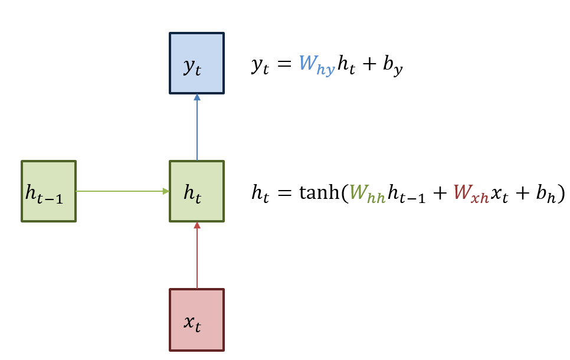
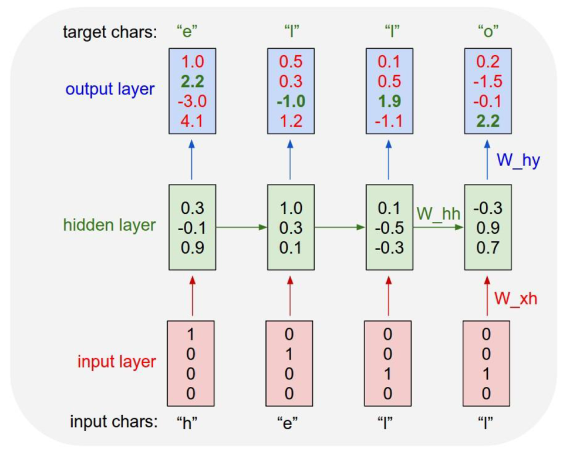
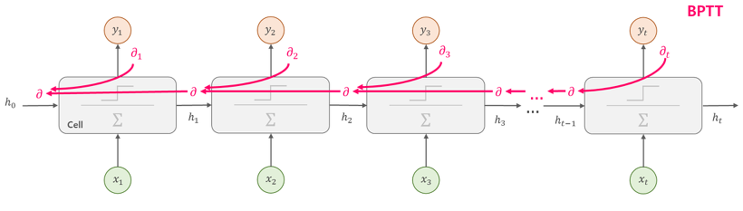
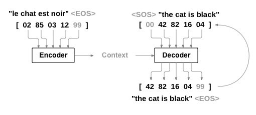
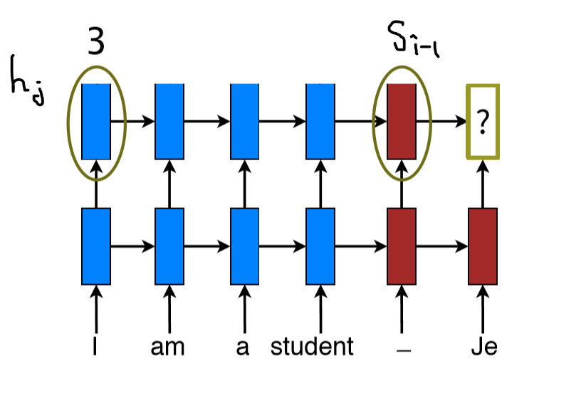
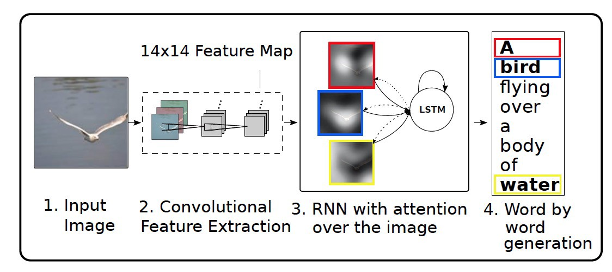
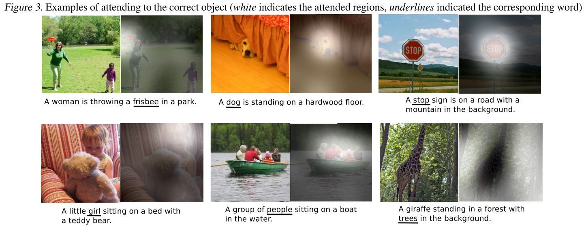
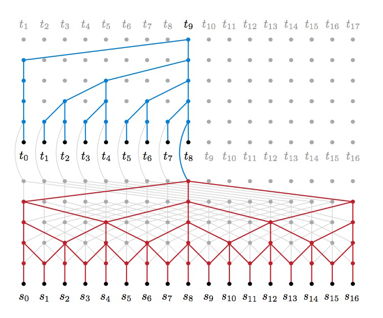
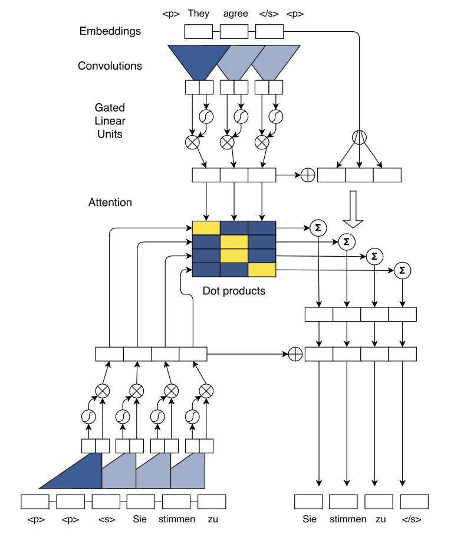
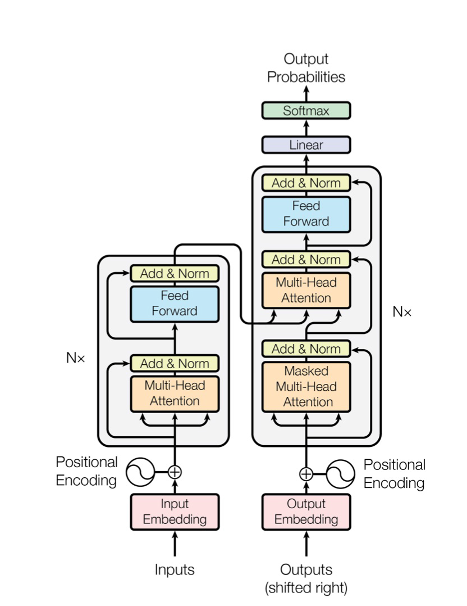

## 밑바닥부터 이해하는 어텐션 메커니즘(Attention Mechanism)

glee1228@naver.com

며칠 전부터 **포항공대 한보형 교수팀과 구글 콜라보**의 논문인 **[Large-Scale Image Retrieval with Attentive Deep Local Features](https://arxiv.org/pdf/1612.06321.pdf)**, 이른바 **DELF(Deep Local Feature)** 로 잘 알려진 논문을 보기 시작했습니다.

**DELF** 논문에서는 이미지 검색 분야에 적합한 local descriptor를 만들기 위해, Descriptor와 Key point 선택에 대한 Attention 매커니즘을 적용한 알고리즘을 제안하고 있습니다.

그래서, **DELF**의 정확한 이해를 위해 딥러닝 전범위에 널리 적용되고 있는 어텐션 메커니즘을 먼저 이해하고 정리하려 합니다.

이 글은 어텐션(Attention) 등장 배경을 순서대로 정리하고 어텐션 메커니즘을 직관적으로 이해하고 정리합니다.

수학적인 수식이 없는 점을 감안하여 수학적 수식이 필요하신 분들은 다른 블로그의 자료 또는 Attention의 원 논문을 참조하시길 바랍니다.

덧붙여, 본 자료는 Stanford cs231n, cs224d 강의와 [딥러닝을 이용한 자연어 처리 입문(위키독스)](https://wikidocs.net/22893) , [우종하님의 딥러닝 자연어처리 ppt](https://www.slideshare.net/deepseaswjh/rnn-bert) , [Synced님의 A Breif Overview of Attention Mechanism](https://medium.com/syncedreview/a-brief-overview-of-attention-mechanism-13c578ba9129) , [colah.github.io](https://colah.github.io/posts/2015-08-Understanding-LSTMs/) 마지막으로 [Jay Alammar님의 Visualizing A Neural Machine Translation Model](https://jalammar.github.io/visualizing-neural-machine-translation-mechanics-of-seq2seq-models-with-attention/) 자료를 바탕으로 정리하였음을 밝힙니다.

### 전제 조건(prerequisite learning)

**DNN(Deep Neural Network)**

**RNN(Recurrent Neural Network)** 

이전 출력값이 현재 결과에 영향을 미칩니다.

아래 그림처럼 순환 $$W_{hh}$$ 의 가중치와 입력 $$W_{xh}$$ 의 두 개의 가중치가 존재합니다.

학습 데이터는 one-hot 인코딩으로 ‘h’, ‘e’, ‘l’, ‘o’ 네 개의 문자를 각각 숫자로 바꾼 데이터입니다.

$$x_1 = [1,0,0,0]$$ 입니다. 이를 기반으로 $$h_1 = [0.3,-0.1,0.9]$$ 를 만들었습니다(이전 hideen layer weight인 $$h_0$$ 이 존재하지 않기 때문에 $$h_0 $$ 의 값은 랜덤 값으로 정합니다 ) 

바로 위의 단계를 반복하는 과정을, 순전파(forward propagation)이라고 합니다.

<video src="https://jalammar.github.io/images/RNN_1.mp4"/>
정답을 알려줘야 모델이 parameter를 적절하게 갱신해나가기 떄문에, h의 정답은 e, e의 정답은 l, l의 정답은 l, l의 정답은 o로 줍니다.

Time step 별 시퀀스를 출력한 output layer와 정답과의 손실함수를 사용하여 각 time step 별 Loss를 구합니다. 그리고 손실 함수의 gradient는 역방향으로 전파됩니다.이를 **BPTT(BackPropagation Through Time)** 이라고 부릅니다.

RNN의 알고리즘과 예시에 대한 자세한 내용은 [CS231n.stanford lecture 10:RNN](http://cs231n.stanford.edu/slides/2017/cs231n_2017_lecture10.pdf) 를 참조하시면 됩니다.

**LSTM(Long Short Term Memory)**

처음 입력의 정보가 뒤로 갈수록 사라지는 현상은 RNN의 큰 문제점입니다.

그래서 입력 중 핵심적인 정보를 잊어버리지 않고 다음 Time Step에 전달하는 방식을 고안하였습니다.

그림에서 RNN 모델은 입력($$x $$), 순환($$h$$)이 각각 1개씩의 가중치를 갖고 연산하는 단일 레이어를 갖고 있습니다. 

그러나 LSTM 모델은 입력과 순환이 각각 4개의 가중치를 갖고 연산하는 4개의 레이어를 갖고 있습니다.

LSTM의 가장 중요한 아이디어는 Cell state인데, 그림에서 다이어그램 안에 가장 윗부분에 수평으로 이어진 직선부분이다.

cell state는 컨베이어 벨트와 같이, 작은 linear interaction만을 적용시키면서 전체의 단계를 반복합니다. 정보를 최대한 보존한채로 흐르게 하는것을 쉽게 할수 있습니다.

LSTM은 cell state에 뭔가를 더하거나 없앨 수 있는 능력이 있는데, 이것은 gate라는 구조에 의해 제어됩니다.

정보가 전달되는 방법을 gate로 제어하는데, sigmoid layer와 pointwise 곱셈으로 이루어져있습니다.

Sigmoid Layer는 0과 1사이의 숫자를 내보내는데, 이 값은 직관적으로 0을 내보낼 경우 "아무것도 넘기지 않는다"라는 뜻이고, 값이 1일 경우는 "모든 것을 넘겨라"라는 뜻입니다.

총 3개의 gate가 있고, 이 gate들은 cell state를 제어하는 역할을 합니다(다시 강조!)

LSTM에 대한 자세한 내용은 https://colah.github.io/posts/2015-08-Understanding-LSTMs/ 를 참조하면 됩니다.

한글로 번역한 블로그는 https://dgkim5360.tistory.com/entry/understanding-long-short-term-memory-lstm-kr 이므로 방문해보기를 권장합니다. 

**Seq2Seq**

RNN은 출력이 바로 이전 입력까지만 고려해서 정확도가 떨어집니다.

전체 입력 문장을 고려하지 않고 다음 문장을 생성해내기 때문입니다. 그래서 Seq2Seq가 등장하게 되었습니다.

**Seq2Seq의 개념과 모델**

RNN은 시퀀스에서 작동하고 후속 단계의 입력으로 자신의 출력을 사용하는 네트워크입니다.

Seq2Seq Network 또는 Encoder Decoder Network라고 불리는 모델은 두 개의 RNN(1D CNN도 가능)으로 구성된 모델입니다.

Encoder는 입력 시퀀스를 읽고 단일 벡터를 출력하고 이 단일벡터는 Context Vector라고 불립니다.

Decoder는 Context Vector를 읽어 출력 시퀀스를 생성합니다.

**Seq2Seq의 추론 방식(위 이미지에 대한 설명)**

1. 입력 시퀀스를 상태 벡터들로 바꿉니다.
2. 크기가 1인 목표 시퀀스로 시작합니다.(시퀀스의 시작 문자에만 해당)
3. 상태 벡터들과 크기가 1인 목표 시퀀스를 decoder에 넣어 다음 문자에 대한 예측치를 생성합니다.
4. 이런 예측치들을 사용해 다음 문자의 표본을 뽑습니다.(간단하게 argmax를 사용)
5. 목표 시퀀스에 샘플링된 문자를 붙입니다.
6. 시퀀스 종료 문자를 생성하거나 끝 문자에 도달할 때까지 앞의 과정을 반복합니다.

<video src="https://jalammar.github.io/images/seq2seq_3.mp4" />
<video src="https://jalammar.github.io/images/seq2seq_4.mp4"/>
<video src="https://jalammar.github.io/images/seq2seq_5.mp4"/>
> 영상 출처 : https://jalammar.github.io/visualizing-neural-machine-translation-mechanics-of-seq2seq-models-with-attention/

**Seq2Seq의 장점**

모든 입력에 해당하는 출력이 있는 단일 RNN의 시퀀스 예측과 달리 Seq2Seq모델은 시퀀스 길이와 순서를 자유롭게 하여 두 언어간의 번역(**서로 다른 도메인으로 변환**)과 같은 task에 이상적입니다.

전체 input을 살펴본 후, 임의의 Context Vector(고정된 사이즈의 벡터)를 출력합니다. -> 전체적인 맥락을 파악한다는 의미입니다.

**Seq2Seq의 한계**

시퀀스의 입력과 출력 길이에 어떠한 제약도 없다는 것은 사실이지만, Seq2Seq 모델은 LSTM의 한계와 마찬가지로 입력 문장이 매우 길면 효율적으로 학습하지 못합니다.

### 어텐션(Attention) 메커니즘의 등장 배경

다시 정리하면, Seq2seq 모델은 인코더에서 입력 시퀀스를 컨텍스트 벡터라는 하나의 고정된 크기의 벡터 표현으로 압축한다. 하지만 이런 RNN에 기반한 Seq2Seq 모델에는 크게 두 가지 문제가 있습니다.

1. 하나의 고정된 크기의 벡터에 모든 정보를 압축하려고 하니까 정보 손실이 발생합니다.
2. RNN(LSTM)의 고질적인 문제인 Vanishing Gradient 문제가 존재합니다.

결론적으로, 입력 문장이 긴 상황에서는 번역 품질이 떨어지는 현상이 나타났고, 이런 현상을 보정하기 위해 중요한 단어에 집중하여 Decoder에 바로 전달하는 Attention 기법이 등장했습니다.

기존 방식보다 훨씬 더 많은 데이터를 Decoder에 전달합니다.

### 어텐션(Attention)은 어떻게 작용하는지

아래 영상은 Seq2Seq2+Attention 모델의 데이터 흐름과 Encoder가 Decoder에 어떤 데이터를 전달하는지를 보여줍니다.

<video src="https://jalammar.github.io/images/seq2seq_7.mp4"/>
>  출처 : https://jalammar.github.io/visualizing-neural-machine-translation-mechanics-of-seq2seq-models-with-attention/

그림으로 도식화 하면 다음과 같습니다.

위 그림을 바탕으로 어떻게 Attention이 작용하는지 설명해보겠습니다.

우선, Attention Decoder에서 나오는 첫 단어(위의 Je)를 만들기 위해 두가지를 준비해야합니다.

하나는 Attention Vector, 나머지 하나는 Step 5번째의 Decoder(빨간색)에서 나오는 hidden state입니다.

우선 Attention Decoder에 전달할 Context Vector를 만들어봅니다.

1. Encoder의 hidden state($$h_1,h_2,h_3,h_4$$)들을 step별로 구합니다.
2. 각각 step의 hidden state($$h_1,h_2,h_3,h_4 $$)에 이전 step 디코더의 hidden state인 $$s_{i-1}$$ 를 각각 dot-product하거나 다른 socre 함수들을 사용해서 점수를 부여합니다.이 점수가 바로 Attention Score입니다.
3. 점수를 softmax합니다.(점수 합이 1)
4. Softmax된 점수에 해당하는 각각의 hidden state들을 곱해줍니다.
5. 점수에 곱해진 Vector들을 Sum up 해줍니다. => Context Vector

Step 5번째의 첫 Decoder의 hidden state를 준비해줍니다.

여기까지 다 되었다면, 위 Je라는 Attention Decoder의 첫 hidden state를 내보낼 준비가 되었습니다.

아래 영상은 위의 과정을 영상으로 보여줍니다. Attention Decoder가 첫 hidden state 을 생성하기 이전에 Attention이 어떻게 작용하는지 Step 별로 보여줍니다.

<video src="https://jalammar.github.io/images/attention_process.mp4"/>

>  출처 : https://jalammar.github.io/visualizing-neural-machine-translation-mechanics-of-seq2seq-models-with-attention/

### 

어텐션의 기본 아이디어는 **디코더(Decoder)에서 출력 단어를 예측하는 매 시점(time-step)마다, 인코더에서의 전체 입력 문장을 다시 한 번 참고한다는 점** 입니다. 단, 전체 입력 문장을 전부 다 동일한 비율로 참고하는 것이 아니라, 해당 시점에서 예측해야할 단어와 연관이 있는 입력 단어 부분을 좀 더 집중해서 보게됩니다. 이 내용을 알고 Decoder의 단계로 넘어갑니다.

## Visual Attention

* A. Karpathy and L. Fei-Fei (2015), "Deep Visual-Semantic Alignments for Generating Image Descriptions," CVPR
* I K. Xu et al. (2015), "Show, Attend and Tell: Neural Image Caption Generation with Visual Attention," ICML

### 단어-이미지 정렬 학습

* Raw Image 를 입력하면, 사이즈가 K인 사전으로부터 단어들의 시퀀스 A를 출력합니다.

* $$
  {y_1,...,y_c},y_i \in \R^K
  $$

* 

**Encoder : D-차원의 feature vector를 추출하는데 CNN을 사용**
$$
a = [a_1,...,a_L] \in \R^{L\times D}
$$
max pooling 하기 전의 lower conv layer의 output인 $$L_1 \times L_2 \times D ( L = L_1 \times L_2)$$ 이다.

**Decoder : context vector, 이전 hidden state, 그리고 이전에 생성된 words에서 매 스텝마다 한 단어를 생성하는 캡션을 생성하기 위한 용도로 Attention 모듈을 사용한 RNN을 사용** 

## Google Transformer

*  A. Vaswani et al. (2017), "Attention is all you need," NIPS

RNN : 순차 연산(Decoder안의 스스로 교정하는 형태의 모델)은 비용이 많이 들고 평행이 쉽지 않습니다.

CNN : ByteNet , ConvS2S 와 같은 긴 term의 dependency들을 잡아내기 위한 많은 레이어를 필요로 합니다.

### ByteNet

* N. Kalchbrenner et al. (2017), "Neural machine translation in linear time" 

### ConvS2S

* J. Gehring et al. (2017), "Convolutional sequence to sequence learning" 

### Transformer

Transformer = encoder + decoder

Encoder or decoder = attention + positional encoding + feedforward net

### Scaled Dot-Product Attention

$$
Attention(Q, K, V) = softmax(\frac{QK^T}{\sqrt{D_K}}) V \in \R^{N\times D_v}
\\
Queries : Q \in \R^{N\times D_k},q_i\in\R^{1\times D_k}
\\
Keys : K \in \R ^{N \times D_k} , k_i \in \R^{1\times D_k}
\\
Values : V \in \R^{N \times D_v} , v_i \in \R^{1 \times D_v}
$$

예를 들어, 쿼리 $$q_i$$ 에 대한 Attention은 
$$
\sum_{n=1}^N\left( \frac{exp(q_ik_n^T /\sqrt D_k)}{\sum_{j=1}^{N}exp(q_jk_n^T / \sqrt D_k)}\right)v_n
$$
이다.

Self-Attention : Queries, Keys 그리고 Values는 동일한 시퀀스.

### Multi-Head Attention

모델이 서로 다른 위치에서 서로 다른 표현 하위 영역의 정보를 공동으로 참조할 수 있도록 하는 역할
$$
\begin{matrix}
MultiHead(Q,K,V)  &=&  \textbf{Concat}(head_1,...,head_h)W^O,
\\
head_i &=& \textbf{Attention}(QW_i^Q,KW_i^K,VW_i^V)
\end{matrix}
$$
매개변수 행렬을 통해 선형 투영이 수행되는 경우

$$
\begin{matrix}
W_i^Q \in \R^{D_{model}\times D_q}&,& W_i^K \in \R^{D_{model}\times D_k},
\\
W_i^V \in \R^{D_{model}\times D_v}&,& W_i^O \in \R^{hD_v\times D_{model}},
\end{matrix}
$$

여기서 h = 8은 병렬로 된 Attention layer의 수입니다.

### Attention in Encoder and Decoder

* Encoder : 
  * Self-Attention layer를 포함
  * encoder안의 각각 position은 encoder 이전 레이어안의 모든 position을 참조
* Decoder:
  * Self-Attention layer를 포함
  * encoder안의 각각 position은 encoder 이전 레이어안의 모든 position을 참조
  * Need to prevent leftward flow in the decoder to preserve the auto-regressive property.

* Encoder-decoder Attention :
  * Queries 는 이전 decoder layer에서 오고, keys / values는 encoder의 output에서 옵니다.
  * decoder에서 모든 position은 input sequence안 모든 position을 참조합니다.
  * Seq2seq 학습에서 encoder-decoder Attentio을 모방

### Position-wise Feedforward Networks

* 각 위치에 개별적으로 동일하게 적용합니다.

* 단일 hidden layer와 함께 FF net
  $$
  FFN(x) = max(0,xW_1 + b_1)W_2+b_2
  $$
  여기서 $$x \in R^{512}$$ 와 hidden 유닛들의 숫자는 2048

  

### Positional Encoding

* 시퀀스의 token들의 상대적이고 절대적인 위치에 대한 정보를 부여
* Positional Encoding vector를 input embedding vector에 더하기
* 이 부분은 더 공부할 필요가 있습니다.
* pos마다 다른 pos와 구분되는 positional encoding 값을 얻기위해 sin, cos 함수를 사용했다고 합니다.

### Transformer Algorithm Flow Visualization

출처 : https://mchromiak.github.io/articles/2017/Sep/12/Transformer-Attention-is-all-you-need