## Feature Pyramid and Hierarchinal Boosting Network for Pavement Crack Detection 논문 번역

### Abstract

포장 균열 감지는 도로 안전을 보장하기 위한 중요한 작업입니다. 수동 균열 감지는 시간이 매우 많이 소요됩니다. 따라서 이러한 진행률을 높이려면 도로 균열 감지 자동 방법이 필요합니다. 그러나 균열의 강도 비균형성 및 배경의 복잡성, 예를 들어 주변 포장재와의 낮은 대조도 및 유사한 강도의 그림자로 인해 여전히 어려운 과제로 남아 있습니다. 최근 컴퓨터 비전에 대한 심층적인 학습에 영감을 받아 포장 균열 감지를 위한 Feature Pyramid 및 Hierarchical Boosting Network(FPHBN)라는 새로운 네트워크 아키텍처를 제안합니다. 제안된 네트워크는 피쳐 피라미드 방식으로 균열 감지를 위해 컨텍스트 정보를 하위 레벨 기능에 통합합니다. 또한, 중첩된 샘플이 훈련 중 계층적 방식으로 재가중되어 손실에 대한 손쉬운 샘플과 하드 샘플의 기여도를 균형 있게 조정합니다. 또한 유니언(AIU)을 통한 평균 교차점이라는 균열검출에 대한 새로운 측정을 제안합니다. 제안된 방법의 우수성과 일반성을 입증하기 위해 5개의 균열 데이터셋에서 평가하여 최신 균열 검출, 에지 감지 및 의미 분할 방법과 비교합니다. 광범위한 실험을 통해 제안된 방법이 정확성과 일반성 측면에서 이러한 방법을 능가한다는 것을 알 수 있습니다. 

코드와 데이터는 https://github.com/fyangneil/pavement-crack-detection 

색인 용어—포장 균열 감지, 심층 학습, 피쳐 피라미드, 계층적 향상 등에서 확인할 수 있습니다.

### 1. Introduction

CRACK는 도로 및 고속도로 안전에 대한 잠재적 위협인 일반적인 포장 문제입니다. 도로의 양호한 상태를 유지하기 위해서는 균열 부위를 국소화하고 고정하는 것이 운송 정비 부서의 중요한 책임입니다. 이 과제의 주요 단계 중 하나는 균열 감지입니다. 그러나 수동 균열 탐지는 상당히 지루하며 도메인 전문가가 필요합니다. 전문가 작업부하를 완화하고 도로점검의 진행을 촉진하기 위해서는 균열감지 자동화가 필요합니다. 

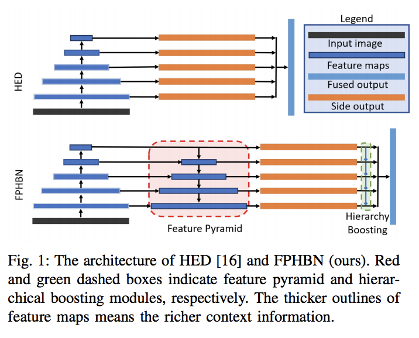

​	컴퓨터 비전 기술이 발전하면서, 자동 균열 감지를 수행하기 위해 컴퓨터 비전 기술을 적용하는 데 많은 노력을 기울여 왔습니다 [1] – [7]. 초기에는 실제 균열 화소가 주변보다 지속적으로 어둡다는 가정 하에 균열 부위를 찾기 위해 문턱값 기반 접근법을 사용합니다. 현재 대부분의 방법은 수작업으로 작성된 기능과 패치 기반 분류를 기반으로 합니다. 균열 검출에는 가보 필터 [9] [10], 웨이브릿 피쳐 [11], 오리엔트 그라디언트의 히스토그램(HOG) [12] 및 로컬 바이너리 패턴(LBP) [13]과 같은 다양한 유형의 기능이 사용되었습니다. 이러한 방법은 로컬 패턴을 인코딩하지만 균열에 대한 글로벌 뷰는 부족합니다. 전지구적 관점에서 균열감지를 실시하기 위해 [4], [14], [15]의 일부 작업에서는 포장 균열 영상의 광도 및 기하학적 특성을 고려하여 균열감지를 수행합니다. 이러한 방법은 소음을 부분적으로 제거하고 감지된 균열의 연속성을 향상시킵니다. 

​	이러한 방법은 전지구적 관점에서 균열 탐지를 수행하지만, 강도 비균질성이나 복잡한 위상으로 균열을 처리할 때는 검출 성능이 우수하지 않습니다. 이러한 방법의 실패는 강력한 형상이 표현되지 않고 균열 간의 상호의존성을 무시하기 때문일 수 있습니다. 

​	앞서 언급한 단점을 극복하기 위해, CrackForest [2]는 균열을 특징짓기 위해 여러 단계의 보완적 기능을 통합하고 균열 패치의 구조 정보를 활용합니다. 이 방법은 CrackTree [4], CrackIT [17], FFA(자유형 비등방성) [18] 및 최소 경로 선택(MPS) [14]과 같은 최신 균열 감지 방법을 능가하는 것으로 나타납니다. 그러나 CrackForest[2]는 여전히 손으로 만든 기능을 기반으로 균열 감지를 수행하는데, 이는 낮은 수준의 단서가 있는 복잡한 배경과 균열을 구별할 만큼 차별적이지 않습니다. 

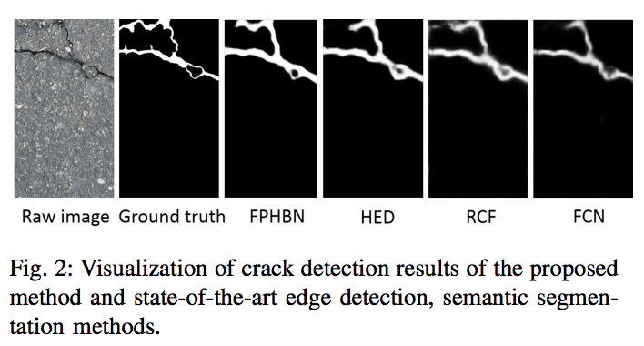

​	최근에는 뛰어난 표현력으로 컴퓨터 비전에 심층 학습이 폭넓게 적용되고 있습니다. 일부 작품 [1] [19] [20] [5]에서는 이러한 심층 학습 특성을 활용하여 균열 탐지를 위한 강력한 특징 표현을 학습하는 데 전념하고 있습니다. Zhang et al [1], Pauly et al [19] 및 I젠바흐 et al[20]은 딥러닝을 사용하여 균열 감지를 위한 패치 기반 분류를 수행하는데, 이는 패치 규모에 불편하고 민감합니다. Schmugge 외[5]는 균열 탐지를 분할 작업으로 처리하며, 심층 학습을 통해 각 픽셀을 균열 또는 배경 범주로 분류합니다. [5]는 상당한 성능을 얻지만, 균열 검출은 전위 및 배경 비율 측면에서 의미적 분할과는 매우 다릅니다. 의미 분할에서 전경과 배경은 균열 검출에 있는 것만큼 불균형하지 않습니다. 

​	이와는 대조적으로 균열 감지 작업은 전경 비율과 배경 비율 면에서 에지 탐지와 더 유사합니다. 또한 균열과 가장자리 검출은 모양과 구조에서 유사한 특성을 공유합니다. 이러한 일반적인 특성 때문에 균열 탐지를 위해 에지 감지 방법을 사용하는 것이 직관적입니다. 예를 들어, Si 등[2]은 균열 감지를 위해 기존의 에지 감지 방법인 구조 포리스트[21]를 성공적으로 적용했습니다. 그러나 이러한 접근 방식은 대표성이 결여된 수공예 기능을 기반으로 합니다.

​	강력한 특징 표현을 배우고 자동 균열 탐지를 위한 고도로 치우친 등급 문제에 대처하기 위해 엔드 투 엔드 방식으로 균열을 자동으로 감지할 수 있는 기능 피라미드 및 계층적 부스팅 네트워크(FPHBN)를 제안합니다. FPHBN은 혁신적인 에지 탐지 방법인 HED(Holistic Nest Detection)[16]를 백본 아키텍처로 채택합니다. 

​	그림 1은 HED [16]의 아키텍처 구성과 제안된 FPHBN을 보여줍니다. 차이점은 FPHBN이 기능 피라미드 모듈과 계층적 부스팅 모듈을 HED[16]에 통합한다는 것입니다. 피쳐 피라미드는 상위 레벨에서 하위 레벨까지의 컨텍스트 정보를 소개하기 위해 하향식 아키텍처를 통해 구축됩니다. 이를 통해 하위 레벨 계층의 형상 표현을 향상시킬 수 있으며, 균열을 배경과 구별할 수 있는 대표적인 기능 향상으로 이어질 수 있습니다. 위 계층적 부스팅은 표본을 맨 위 계층에서 아래 계층으로 재평가하기 위해 제안되며, 이를 통해 FPHBN은 단단한 예제에 더 많은 주의를 기울일 수 있습니다. 

​	그림 2는 FPHBN의 검출 결과와 최첨단 에지 및 의미 분할 방법을 보여줍니다. HED [16], RCF(에지 탐지를 위한 보다 풍부한 콘볼루션 기능) [22], 의미 분할을 위한 완전 콘볼루션 네트워크(FCN) [23]. 그림 2에서 우리는 FPHBN의 검출 결과가 다른 방법보다 훨씬 명확하고 거짓 긍정도 적다는 것을 알 수 있습니다. 

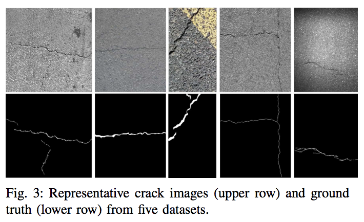

​	균열 감지 알고리즘을 평가하기 위해 Si 등[2]은 정밀도 및 호출(PR)을 측정으로 사용합니다. 검출된 픽셀은 레이블이 지정된 픽셀에서 5픽셀 내에 있는 경우 True Positive로 처리됩니다. 이 기준은 균열 주석의 폭이 큰 경우 너무 느슨합니다. 또한 PR은 특히 균열이 클 경우 검출된 균열과 지면 진리 사이의 중첩 정도를 적절하게 입증할 수 없습니다. 예를 들어, 그림 3에서 우리는 세 번째 열의 지상 진리가 다른 것보다 훨씬 넓다는 것을 볼 수 있습니다. 이 상황에서 PR은 검출 결과를 측정할 만큼 정밀하지 않습니다. 따라서 PR 외에도 균열 감지 평가를 위한 보완적 측정으로 유니언(AIU)을 통한 평균 교차점을 제안합니다. AIU는 서로 다른 임계값에 대한 조합을 통한 평균 교차점(IU)을 계산함으로써 폭 정보를 고려하여 탐지를 평가하고 탐지와 지상 진리 사이의 전체적인 중첩 범위를 보여줍니다. 따라서 AIU를 사용하여 폭의 정확한 추정 여부를 판단할 수 있으며, 이는 포장도로의 손상 정도를 평가하는 데 매우 중요합니다. 

​	본 논문의 기여는 다음과 같은 측면으로 요약할 수 있습니다. 

• 균열 탐지를 위한 피쳐 피라미드 모듈이 도입되었습니다. 피쳐 피라미드는 위에서 아래로, 계층별로 컨텍스트 정보를 통합하는 하향식 아키텍처에 의해 구성됩니다. 

• 모형이 단단한 표본에 초점을 맞추도록 표본을 층별로 재평가하는 계층적 부스팅 모듈이 제안됩니다. 

• 균열 감지 방법을 평가하기 위한 새로운 측정이 제안됩니다. 측정 시 균열 폭뿐만 아니라 주석 바이어스를 방지합니다. 

나머지 논문은 다음과 같은 방법으로 정리되어 있습니다: 관련 저작은 섹션 II에서 검토됩니다; 섹션 III는 제안된 FPHBN의 세부사항을 설명합니다; 섹션 IV는 실험 설계와 실험 결과를 보여줍니다. 섹션 V가 결론입니다.

### 2. Related Works

이 섹션에서는 먼저 균열검출에 관한 전통적인 작업을 간략하게 검토합니다. 그런 다음, 기존의 접근 방식에 대한 우수성을 입증하기 위해 심층 학습 기반의 균열 감지 방법이 논의됩니다. 

**A. 전통적인 균열 감지 방법 **

​	본 연구에서는 깊이가 없는 학습 기법에 기초한 균열 감지 방법을 전통적인 균열 감지 방법이라고 합니다. 지난 몇 년 동안 수많은 연구자들이 균열 탐지를 자동화하는데 전념해 왔습니다. 이러한 작업은 1)파형 변환, 2)영상 임계값 설정, 3)수공 처리된 기능 및 분류, 4)에지 감지 기반 방법, 5)최소 경로 기반 방법 등 5가지 범주로 나눌 수 있습니다. 

​	1)파형 변환: [11]에서는 영상이 서로 다른 주파수 하위 대역으로 분해되도록 포장 이미지에 웨이브릿 변환이 적용됩니다. 조난과 노이즈는 각각 고진폭 및 저진폭 파동수 계수로 변환됩니다. Subirats 등[24]은 2D 파형릿 변환을 다중 스케일 방식으로 수행하여 복잡한 계수 맵을 작성합니다. 그런 다음 최대 파형릿 계수를 최대 눈금에서 최소 눈금까지 검색하여 균열 영역을 얻을 수 있습니다. 그러나 파동의 비등방성 특성 때문에 이러한 접근방식은 연속성이 낮거나 곡률이 높은 특성을 가진 균열을 다룰 수 없습니다. 

​	2) 이미지 임계값 지정은 다음과 같습니다. [25]–[28]에서는 조명 아티팩트를 줄이기 위해 먼저 사전 처리 알고리즘을 사용합니다. 그런 다음 이미지에 임계값 지정이 적용되어 균열 후보를 내줍니다. 가공된 균열 이미지는 형태학적 기술을 사용하여 더욱 정교하게 만들어집니다. [4] [15] [29]는 그래프 기반 방법을 활용하여 균열 후보를 정교하게 만드는 이 그룹의 변형입니다. 

​	3) 수공예 특성과 분류: 현재 대부분의 균열 감지 방법은 손으로 만든 기능과 패치 기반 분류기를 기반으로 합니다. [12], [13], [30]–[32], 수공예 기능(예: HOG [12], LBP [13])은 균열의 설명자로 이미지 패치에서 추출한 다음, 서포트 벡터 기계와 같은 분류자를 따릅니다. 

​	4) 가장자리 검출 기반 방법 : Yan 등[33]은 균열 검출에 형태학적 필터를 도입하고 수정된 중앙분리기로 노이즈를 제거합니다. Ayenu-Prah 등[34]은 입체 경험적 모드 분해 알고리즘에 의해 이미지를 평활화하고 반점 노이즈를 제거한 후 균열을 감지하기 위해 Sobel 에지 검출기를 적용합니다. 시 외 [2] 무작위 구조 포리스트[21]를 적용하여 균열 탐지를 위한 구조 정보를 이용합니다. 

​	5) 최소 경로 기반 방법: Kass et al[35]은 곡선의 두 끝점에 대해 영상에서 단순 열린 곡선을 추출하기 위해 최소 경로 방법을 사용할 것을 제안합니다. Kaul et al[36]은 개선된 최소 경로 방법을 사용하여 동일한 유형의 윤곽선 영상 구조를 탐지할 것을 제안합니다. 개선된 방법은 원하는 곡선의 위상과 끝점에 대한 사전 지식이 부족합니다. Amhaz 등[14]은 균열 감지를 위한 2단계 방법을 제안합니다. 첫째, 끝점을 로컬 규모로 선택하고, 둘째로 글로벌 규모로 최소 경로를 선택합니다. Nguyen et al [18]은 자유형 비등방성[18]을 도입하여 균열 탐지를 위한 강도 및 균열 형상 특성을 동시에 고려하는 방법을 제시합니다. 

**B. 심층 학습 기반 균열 감지 **

​	최근 몇 년 동안 심층 학습은 컴퓨터 시각에서 전례 없는 성공을 달성합니다 [37]. 많은 작품들이 크랙 검출 작업에 심층 학습을 적용하려고 합니다. 장 외 연구진[1]은 먼저 패치 기반 방식으로 균열 탐지를 수행하기 위해 4개의 경련층과 2개의 완전히 연결된 층으로 구성된 비교적 얕은 신경망을 제안합니다. 또한, Zhang 등[1]은 심층 학습의 특징적 표현의 장점을 보여주기 위해 수공예 기능 기반 방법과 비교합니다. Pauly 등[19]은 더 깊은 신경망을 적용하여 균열과 비균열 패치를 분류하고 더 깊은 신경망의 우월성을 보여줍니다. 펑 외 연구진[38]은 제한된 라벨 자원 문제를 다루기 위한 심층적인 적극적인 학습 시스템을 제안합니다. 아이젠바흐 외[20]에서는 심층 학습 네트워크를 교육하기 위한 도로 조난 데이터 세트를 제시하고, 먼저 포장 조난 감지의 최첨단 접근 방식을 평가하고 분석합니다. 

​	전술한 접근 방식은 균열 감지를 패치 기반 분류 작업으로 처리합니다. 각 이미지는 작은 패치로 잘리고, 깊은 신경 네트워크는 각 패치를 균열로 분류하도록 훈련됩니다. 이 방법은 패치 규모에 불편하고 민감합니다. 의미 분할 작업 [23] [39] [40]의 급속한 개발로 인해, Schmugge 외[5]는 원격 시각 검사 비디오에 대한 SegNet [39]에 기초한 균열 분할 방법을 제시합니다. 이 방법은 비디오에 겹치는 여러 프레임에서 균열 확률을 집계하여 균열 감지를 수행합니다.

### 3. Method

**A. 제안된 방법의 개요 **

​	이 문서에서는 균열 감지가 픽셀 단위 이진 분류 작업으로 공식화되었습니다. 지정된 균열 영상의 경우 설계 모델은 균열 예측 맵을 산출합니다. 여기서 균열 영역은 높은 확률, 비균열 영역은 낮은 확률입니다. 그림 4는 제안된 피쳐 피라미드 및 계층적 부스팅 네트워크(FPHBN)의 아키텍처를 보여줍니다. FPHBN은 4개의 주요 구성요소로 구성되어 있습니다. 1. 계층적 피쳐 추출을 위한 상향식 아키텍처, 2. 하향식 아키텍처를 사용하여 컨텍스트 정보를 하위 계층에 병합하는 피쳐 피라미드, 3. 심층 관리자의 측면 네트워크.그리고 4는 샘플 체중을 중첩된 방식으로 조정하는 계층적 부스팅 모듈입니다. 

​	균열 이미지와 그에 상응하는 접지 진실에 따라 균열 이미지는 먼저 상향식 네트워크로 전달되어 서로 다른 수준의 특징을 추출합니다. 각각의 레이어는 피라미드의 레벨에 해당합니다. 각 수준에서는 다섯 번째 수준을 제외하고 상위 레벨 피쳐 맵을 하위 레벨 피쳐 맵을 계층별로 통합하여 상위 레벨에서 하위 레벨로 컨텍스트 정보가 이동하도록 하는 피쳐 병합 작업이 수행됩니다. 각 레벨에서 하향식 아키텍처의 형상 맵은 치수 축소를 위해 1×1 크기의 원통형 필터와 형상 맵의 크기를 입력 이미지의 동일한 크기로 조정하기 위해 디콘볼루션 필터에 공급됩니다. 그런 다음 크기 조정된 각 형상 맵이 계층적 부스팅 모듈에 도입되어 균열 예측 맵을 산출하고 지반 진실로 지그모이드 교차 엔트로피 손실을 계산합니다. 각 레벨의 경합 필터, 디콘볼루션 필터 및 손실 계층은 측면 네트워크로 구성됩니다. 마지막으로, 크기가 조정된 5개의 형상 맵은 모두 1×1의 경합 필터에 의해 혼합되어 균열 예측 맵을 생성하고 지면 진실로 최종 sigmoid 교차-엔트로피 손실을 계산합니다. 

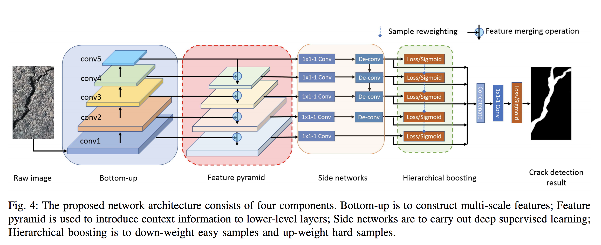

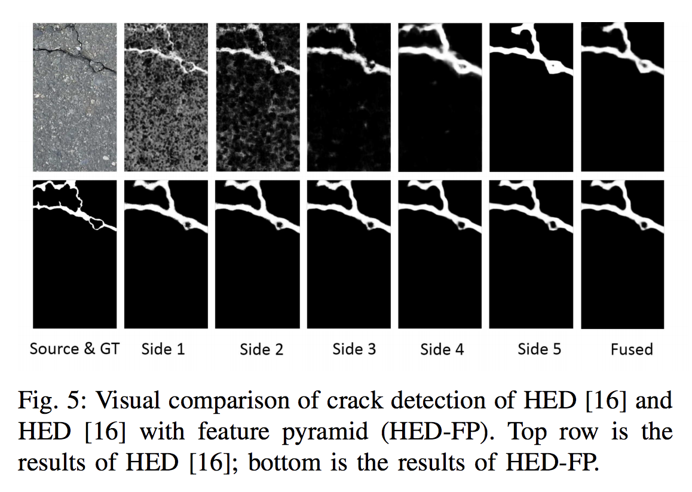

**B. Bottom-up 아키텍처 **

​	우리의 방법에서, 상향식 아키텍처는 VGG[41]의 confolutional 계층들 사이의 최대 풀링 계층을 포함한 conf1-conf5 부분으로 구성됩니다. 상향식 아키텍처를 통해 ConvNets(ConvNets)는 계층적 특징 표현을 계산합니다. 최대 풀링 계층으로 인해 피쳐 계층 구조에는 고유한 다중 스케일 피라미드 모양이 있습니다. 

​	다중 스케일 이미지를 기반으로 구축된 다중 스케일 기능과 달리, Deep ConvNets에 의해 계산된 다중 스케일 기능은 스케일의 분산을 더욱 견고하게 합니다 [42]. 따라서 단일 입력 척도에서 인식을 용이하게 합니다. 더욱 중요한 것은, Deep ConvNets를 통해 다중 규모 표현을 자동화하고 편리하게 만들 수 있다는 점입니다. 이는 다양한 이미지의 컴퓨팅 기능보다 훨씬 효율적이고 효과적입니다. 

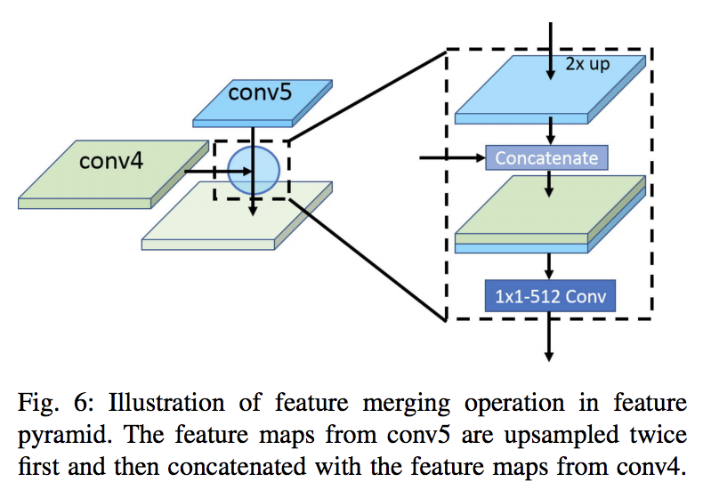

​	상향식 네트워크에서 네트워크 계층은 서로 다른 공간 해상도의 피쳐 맵을 생성하지만 컨텍스트 간격이 큽니다. 피쳐 맵의 하단 레벨은 해상도는 높지만 피쳐의 최상위 레벨보다 컨텍스트 정보가 적습니다. 반대로 피쳐 맵의 최상위 수준은 해상도는 낮지만 컨텍스트 정보가 더 많습니다. 컨텍스트 정보는 균열 탐지에 유용합니다. 따라서 이러한 기능 맵이 각 측면 네트워크로 직접 전송되는 경우 서로 다른 측면 네트워크의 출력이 크게 달라집니다. 

​	그림 5의 첫 번째 행은 5개의 측면 출력과 퓨전 출력을 나타냅니다. 측면 출력 1-3은 매우 지저분하고 거의 인식되지 않으며, 측면 출력 4-5와 퓨즈가 측면 출력 1-3보다 훨씬 우수합니다. 또한, 퓨전 결과가 사이드 출력 1-4보다 더 선명하지만 여전히 약간 흐릿하다는 것을 알게 되었습니다. 이는 퓨전된 결과가 사이드 출력 1-4의 정보를 병합하기 때문입니다. 이 정보는 어수선하고 흐릿합니다. 이러한 지저분한 측면 출력의 원인은 하위 계층에 컨텍스트 정보가 부족하기 때문입니다. 

**C. 피쳐 피라미드 **

​	앞서 언급한 문제를 다루기 위해, 하위 계층에 상황 정보를 도입하여 [42]에서 영감을 얻은 하향식 아키텍처를 통해 형상 피라미드를 생성합니다. 그림 4에서와 같이, 하향식 아키텍처는 5단계와 4단계 피쳐 맵을 피쳐 병합 작업 유닛으로 공급한 다음, 피쳐 맵의 출력 및 3단계 피쳐 맵을 다음 병합 작업 유닛으로 공급합니다. 이 작업은 하단 레벨까지 점진적으로 수행됩니다. 이렇게 하면 5번째 수준을 제외한 각 레벨의 기능이 상향식 네트워크의 기능보다 훨씬 풍부한 새로운 기능 맵 세트를 생성할 수 있습니다. 그림 5에서, 우리는 피쳐 피라미드를 도입한 후, 측면 출력 1-4와 퓨전 결과가 HED의 결과보다 훨씬 더 선명하다는 것에 주목합니다 [16]. 피쳐 피라미드 모듈의 로우 레벨 피쳐 맵에 다중 스케일 컨텍스트 정보를 결합하면 로우 레벨 사이드 네트워크의 성능 향상에 도움이 됩니다. 특히, 균열의 다양한 척도를 탐지하려면 상황에 맞는 정보의 범위가 다양해야 합니다. 보다 심층적인 콘볼루션 계층은 얕은 층보다 수용성 영역이 훨씬 크기 때문에, 높은 레벨의 기능에는 낮은 레벨의 것보다 더 많은 컨텍스트 정보가 포함되어 있습니다. 따라서, 높은 수준의 기능이 낮은 수준의 기능과 결합될 경우, 낮은 수준의 사이드 네트워크는 다중 규모의 컨텍스트 정보를 활용하여 탐지 성능을 높이고 퓨전된 감지 성능을 향상시킵니다. 형상 피라미드의 형상 병합 연산은 그림 6에 나와 있습니다. 우리는 콘크리트 연산을 예시하기 위해 네 번째 레벨에서 형상 병합 연산을 사용합니다. conf5의 형상 맵은 두 번 상향 샘플링되고 conf4의 형상 맵과 결합됩니다. 연결된 피쳐 맵은 512개 필터의 1 × 1개의 회선 레이어로 퓨전되고 줄어듭니다. conf3에서 conf1 레벨로 필터 번호는 각각 256, 128 및 64로 설정됩니다.

**D. 사이드 네트워크**

​	각 레벨의 사이드 네트워크는 개별적으로 균열 예측을 수행합니다. 이러한 학습 구성은 [43]에서 제안된 깊이 관리된 학습으로 명명되며, HED의 에지 탐지에 상당히 유용한 것으로 정당화됩니다 [16]. 심층감독의 핵심 특징은 가장 높은 계층에서 인식작업을 수행하는 대신 사이드 네트워크를 통해 각 레벨에서 인지를 실시하는 것입니다. 먼저 균열검출의 맥락에서 HED [16]을 소개하겠습니다. 

​	1) 교육 단계: NAT은 균열 교육 데이터 세트를 S = (Xn, Yn), n = 1, ..., N으로 나타냅니다. 여기서 샘플 Xn과 Yn은 각각 원시 균열 이미지와 해당 이진 진리 균열 맵을 나타냅니다. 편의를 위해 후속 단락에서 구독 n을 삭제합니다. 전체 네트워크의 매개변수는 W로 표시됩니다. HED [16]에 M 측 네트워크가 있다고 가정합니다. 각 측면 네트워크는 해당 가중치가 w = (w (1), ..., w(M) 로 표시되는 분류기와 연결됩니다. 

목표 함수는 Lside(W, w) = X M m=1" m side(W, w(m) ), (1)

로 정의됩니다. 

여기서 "side(side)는 측면 네트워크의 영상 수준 손실 기능을 나타냅니다. 이미지 투 이미지 교육 중, 손실 기능은 훈련 이미지 X = (xi , i = 1, ..., |X|) 및 크랙 맵 Y = (i, i = 1, ..., |Y |), yi ∈ {0, 1}의 모든 픽셀에 대해 계산됩니다. 그러나 이러한 종류의 손실 기능은 긍정과 부정을 동등하게 간주하므로 실제 상황에 적합하지 않습니다. 그림. 5와 같이 일반적인 균열 이미지의 경우 균열 및 비균열 픽셀의 분포가 크게 편향되어 있습니다. 이미지의 대부분의 영역은 크랙이 아닌 픽셀입니다. HED [16]에서는 간단한 전략을 사용하여 긍정과 부정의 손실에 대한 기여를 자동으로 균형 있게 조정합니다. 클래스 밸런싱 중량 β는 픽셀 단위로 도입됩니다. Index i가 이미지 X의 이미지 공간 치수 위에 있습니다. 그런 다음 β를 사용하여 균열과 비균열 픽셀 간의 불균형을 상쇄합니다. 

구체적으로 식 1은 

(m) 측(W, w(m) ) = -β X i∈Y+ 로그 Pi(i = 1|X, W, w(m) ) -(1 - β) X i XY- log Pi(ii= 0|X; W, w(m) |Y/Y

로 다시 씁니다. 

Pi(i = 1|X; W, w(m) ) = σ(m i ) ∈ [0, 1]은 픽셀 i의 활성화에 대한 sigmoid 함수 σ()에 의해 계산됩니다. 그런 다음 각 측 출력 네트워크에서 균열 지도 예측 Yˆ(m) 측 = σ(m) 측, 여기서 A≡(m) 측 {a(m) i, i = 1, ..., |Y|}은(는) 계층 m의 측출력의 활성화입니다. 측면 출력 예측을 활용하기 위해 '가중 퓨전' 레이어가 네트워크에 추가되고 교육 중에 모든 측면 네트워크와의 융접 중량을 동시에 학습합니다. 융접층 Lfuse의 손실 기능은 Lfuse(W, w, h) = Ds(Y, Yˆ 퓨즈)가 되고, (3) Yˆ 퓨즈 ≡(PM m=1 hmAˆ (m)측) 여기서 h = (h1, ..., hM)은 융접 중량입니다. Ds(, .)는 결합된 예측과 지상의 진리 균열 지도 사이의 거리이며, sigmoid cross-entropy loss로 설정되어 있습니다. 전체 네트워크의 경우 전체 개체 기능을 최소화할 필요가 있습니다(W, w, h) = arg min(Lside(W, w) + Lfuse(W, w, h)), (4) 

​	2) 테스트 단계: 테스트하는 동안, 이미지 X의 경우, (Yˆ 퓨즈, Yˆ(1) 측, ..., Yˆ(M) 측) = CNN(X, (W, w, h) ∗), (5) 여기에서 CNN(.)은 HED에 의해 생성된 균열 지도를 나타냅니다 [16]. 

**E. 계층적 증강 **

​	HED[16]는 등급 균형 가중치 β를 사용하여 불균형 양과 부정의 문제를 고려하지만, 쉽고 단단한 샘플을 구별할 수 없습니다. 특히, 균열 검출에서 손실 함수 방정식 4는 표본의 기울기가 매우 높기 때문에 쉽게 분류되는 음의 샘플에 의해 지배됩니다. 따라서, 네트워크는 훈련 단계 동안 잘못 분류된 샘플로부터 매개변수를 효과적으로 학습할 수 없습니다. 

​	이 문제를 해결하기 위해, 일반적인 해결책은 훈련 중 또는 보다 복잡한 샘플링/재가중 계획 중에 하드 샘플을 샘플링하는 몇 가지 형태의 하드 마이닝 [44] [45]을 수행하는 것입니다 [46]. 이와는 대조적으로, 린 외[47]은 저체중 잘 분류된 예시들에 대한 새로운 손실을 제안하고 훈련 중에 단단한 예시들에 초점을 맞추고 있습니다. 

​	이러한 이전 작업과는 달리, 우리는 샘플의 무게를 재는 새로운 체계, 계층적 향상을 설계합니다. 그림 4에서 우리는 계층적 부스팅 모듈에서 위에서 아래로 샘플 재가중 작업이 계층별로 수행됩니다. 이 하향식 계층 구조는 그림 5에서 측면 출력 예측이 서로 유사하다는 관찰에서 영감을 얻었습니다. 즉, 각 측면 네트워크는 균열 감지 기능이 유사합니다. 또한, 5개의 사이드 네트워크는 정보의 흐름 측면에서 순차적입니다. 예를 들어, 네 번째 측면 네트워크에서는 균열 예측 맵과 손실을 계산하기 위해 다섯 번째 측면 네트워크의 피쳐 맵이 필요합니다. 상위 네트워크가 어떤 샘플을 분류하기 어려운지를 하위 네트워크에 알릴 수 있는 경우 하위 네트워크는 이러한 하드 샘플에 더 많은 주의를 기울입니다. 이를 통해 균열 감지 성능을 개선할 수 있습니다. 따라서, 우리는 인접 네트워크들 간의 통신을 용이하게 함으로써 하드 샘플 문제를 해결하기 위한 계층적 증대 방법을 제안합니다. 

​	구체적으로는, m+1 th 측 네트워크로부터의 출력을 P m+1로 하면, P m+1과 접지 진리의 차이는 Dm+1 = (d m+1 i , i = 1, ..., |Y |로 표시됩니다. 따라서 m-th측 네트워크의 손실 함수 방정식 2는 (m)측면(W, w(m) = -β X i∈Y+ |d m+1 i| log Pi(ii = 1|X; W, w(m) |(m) X i∈Y+1 i(i)로 다시 쓸 수 있습니다. 따라서, 더 깊은 측면 네트워크의 예측은 서로 다른 측면 네트워크 간의 통신을 장려하기 위해 더 낮은 측면 네트워크의 체중 감량 기간으로 활용됩니다. 

### 4. Experiments and Results

​	이 섹션에서는 제안된 FPHBN의 구현 세부 사항을 설명합니다. 그런 다음 평가, 비교 방법 및 평가 기준을 위한 데이터 세트가 도입됩니다. 마지막으로 실험 결과를 제시하고 분석합니다. 

**A. 구현 세부 정보 **

​	제안 방법은 널리 사용되는 카페 라이브러리[48]와 FCN의 개방형 구현[23]에서 구현됩니다. 상향 조정 부분은 사전 훈련된 VGG의 cron1-conf5입니다 [41]. 피쳐 피라미드는 카페에서 Concat 및 Convolutional 레이어를 사용하여 구현됩니다. 검체 재가중은 Python. 

​	1) 매개변수 설정을 사용하여 구현됩니다. 하이퍼 매개 변수로는 Minibatch(10), 학습 속도(1e-8), 각 측면 네트워크의 손실 중량(1), 모멘텀(0.9), 체중 감소(0.0002), 퓨전 계층 초기화(0.2), 기능 병합 작동 시 필터 초기화(0.2, 평균 0, std 0.01)가 있습니다.tion (40,000), 학습 속도를 10,000번 반복당 10번으로 나눕니다. 모델은 4,000회 반복할 때마다 저장됩니다. 

​	2) 업샘플링 작동은 다음과 같습니다. 제안된 FPHBN 내에서 업샘플링 작업은 네트워크 내 디콘볼루션 레이어로 구현됩니다. 디콘볼루션 레이어의 파라미터를 학습하는 대신, 파라미터를 동결하여 바이라인 보간법을 수행합니다. 

​	3) 검체 재가중치는 다음과 같습니다. 샘플 재가중인 경우, 그러한 기능을 완성할 수 있는 레이어가 카페에 없기 때문에, 우리는 피톤 레이어로 구현하고, 피톤 카페 인터페이스를 사용하여 제안된 네트워크에 통합합니다. 달성한 성과가 구현에 의한 것이 아님을 확인하기 위해 먼저 구현한 클래스-임밸런스 교차로피 손실을 이용한 실험을 실시하고, 이를 원래 구현과 비교합니다. 실험 결과가 같다는 것을 발견했습니다. 

​	4) 계산 플랫폼은 다음과 같습니다. 추론 단계에서는 12G GeForce GTX TITAN X에서 심층학습법을 테스트하고 있으며, 비깊이 학습 방법은 16G RAM과 i7-3770 CPU@3.14GHz로 컴퓨터에서 테스트하고 있습니다. 

**B. Datasets **

​	1) CRACK500 : 약 2, 000 × 1,500픽셀 크기의 500개의 이미지를 가진 포장 균열 데이터 세트를 템플 대학 본교에서 수집합니다. 이 데이터 세트의 이름은 CRACK500입니다. 각 균열 영상에는 픽셀 레벨에 주석으로 표시된 이진 맵이 있습니다. 향후 연구를 촉진하기 위해 CRACK500을 연구 커뮤니티에 공유합니다. 가장 잘 알고 있는 바로는 이 데이터 세트는 현재 픽셀 단위 주석을 사용하여 공개적으로 액세스할 수 있는 가장 큰 포장 균열 데이터 세트입니다. 데이터 세트는 교육 데이터 이미지 250개, 검증 데이터 이미지 50개, 테스트 데이터 이미지 200개로 나뉩니다. 제한된 영상 수, 큰 크기 및 제한된 계산 리소스로 인해 각 영상을 겹치지 않은 16개의 영상 영역으로 자르고 1,000픽셀 이상의 균열이 포함된 영역만 유지됩니다. 이 방법을 통해 교육 데이터는 1,896개의 이미지로 구성되며 검증 데이터는 348개의 이미지를 포함하고 테스트 데이터는 1124개의 이미지를 포함합니다. 검증 데이터는 교육 과정 중에 오버핏을 방지하기 위해 최적의 모델을 선택하는 데 사용됩니다. 모델을 선택한 후에는 일반화성 평가를 위해 테스트 데이터 및 기타 데이터셋에서 테스트됩니다. 

​	2) GAPs384: [20]에 독일산 아스팔트 포장 장애물(GAPs) 데이터 세트를 제시하여 대규모의 표준화된 고품질 데이터 세트를 제공하여 포장 문제 영역의 비교 가능성 문제를 해결합니다. GAP 데이터 세트에는 총 1,969개의 회색 값이 지정된 이미지가 포함되어 있으며, 균열, 구멍, 인라이드 패치 등과 같은 다양한 유형의 문제가 있습니다. 영상 해상도는 1, 920 × 1, 080 픽셀이며 픽셀당 1.2mm × 1.2mm의 소산입니다. 데이터 세트에 대한 자세한 내용은 [20] 이미지의 실제 손상은 경계 상자로 둘러싸여 있습니다. 이러한 주석 유형은 픽셀 단위 균열 예측 작업에 대해 심층 모델을 교육하기에 충분하지 않습니다. 이 문제를 해결하기 위해 GAP 데이터 세트에서 트러블의 균열 등급만 포함하는 384개의 이미지를 수동으로 선택하고 픽셀 단위 주석을 수행합니다. 이 픽셀 단위 주석을 가진 균열 데이터 세트의 이름은 GAPs384로 명명되며 CRACK500에서 훈련된 모델의 일반화를 테스트하는 데 사용됩니다. 이미지의 크기가 크고 GPU의 메모리가 제한되므로 각 이미지는 640×540 픽셀 크기의 겹치지 않은 영상 영역 6개로 잘립니다. 1,000픽셀을 초과하는 영상 영역만 남아 있습니다. 따라서 테스트를 위해 509개의 영상을 얻을 수 있습니다. 

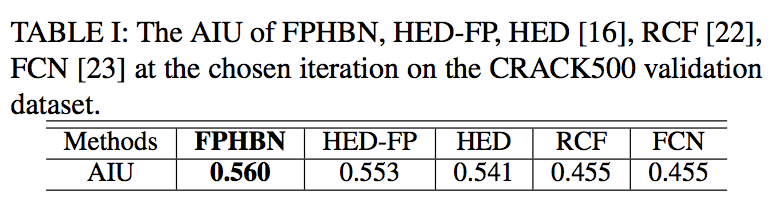

​	3) Cracktree200: Zou et al [4]는 제안된 방법을 평가하기 위한 데이터 세트를 제공합니다. 데이터 세트에는 다양한 유형의 균열이 있는 800 × 600 크기의 206개의 포장 이미지가 포함되어 있습니다. 따라서 이 데이터 세트의 이름은 Cracktree200입니다. 이 데이터 세트는 섀도, 오클루션, 저 대조도, 노이즈 등과 같은 과제를 안고 있습니다. 데이터 세트의 주석은 픽셀 단위 레이블로, 평가에 직접 사용할 수 있습니다. 

​	4) CFD: Si et al [2]에 CFD라고 하는 주석이 달린 도로 균열 데이터 세트를 제안합니다. 데이터 세트는 480×320 픽셀 크기의 118개의 이미지로 구성됩니다. 각 이미지에는 수동으로 균열 윤곽선 레이블이 지정되어 있습니다. 이미지를 획득하는 데 사용되는 장치는 iPhone5이며, 초점은 4mm, 조리개 f/2.4, 노출 시간은 1/135입니다. CFD는 모델을 평가하는 데 사용됩니다. 

​	5) Aigle-RN & ESAR & LCMS: Aigle-RN은 [14]에서 제안되며, 38개의 영상이 픽셀 레벨 주석을 가지고 있습니다. 데이터 세트는 Aigle-RN 시스템을 사용하여 프랑스 포장 표면 상태를 정기적으로 모니터링하기 위해 트래픽 속도로 획득됩니다. ESAR은 제어되는 조명이 없는 정적 획득 시스템에 의해 획득됩니다. ESAR에는 15개의 완전히 주석 처리된 균열 영상이 있습니다. LCMS에는 5픽셀 단위로 주석 처리된 크랙 영상이 포함되어 있습니다. 세 데이터 세트는 적은 수의 이미지를 가지고 있기 때문에 모델 평가를 위해 AEL이라는 하나의 데이터 세트로 결합됩니다. 

**C. 비교 방법 **

​	1) HED: HED [16]은 에지 탐지의 획기적인 연구입니다. NAT은 Crack500 교육 데이터에 대한 균열 감지를 위해 HED [16]를 교육하고 Crack500 검증 데이터를 사용하여 최적의 모델을 선택합니다. 교육 중에 하이퍼 파라미터는 기능 병합 작업 유닛을 제외하고 FPHBN과 같이 설정됩니다. 

​	2) RCF : RCF [22]는 에지 탐지를 위한 HED [16]을 기반으로 한 확장 작업입니다. 교육 및 검증 절차는 HED [16]과 동일합니다. 하이퍼 파라미터는 1e-9로 설정된 학습 속도를 제외하고 HED [16]와 동일하게 설정됩니다. 

​	3) FCN: FCN: 손실 기능을 균열 감지를 위해 지그모이드 교차 엔트로피 손실로 대체하여 FCN-8s [23]을 채택합니다. 사용된 교육 및 검증 데이터는 HED [16]의 데이터와 동일합니다. 하이퍼 파라미터: 기본 학습 속도가 0.00001, 모멘텀이 0.99로 설정되고 체중 감소가 0.0005.

​	4) CrackForest: CRACK500 교육 데이터에 대해 CrackForest [2]를 교육합니다. 모든 하이퍼 파라미터는 기본값으로 설정됩니다.

**D. 평가 기준 **

​	가장자리 검출과 유사하므로 가장자리 검출 기준을 직접 활용하여 균열 탐지를 위한 평가를 실시하는 것이 직관적입니다. 에지 탐지 도메인의 표준 기준은 고정 척도(ODS)에 대한 데이터 세트의 최적 F-측정, 각 이미지(OIS)에서 최상의 척도를 위한 데이터 세트의 집계 F-측정입니다. 

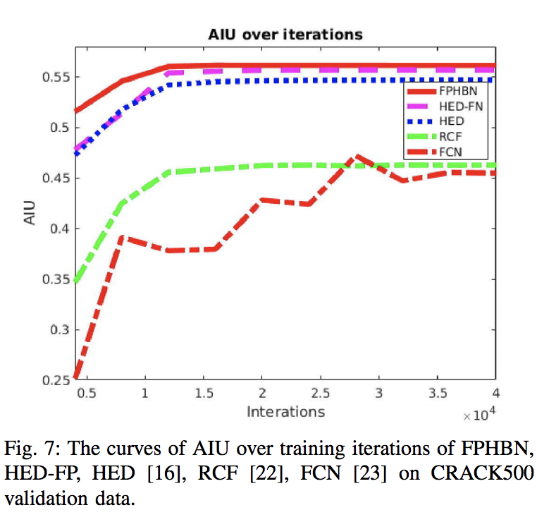

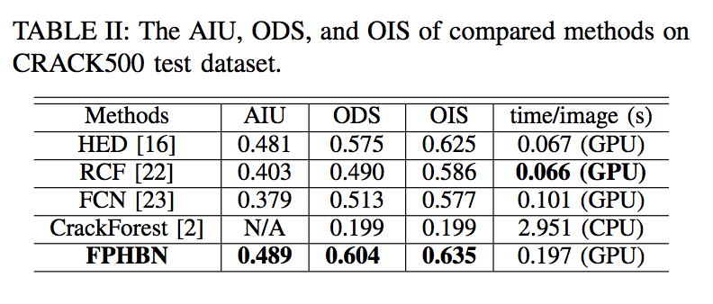

​	ODS 및 OIS의 정의는 max{2 Pt×Rt Pt+Rt : t = 0.01, 0.02, ..., 0.99} 및 1 Nimg PNimg i max{2 Pi t t t +Ri t : t = 0.0.01, 0.02, ..., 0.99}입니다. t는 임계값을 나타내며, i는 이미지 색인, Nimg는 총 이미지 수입니다. Pt와 Rt는 데이터 집합에서 임계값 t에서 정밀하고 호출됩니다. Pi t 및 Ri t는 이미지 i를 통해 계산됩니다. 두 기준의 상세한 정의에 대해서는 [49]를 참조합니다. 에지 접지 진위 주석(edge ground truth nothation)은 이진 경계 맵으로, 균열 주석이 이진 분할 맵인 일부 균열 데이터 세트의 접지 진위 주석과 다릅니다. 따라서 평가 중에 균열 감지 및 접지 진리는 NMS(Non-max suppression)에 의해 먼저 처리된 후 ODS 및 OIS를 계산하기 전에 1픽셀 너비로 얇게 처리됩니다. 예측 및 접지 진실의 정확한 일치에 허용되는 최대 허용 오차는 0.0075로 설정됩니다. 

​	제안된 새로운 측정값 AIU는 NMS와 박리 작동 없이 검출 및 접지 진실에 대해 계산됩니다. 이미지의 AIU는 1Nt X t Nt pg + Nt g - Nt pg(7)로 정의되며, 여기서 Nt는 간격 0.01의 임계값 t ∈ [0.01, 0.99]의 총 수를 나타냅니다. 지정된 임계값 t에 대해 Nt pg는 예측된 진리와 접지 균열 영역 사이에 교차되는 영역의 픽셀 수입니다. Pt와 Nt는 g 픽셀의 수입니다.각각 무자비한 균열 지역입니다. 따라서 AIU는 0에서 1 사이의 범위에 있으며 값이 높을수록 성능이 향상됩니다. 데이터 세트의 AIU는 데이터 세트에 있는 모든 이미지의 AIU 평균입니다. 

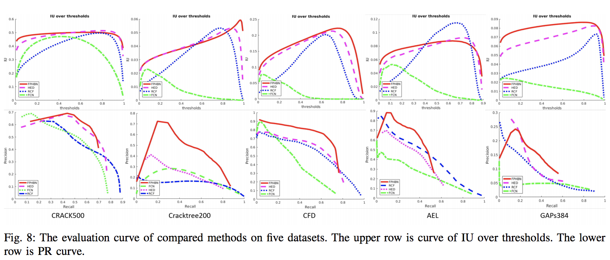

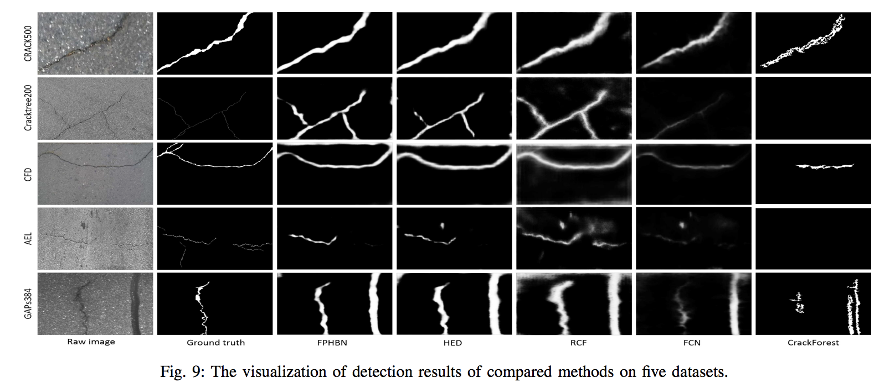

**E. 실험 결과 **

​	1) CRACK500에 대한 결과: CRACK500의 경우 검증 데이터를 사용하여 최상의 교육 반복을 선택합니다. 그림 7에서 AIU 메트릭스는 교육 반복을 통해 수렴되는 경향이 있습니다. 곡선을 기준으로 AIU 곡선이 수렴되었을 때 모델을 선택합니다. 즉, 12,000번째 반복에서 FPHBN, HED [16] 및 RCF [22]를 선택하고 36,000번째 반복에서 FCN [23]을 선택합니다. TABLE I을 통해 검증 데이터셋 FPHBN이 AIU 측면에서 RCF [22], HED [16], FCN [23]을 능가한다는 것을 알 수 있습니다. 

​	CRACK500 검증 세트에 대해 제안된 방법의 각 구성 요소의 기여도를 살펴봅니다. 표 I과 같이, 먼저 피쳐 피라미드를 HED, 즉 HED-FP에 소개합니다. 당초 HED와 비교하면 AIU가 0.541에서 0.553으로 개선된 것으로 관찰됩니다. 그런 다음 계층적 부스팅을 HED-FP, 즉 FPHBN에 통합합니다. AIU는 HED-FP에 비해 0.553에서 0.560으로 증가합니다. 기능 피라미드와 계층적 부스팅은 모두 성능 향상에 기여합니다. 

​	Crack500 테스트 데이터 세트에서는 비교 방법의 평가 곡선과 탐지 결과가 각각 그림 8의 첫 번째 열과 그림 9의 첫 번째 행에 나와 있습니다. IU(교차 초과 유니언) 곡선의 경우 FPHBN은 항상 다양한 임계값에 대해 상당히 유망한 IU를 가지고 있음을 알 수 있습니다. 정밀도 및 호출(PR) 곡선의 경우 FPHBN이 모든 비교 방법 중 가장 높습니다. CrackForest[2]의 출력은 이진 맵이므로 IU와 PR 곡선을 계산할 수 없고 관련 표에 ODS와 OIS 값만 나열할 수 없습니다. 

​	TABLE II에서와 같이 FPHBN은 ODS 측면에서 HED [16]에 비해 성능이 5% 향상되었습니다. 그림 9의 첫 번째 행에서, 우리는 FPHBN이 다른 것들보다 시각적으로 훨씬 더 선명한 균열 탐지를 얻는 것에 주목합니다. 

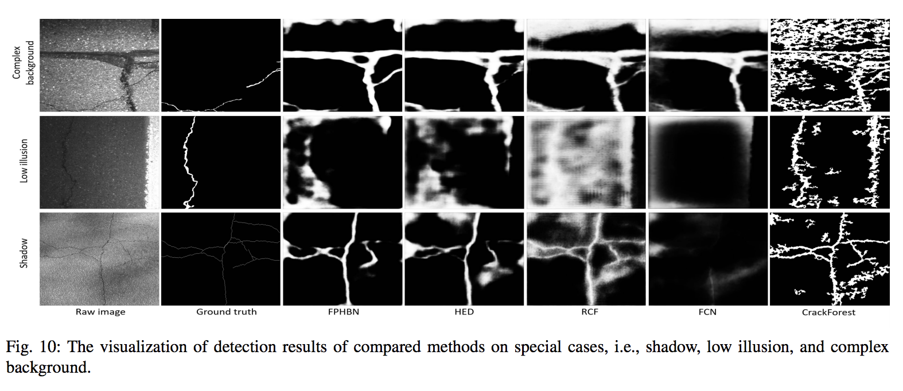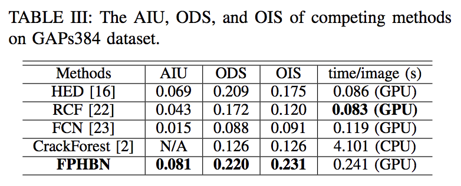

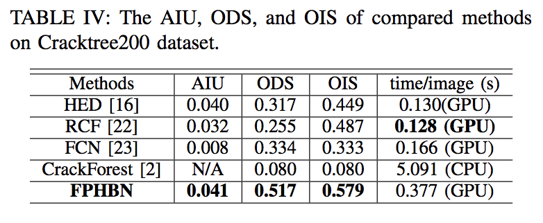

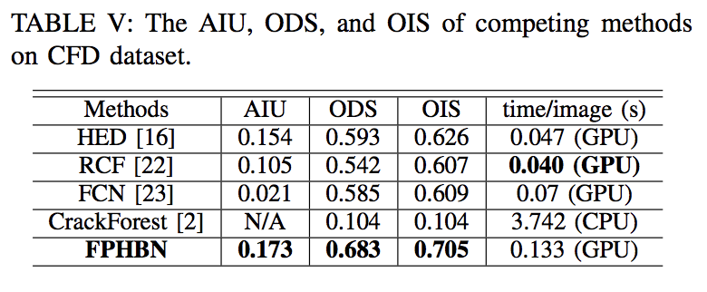

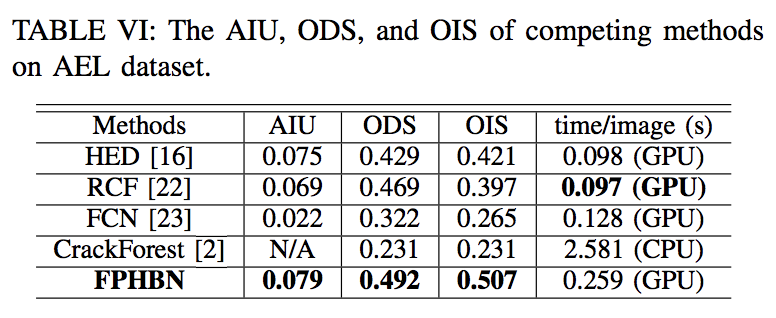

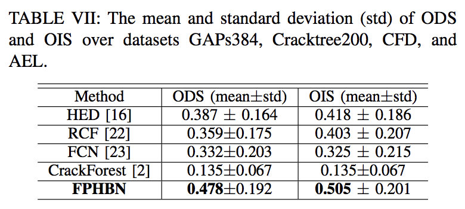

​	2) GAPs384 결과: 그림 8과 TABLE III에서, 제안된 FPHBN이 최고의 성능을 달성한다는 것을 알 수 있습니다. 하지만 향상된 성능은 다른 데이터 세트의 성능보다 훨씬 낮습니다. GAPs384 데이터 세트의 조명이 동일하지 않고 배경도 비슷하기 때문입니다. 예를 들어, 그림 9의 마지막 행에서 밀봉된 균열은 실제 균열 옆에 있으며 균열로 잘못 분류됩니다. 또한 비교한 모든 방법의 AIU 값은 매우 작습니다. GAPs384의 접지 진리는 폭이 하나 또는 여러 픽셀이기 때문입니다. 

​	3) 크랙트리200에 대한 결과: 그림 8의 두 번째 열과 그림 9의 두 번째 행에서 우리는 FPHBN이 최고의 성능을 얻는다는 것을 알 수 있습니다. 특히 PR곡선에서는 FPHBN이 큰 폭으로 성능을 향상시킵니다. TABLE IV에서는 FPHBN이 ODS와 OIS에서 각각 63.1%와 28.9%의 HED를 능가한다는 것을 알 수 있습니다. 

​	4) CFD 결과: 그림 8의 3번째 컬럼에서 FPHBN이 HED [16], RCF22], FCN [23]에 비해 우수한 성능을 달성한다는 것을 알 수 있습니다. TABLE V에서 FPHBN은 ODS와 OIS의 측면에서 HED [16]를 각각 15.2%, 12.6% 향상시킵니다. 

​	5) AEL 결과: 그림 8과 TABLE VI에서와 같이, RCF [22]가 IU 곡선에서 가장 높은 값을 얻지만, FPHBN에 의해 최고의 AIU가 달성됩니다. 그림 9에서 우리는 FPHBN이 훨씬 적은 위조를 가지고 있다는 것을 알 수 있습니다.TABLE VI에서 FPHBN은 ODS와 OIS를 각각 4.9%, 20.4% 증가시킵니다. 

**F. 교차 데이터셋 일반화 **

​	비교 방법의 일반화를 위해 NAT은 GAPs384, Cracktree200, CFD 및 AEL에 대한 ODS 및 OIS의 평균 및 표준 편차를 계산합니다. TABLE.VII는 정량적 결과를 보여줍니다. 제안된 FPHBN은 최상의 평균 ODS와 OIS를 달성하고 큰 차이로 두 번째 최고를 능가합니다. 이는 제안된 방법이 최신 방법보다 일반화 가능성이 훨씬 더 뛰어나다는 것을 보여줍니다. 제안된 방법의 우수한 성능의 이유는 다음 두 가지 측면에서 기인할 수 있습니다: 1. 상하의 피쳐 피라미드 구조를 통해 저층 계층으로 다중 규모의 컨텍스트 정보를 공급하여 균열 탐지를 위해 저층 계층에서 형상을 풍부하게 표현하고, 2. 계층적 증진에 의해 단단한 예 채굴이 수행됩니다. 이는 측면 네트워크가 상호 보완적인 방식으로 균열 감지를 수행하는 데 도움이 됩니다. 로우레벨 사이드 네트워크는 최종 감지 성능이 향상되도록 하이레벨 네트워크로 잘 분류되지 않은 픽셀에 초점을 맞춥니다. 

**G. 속도 비교 **

​	모든 데이터 세트에서 비교 방법의 추론 시간을 테스트합니다. CrackForest [2]는 GPU에 구현되지 않으므로 CPU 시간만 나열됩니다. TABLE I에서 VI까지, 제안된 FPHBN은 0.086s ~ 0.249s의 HED [16]보다 느립니다. 피쳐 피라미드는 각 측면 네트워크의 계산 비용을 증가시키기 때문입니다. 우리의 방법은 실시간은 아니지만, 하드웨어의 개발과 모델 압축 기술을 통해 속도를 향상시킬 수 있습니다 [50]. 

**H. 특별 사례 토론 **

​	제안 방법 및 최신 방법을 더 많이 비교 및 분석하기 위해, 우리는 복잡한 배경, 낮은 조명 및 그림자 같은 몇 가지 특수 사례에 대한 실험을 수행합니다. 그림 10은 모든 방법의 대표적인 결과를 보여줍니다. 복잡한 배경에서 실제 균열은 밀폐된 균열로 둘러싸여 있습니다. 이 경우 모든 알고리즘이 밀봉된 균열을 균열로 잘못 분류합니다. 제안된 FPHBN은 최신 방법과 비교하여 더 명확하고 더 나은 결과를 산출합니다(그림 10의 첫 번째 행). 이 방법들이 실패한 이유는 균열과 밀봉된 균열 사이의 유사한 패턴 때문입니다. 

​	조도가 낮은 상태에서는 모든 방법이 균열을 감지하지 못합니다. 교육 데이터에서는 이러한 시나리오를 볼 수 없기 때문입니다. 적절한 데이터 확대로 문제를 어느 정도 해결할 수 있습니다. 섀도가 있는 씬(scene)의 경우 HED [16]와 비교하여 제안된 FPHBN은 훨씬 적은 양의 거짓 양수를 생성합니다. 이는 FPHBN이 형상 피라미드 및 계층적 부스팅에 기여할 수 있는 HED [16]보다 그림자에 더 강하다는 것을 나타냅니다. 

### 5. Conclusion

이 작업에서는 포장 균열 감지를 위한 피쳐 피라미드 및 계층적 부스팅 네트워크(FPHBN)가 제안됩니다. 피쳐 피라미드는 높은 수준의 층에서 나온 의미 정보를 피라미드 방식으로 통합하여 낮은 수준의 특징을 풍부하게 하기 위해 도입됩니다. 계층적 부스팅 모듈은 표본을 계층적 방식으로 재가중함으로써 어려운 예를 다루기 위해 제안됩니다. 두 구성 요소를 HED [16]에 통합하면 FPHBN이 제안됩니다. 새로운 균열 감지 측정, 즉 AIU가 제안되었습니다. 광범위한 실험은 FPHBN의 우수성과 일반성을 입증하기 위해 수행됩니다.

### References

[1] L. Zhang, F. Yang, Y. D. Zhang, and Y. J. Zhu, “Road crack detection using deep convolutional neural network,” in ICIP, 2016, pp. 3708–3712. 

[2] Y. Shi, L. Cui, Z. Qi, F. Meng, and Z. Chen, “Automatic road crack detection using random structured forests,” IEEE Transactions on Intelligent Transportation Systems, vol. 17, no. 12, pp. 3434–3445, 2016. 

[3] Y. Huang and B. Xu, “Automatic inspection of pavement cracking distress,” Journal of Electronic Imaging, vol. 15, no. 1, pp. 013 017– 013 017, 2006. 

[4] Q. Zou, Y. Cao, Q. Li, Q. Mao, and S. Wang, “Cracktree: Automatic crack detection from pavement images,” Pattern Recognition Letters, vol. 33, no. 3, pp. 227–238, 2012. 

[5] S. J. Schmugge, L. Rice, J. Lindberg, R. Grizziy, C. Joffey, and M. C. Shin, “Crack segmentation by leveraging multiple frames of varying illumination,” in WACV, 2017, pp. 1045–1053. 

[6] M. S. Kaseko and S. G. Ritchie, “A neural network-based methodology for pavement crack detection and classification,” Transportation Research Part C: Emerging Technologies, vol. 1, no. 4, pp. 275–291, 1993. 

[7] M. R. Jahanshahi, S. F. Masri, C. W. Padgett, and G. S. Sukhatme, “An innovative methodology for detection and quantification of cracks through incorporation of depth perception,” Machine vision and applications, pp. 1–15, 2013. 

[8] F. Liu, G. Xu, Y. Yang, X. Niu, and Y. Pan, “Novel approach to pavement cracking automatic detection based on segment extending,” in International Symposium on Knowledge Acquisition and Modeling, 2008, pp. 610–614. 

[9] S. Chanda, G. Bu, H. Guan, J. Jo, U. Pal, Y.-C. Loo, and M. Blumenstein, “Automatic bridge crack detection–a texture analysis-based approach,” in IAPR Workshop on Artificial Neural Networks in Pattern Recognition, 2014, pp. 193–203. 

[10] R. Medina, J. Llamas, E. Zalama, and J. Gomez-Garc ´ ´ıa-Bermejo, “Enhanced automatic detection of road surface cracks by combining 2d/3d image processing techniques,” in ICIP, 2014, pp. 778–782. 

[11] J. Zhou, P. S. Huang, and F.-P. Chiang, “Wavelet-based pavement distress detection and evaluation,” Optical Engineering, vol. 45, no. 2, pp. 027 007–027 007, 2006. 

[12] R. Kapela, P. Sniatała, A. Turkot, A. Rybarczyk, A. Po ´ zarycki, P. Ry- ˙ dzewski, M. Wyczałek, and A. Błoch, “Asphalt surfaced pavement cracks detection based on histograms of oriented gradients,” in International Conference Mixed Design of Integrated Circuits & Systems, 2015, pp. 579–584. 

[13] Y. Hu and C.-x. Zhao, “A novel lbp based methods for pavement crack detection,” Journal of Pattern Recognition Research, vol. 5, no. 1, pp. 140–147, 2010. 

[14] R. Amhaz, S. Chambon, J. Idier, and V. Baltazart, “Automatic crack detection on two-dimensional pavement images: An algorithm based on minimal path selection,” IEEE Transactions on Intelligent Transportation Systems, vol. 17, no. 10, pp. 2718–2729, 2016. 

[15] K. Fernandes and L. Ciobanu, “Pavement pathologies classification using graph-based features,” in ICIP, 2014, pp. 793–797. 

[16] S. Xie and Z. Tu, “Holistically-nested edge detection,” in ICCV, 2015, pp. 1395–1403. 

[17] H. Oliveira and P. L. Correia, “Automatic road crack detection and characterization,” IEEE Transactions on Intelligent Transportation Systems, vol. 14, no. 1, pp. 155–168, 2013. 

[18] T. S. Nguyen, S. Begot, F. Duculty, and M. Avila, “Free-form anisotropy: A new method for crack detection on pavement surface images,” in ICIP, 2011, pp. 1069–1072. 

[19] L. Pauly, H. Peel, S. Luo, D. Hogg, and R. Fuentes, “Deeper networks for pavement crack detection,” in Proceedings of the International Symposium on Automation and Robotics in Construction, vol. 34, 2017. 

[20] M. Eisenbach, R. Stricker, D. Seichter, K. Amende, K. Debes, M. Sesselmann, D. Ebersbach, U. Stoeckert, and H.-M. Gross, “How to get pavement distress detection ready for deep learning? a systematic approach,” in International Joint Conference on Neural Networks, 2017, pp. 2039–2047. 

[21] P. Dollar and C. L. Zitnick, “Structured forests for fast edge detection,” ´ in ICCV, 2013, pp. 1841–1848. 

[22] Y. Liu, M.-M. Cheng, X. Hu, K. Wang, and X. Bai, “Richer convolutional features for edge detection,” in CVPR, 2017, pp. 5872–5881.

[23] J. Long, E. Shelhamer, and T. Darrell, “Fully convolutional networks for semantic segmentation,” in CVPR, 2015, pp. 3431–3440. 

[24] P. Subirats, J. Dumoulin, V. Legeay, and D. Barba, “Automation of pavement surface crack detection using the continuous wavelet transform,” in ICIP, 2006, pp. 3037–3040. 

[25] W. Huang and N. Zhang, “A novel road crack detection and identification method using digital image processing techniques,” in International Conference on Computing and Convergence Technology, 2012, pp. 397– 400. 

[26] L. Peng, W. Chao, L. Shuangmiao, and F. Baocai, “Research on crack detection method of airport runway based on twice-threshold segmentation,” in International Conference on Instrumentation and Measurement, Computer, Communication and Control, 2015, pp. 1716–1720. 

[27] W. Xu, Z. Tang, J. Zhou, and J. Ding, “Pavement crack detection based on saliency and statistical features,” in ICIP, 2013, pp. 4093–4097. 

[28] S. Chambon and J.-M. Moliard, “Automatic road pavement assessment with image processing: Review and comparison,” International Journal of Geophysics, vol. 2011, 2011. 

[29] J. Tang and Y. Gu, “Automatic crack detection and segmentation using a hybrid algorithm for road distress analysis,” in International Conference on Systems, Man, and Cybernetics, 2013, pp. 3026–3030. 

[30] M. Quintana, J. Torres, and J. M. Menendez, “A simplified computer ´ vision system for road surface inspection and maintenance,” IEEE Transactions on Intelligent Transportation Systems, vol. 17, no. 3, pp. 608–619, 2016. 

[31] S. Varadharajan, S. Jose, K. Sharma, L. Wander, and C. Mertz, “Vision for road inspection,” in WACV, 2014, pp. 115–122. 

[32] H. Zakeri, F. M. Nejad, A. Fahimifar, A. D. Torshizi, and M. F. Zarandi, “A multi-stage expert system for classification of pavement cracking,” in Joint IFSA World Congress and NAFIPS Annual Meetin, 2013, pp. 1125–1130. 

[33] M. Yan, S. Bo, K. Xu, and Y. He, “Pavement crack detection and analysis for high-grade highway,” in International Conference on Electronic Measurement and Instruments, 2007, pp. 4–548. 

[34] A. Ayenu-Prah and N. Attoh-Okine, “Evaluating pavement cracks with bidimensional empirical mode decomposition,” EURASIP Journal on Advances in Signal Processing, vol. 2008, no. 1, p. 861701, 2008. 

[35] M. Kass, A. Witkin, and D. Terzopoulos, “Snakes: Active contour models,” International Journal of Computer Vision, vol. 1, no. 4, pp. 321–331, 1988. 

[36] V. Kaul, A. Yezzi, and Y. Tsai, “Detecting curves with unknown endpoints and arbitrary topology using minimal paths,” PAMI, vol. 34, no. 10, pp. 1952–1965, 2012. 

[37] A. Krizhevsky, I. Sutskever, and G. E. Hinton, “Imagenet classification with deep convolutional neural networks,” in Advances in Neural Information Processing Systems, 2012, pp. 1097–1105. 

[38] C. Feng, M.-Y. Liu, C.-C. Kao, and T.-Y. Lee, “Deep active learning for civil infrastructure defect detection and classification,” in Computing in Civil Engineering, 2017, pp. 298–306. 

[39] V. Badrinarayanan, A. Kendall, and R. Cipolla, “Segnet: A deep convolutional encoder-decoder architecture for image segmentation,” arXiv preprint arXiv:1511.00561, 2015. 

[40] H. Fan, X. Mei, D. Prokhorov, and H. Ling, “Multi-level contextual rnns with attention model for scene labeling,” IEEE Transactions on Intelligent Transportation Systems, no. 99, pp. 1–11, 2018. 

[41] K. Simonyan and A. Zisserman, “Very deep convolutional networks for large-scale image recognition,” arXiv preprint arXiv:1409.1556, 2014. 

[42] T.-Y. Lin, P. Dollar, R. Girshick, K. He, B. Hariharan, and S. Be- ´ longie, “Feature pyramid networks for object detection,” arXiv preprint arXiv:1612.03144, 2016. 

[43] C.-Y. Lee, S. Xie, P. Gallagher, Z. Zhang, and Z. Tu, “Deeply-supervised nets,” in Artificial Intelligence and Statistics, 2015, pp. 562–570. 

[44] A. Shrivastava, A. Gupta, and R. Girshick, “Training region-based object detectors with online hard example mining,” in CVPR, 2016, pp. 761– 769. 

[45] P. Viola and M. Jones, “Rapid object detection using a boosted cascade of simple features,” in CVPR, vol. 1, 2001, pp. I–I. 

[46] S. R. Bulo, G. Neuhold, and P. Kontschieder, “Loss max-pooling for semantic image segmentation,” arXiv preprint arXiv:1704.02966, 2017. 

[47] T.-Y. Lin, P. Goyal, R. Girshick, K. He, and P. Dollar, “Focal loss for ´ dense object detection,” arXiv preprint arXiv:1708.02002, 2017. 

[48] Y. Jia, E. Shelhamer, J. Donahue, S. Karayev, J. Long, R. Girshick, S. Guadarrama, and T. Darrell, “Caffe: Convolutional architecture for fast feature embedding,” in ACM international conference on Multimedia, 2014, pp. 675–678. 

[49] P. Arbelaez, M. Maire, C. Fowlkes, and J. Malik, “Contour detection and hierarchical image segmentation,” PAMI, vol. 33, no. 5, pp. 898–916, 2011. 

[50] S. Han, H. Mao, and W. J. Dally, “Deep compression: Compressing deep neural networks with pruning, trained quantization and huffman coding,” arXiv preprint arXiv:1510.00149, 2015. Fan Yang received the B.S