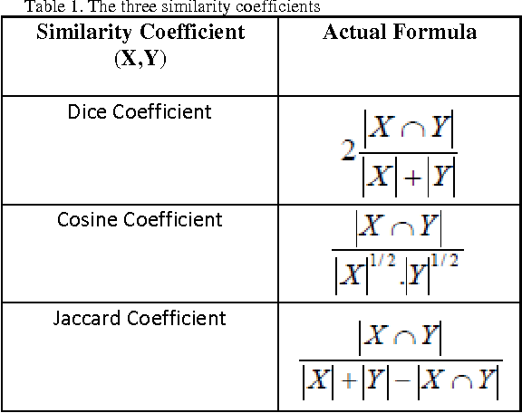

## 유사도 측정 방법

다이스 계수는 
$$
2\frac{|X|\cap|Y|}{|X|+|Y|}
$$

코사인 계수는
$$
\frac{|X\cap Y|}{|X|^{1/2}|Y|^{1/2}}
$$

자카드 계수는 
$$
\frac{|X\cap Y|}{|X|+|Y|-|X\cap Y|}
$$

이외에도 유클리디언 거리 , 벡터 내적곱 등이 있다.

## Reference

> @inproceedings{Thada2013ComparisonOJ,  title={Comparison of Jaccard , Dice , Cosine Similarity Coefficient To Find Best Fitness},  author={Vikas Thada and Vivek Jaglan},  year={2013} }