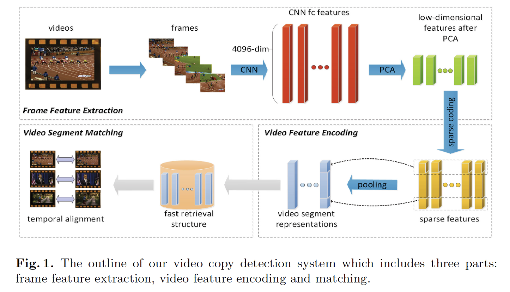

## Compact CNN Based Video Representation for Efficient Video Copy Detection

Ling Wang, Yu Bao, Haojie Li(B) , Xin Fan, and Zhongxuan Luo

**Keywords** : Video copy detection · Convolutional neural network · Sparse coding · Video level representation · Dense sampling

## Abstract

* 콘텐츠 기반의 비디오 복사 탐지 시스템이다.
* 대부분 콘텐츠 기반 비디오 복사 탐지 시스템(CCD)는 sparse한 샘플링된 특징을 사용한다.
* 이 논문은 CNN기반의 컴팩트한 비디오 표현과 sparse coding(SC)를 사용해서 비디오 복사를 탐지한다.
* 이 제안된 방법은 두가지 장점이 있다. 
  * 첫 번째는 샘플링 프레임 레이트에 관계없이 컴팩트하다. 
  * 두 번째는 비디오 복사 탐지를 위해 밀도있는 샘플링된 CNN 특징들을 인코딩해서 discriminative하다.
* 이 논문이 게재된 기점에 VCDB 데이터셋에 대해 비디오 복사 탐지 SOTA이다.

## 1. Introduction

* 콘텐츠 기반 비디오 복사 탐지는 쿼리 비디오가 테스트 비디오의 일부분을 가지고 있는지 아닌지를 판단하는 task이다. 
* 복사 탐지는 광범위한 잠재적인 애플리케이션을 갖고 있다. Copyright control, vusiness intelligence가 그 예시이다. 그래서 지난 세기동안 많은 연구가 진행되어왔다.
* 복제 세그먼트는 몇 가지 왜곡을 갖고 있고, 길이는 원본 비디오만큼 길거나 1초보다 짧을 수 있다.
* 다양한 왜곡들은 까다로운 문제인데, 이 문제를 다루기 위해, TREC 비디오 검색 평가(TRECVID)가 콘텐츠기반 비디오 복사 탐지 벤치마크로 개방되었다. 이 컴페티션은 2008년부터 2011년까지 진행되었다.
* 많은 솔루션이 있었지만, 가장 유명한 방법은 SIFT와 같은 local feature를 사용하여 temporal alignment에 따른 유사한 프레임쌍을 찾는 것이다. 이 방법에서 BoVW 표현방법과 inverted files와 같은 방법이 넓게 채택되었다. 실제로 완벽에 가까운 성능을 달성할 수 있었다.
* 시뮬레이트된 데이터인 TRECVID는 실제 복제 비디오를 반영하지는 못했다. 그 이유는 실제 복제 비디오는 더 복잡한 형태의 변형들이 존재하기 때문이다.
* 감당할 수 없이 많은 연산을 피하고 저장부담을 줄이기 위해 대부분 sparse하게 샘플링된 프레임에서 특징을 추출한다. 예를 들어, 초당 1프레임 또는 2프레임을 추출하는 식이다.
* Sparse Sampling은 프레임을 떨어뜨리면서 유용한 정보들을 놓칠 수 있다. 그래서 더많은 비디오 세그먼트 정보를 인코딩할 수 있다면, 탐지 퍼포먼스가 더 개선될 것이라고 여긴다.
* 반면, 딥러닝 접근방법인 CNN은 distinctive한 이미지와 오브젝트 특징을 추출하는데 powerful한 퍼포먼스를 보여주고 있다.
* CNN 특징들은 전통적인 방법들보다 더 나은 퍼포먼스를 보여준다는 것이 증명되었다.
* dense하게 샘플링된 프레임의 CNN특징을 인코딩을 제안한다. CNN fully-connected layer의 특징을 PCA를 사용해서 차원을 줄이고 그 후 sparse coding을 사용해서 각 프레임 특징을 M 코드 셋에 sparse하게 할당한다.
* 그래서 M-차원의 sparse한 벡터가 각각의 프레임별로 얻어진다. 이 후, Max-pooling을 이 벡터에 수행한다.
* 이 논문의 기여는 두가지이다. 
  * 첫 번째 기여는 이 제안된 비디오 레벨의 표현은 빠른 검색을 할 수 있고, 더 작은 저장용량이 필요하도록 컴팩트하게 만든다는 점이다.
  * 두 번째 기여는 dense하게 샘플링된 프레임 CNN 특징을 인코딩하면서 전통적인 방법을 상회하는 성능을 냈다는 점이다.

## 2. Related Work

* 비디오 복사 탐지는 많은 연구가 진행되어 왔고 두 가지 접근 방법으로 진행되어 왔다.
  * 첫 번째는 local feature 기반의 방법이다
  * 두 번째는 global feature 기반의 방법이다.
* **LBP**는 **Multiple feature hashing for real-time large scale near-duplicate video retrieval.**에서 , 
* **LBP-CS**는 **Description of interest regions with local binary patterns** 에서, 
* **SIFT**는 **An image-based approach to video copy detection with spatio-temporal post-filtering** 논문 에서 각각 사용되었다. 
* **An image-based approach to video copy detection with spatio-temporal post-filtering** 논문에서는 local feature들을 visual word로 클러스터링하고, 이미지는 BoVW 모델로 표현했다.
* Inverted file은 빠른 검색을 위한 이미지를 인덱싱하기 위한 방법으로 채택되었다.
* **Hamming embedding and weak geometric consistency for large scale image search** 논문에서 해밍 임베딩(HE)은 local feature 매칭의 정확도를 개선시키고자 클러스터를 하위 공간으로 쪼갰다.
* 반면에 약한 기하 일관성(WGC)는 틀린 특징간 매칭을 제거하는데 사용된다.
* BoVW, HE그리고 WGC 모두 근복사된 비디오 탐지에 효율적으로 작동한다.
* 이 방법들은 sparse하게 샘플링된 프레임에 대해서 local feature를 추출한다. 
* 그러나 하나의 비디오 프레임은 수천개의 local feature를 생산하기 때문에 여전히 무거운 저장용량의 부담을 주고 많은 프레임 특징을 검색해야하는 단점이 여전히 존재한다.
* 이에 대한 해결책으로, **Practical elimination of near-duplicates from web video search** 논문에서 비슷한 비디오를 탐지하기 위해 프레임 특징으로서 색상 히스토그램을 추출했다. 
* **Compact video description for copy detection with precise temporal alignment** 논문에서, Fisher Vector(FV)와 동일한 표현이 local feature를 global feature로 aggregate하는 방식으로 제안되었다.
* **Partial copy detection in videos: a benchmark and an evaluation of popular methods** 논문에서, 고정된 간격으로 프레임을 샘플링하고, CNN기반의 특징을 각 샘플링된 프레임으로부터 추출한다. 여기서 CNN을 구현하는 두가지 방법이 있는데, 하나는 기본적인 CNN(Alexnet)이 있고, 4096차원의 fully connected layer 특징이 프레임별로 생성된다. 나머지 하나는 이미지에 대한 패치에 대한 supervised CNN 구조의 Sianmese convolutional neural network(SCNN)의 특징을 추출한다. 이 특징은 64차원에서 512차원까지의 범위를 가진다.  
* 이 방법들은 빠른 검색을 위해 고안되었다.
* 최종적으로 **Scalable detection of partial nearduplicate videos by visual-temporal consistency** 논문에서, 매칭된 결과를 원본 비디오에 정렬하기 위해서 temporal network를 사용한다. 
* **VCDB: a large-scale database for partial copy detection in videos** 논문에서, temporal network가 temporal alignment에서 전통적인 방식인 Hough Voting Alignment 방법보다 적합하다는 것을 증명했다.
* 위의 방식들은 dense하게 샘플링된 프레임보다 sparse하게 샘플링된 프레임에서 특징을 추출한 방식이 대부분이었다.
* 이 논문에서는 정보 손실을 일으키지 않기 위한 최대한 Compact하고 discriminative한 표현을 만드는 것을 목표로 한다.

## 3. Compact Video Representation

* 

* 크게 세부분으로 나눌 수 있다. 프레임 특징 추출, 비디오 특징 인코딩, 매칭 부분이다.