## Efficient Copy Detection for Compressed Digital Videos by Spatial and Temporal Feature Extraction

### Abstract

​	이 연구는 조사된 비디오가 지적 재산권을 침해할 수 있는 복제본인지 여부를 결정하기 위한 실용적인 비디오 복사 탐지 메커니즘을 개발하는 것을 목표로 한다. 원본 비디오의 중요한 기능을 추출하여 서버에 저장한다. 업로드된 비디오를 통해 동일한 기능을 추출하여 저장된 기능과 비교함으로써 가능한 일치를 모색한다. 압축된 비디오의 공간적 특성과 시간적 특성은 모두 제안된 체계에서 활용된다. 장면 변경 검출은 주요 프레임을 선택하기 위해 적용되며, 여기서 시각적으로 유사한 프레임을 검색할 수 있도록 견고한 공간적 특징을 추출한다. 샷 길이는 매칭 정확도를 더욱 보장하기 위해 시간적 특성으로 사용된다. 제안된 방법이 고려된 애플리케이션에서 실용성을 보장하기 위해 서버에 저장된 형상의 크기, 매칭 형상의 효율성 및 정확성이 주요 설계 원칙이다. 많은 수의 압축 비디오를 시험한 실험 결과는 제안된 계획의 실현 가능성을 보여준다.

**Keywords** Copy detection · video coding · feature extraction · content management ·
multimedia databases · copyright protection

### 1. Introduction

​	디지털 비디오는 가격이 저렴하지만 점점 더 강력해지는 개인용 컴퓨터의 확산, 고속 네트워킹 시설의 보급 및 고급 비디오 코딩 기술 덕분에 요즘 다양한 미디어에 널리 보급되고 있습니다. 많은 멀티미디어 서비스 제공업체들은 디지털 비디오를 업로드하고 공유할 수 있는 편리한 플랫폼을 개발합니다. 이러한 플랫폼은 디지털 콘텐츠의 확산을 더욱 촉진합니다. 비록 사용자들은 분명 그러한 편리함을 즐기고 다양한 비디오를 보는 것을 즐기지만, 많은 비디오들이 허락 없이 제공되거나 지적 재산권을 침해할 수 있기 때문에 콘텐츠 소유자들은 항상 지지하지 않을 수도 있습니다. 서비스 제공업체는 특정 동영상을 삭제하도록 요청받거나 저작권 침해로 고소당할 수도 있습니다. 따라서, 저작권 보호 문제는 비디오 서버나 서비스 제공업체가 이러한 논란이나 분쟁을 줄이는데 있어 매우 중요해집니다. 

​	매일 많은 수의 비디오 클립이 비디오 서버에 업로드되고 있기 때문에, 저작권을 침해할 수 있는 비디오 클립을 찾는 것은 어려운 과제입니다. 디지털 워터마킹과 컨텐츠 매칭은 두 가지 잠재적 솔루션입니다. 디지털 워터마킹에서는 비디오 콘텐츠 공급자가 감지할 수 없는 신호, 즉 디지털 워터마크를 분산 비디오에 삽입하여 소유권을 주장할 수 있습니다. 비디오 서버에는 워터마크 감지기가 제공되어 일단 업로드된 비디오 클립이 워터마크 신호의 존재를 확인하여 저작권이 있는 자료에 속하는지 여부를 조사할 것입니다. 복사 감지를 위한 디지털 워터마크의 일반적인 요구사항에는 지각 불가능성, 낮은 거짓 탐지율 및 콘텐츠 보존 처리에 대한 견고성이 포함됩니다. 디지털 워터마킹의 방법론은 우아해 보이지만, 어떤 문제가 존재합니다. 우선, 워터마크를 이미 배포된 비디오 컨텐츠에 포함시킬 수 없기 때문에 새로 발행된 일부 비디오만 보호됩니다. 또한 콘텐츠 공급자는 디지털 워터마크의 요구사항/기술에 대해 서로 다른 의견을 가질 수 있으므로 다양한 워터마크 방식을 사용할 수 있습니다. 업로드된 각 비디오 클립에 여러 가지 워터마크 탐지 절차(다양한 콘텐츠 공급자)를 적용해야 하므로 워터마크 검출의 효율성이 떨어집니다. 디지털 워터마킹의 표준화가 해결책이 될 수 있지만 성공률이 낮은 것으로 입증되었습니다. 이러한 문제를 해결하기 위해 일부 인기 비디오 서버는 콘텐츠 공급자가 분산 작업에 참여할 수 있도록 자체 워터마크를 제안합니다. 그럼에도 불구하고 동영상 콘텐츠 제공업체들은 앞으로 콘텐츠가 비디오 서버에 의해 제어될 수 있다는 우려 때문에 이런 신호를 내장하는 것을 꺼리고 있습니다. 게다가 워터마크 임베딩의 추가 비용 및 비디오 콘텐츠의 품질 저하 가능성 또한 콘텐츠 공급업체가 워터마크 기술을 수용하는 데 걸림돌이 되고 있습니다. 

​	콘텐츠 일치 방법론에서 업로드된 비디오 클립은 복사 여부를 식별하기 위해 아카이브된 데이터와 일치합니다. 디지털 워터마킹과 비교하여, 컨텐츠 기반 접근법은 워터마크 임베딩과 같은 추가 절차를 원래 컨텐츠를 배포하기 전에 적용할 필요가 없다는 점에서 우위를 점하고 있습니다. 배포된 콘텐츠의 품질은 전혀 영향을 받지 않습니다. 게다가, 비디오 서버에 저작권이 있는 자료에 대한 정보가 있는 한 이론적으로 일치하는 프로세스를 적용할 수 있기 때문에 더 많은 비디오가 보호될 것입니다. 그러나 콘텐츠 소유자의 공유가 꺼려지고 대용량 스토리지의 요구로 인해 비디오 서버가 원본 비디오를 모두 소유하는 것은 비현실적입니다. 데이터베이스에 있는 대량의 비디오도 비디오 콘텐츠를 추적하기가 어렵습니다. 매일 업로드되는 많은 수의 비디오가 이 문제를 더욱 악화시킵니다. 또한 비디오 공급자는 비디오 콘텐츠를 매우 소중히 여기고 있으며 이러한 디지털 자산을 비디오 웹 서버와 공유하지 않을 것입니다. 실용적이고 효율적인 비디오 컨텐츠 매칭을 달성하기 위해 비디오 자체 대신 비교를 위해 비디오에서 중요한 기능을 추출/저장하는 것이 한 가지 해결책입니다. 기능의 데이터 볼륨은 비디오보다 훨씬 작기 때문에 스토리지 문제를 줄일 수 있습니다. 콘텐츠 공급자는 동일한 기능 추출 방법으로 동영상을 처리한 다음 추출된 정보를 비디오 서버에 제공하여 복사 탐지를 수행할 수 있습니다. 

​	기존 방법은 이미지에서 공간적 기능을 추출하고 비디오에서 시간적 기능을 신뢰할 수 있는 콘텐츠 "해시"로 추출하는 것입니다. 시각적으로 유사한 콘텐츠는 일반적으로 트랜스코딩 또는 다른 프로세스 후에 보존되는 유사한 색상 통계를 가져야 하므로, 색상 히스토그램은 내용 기반 검색에 중요한 기능입니다 [1–3]. Hsu 등입니다. [4] 영상 컨텐츠에 따라 비디오 프레임을 하위 이미지로 분할할 것을 제안하고 각 파티션에 대한 로컬 컬러 히스토그램을 컨텐츠 매칭에 사용합니다. 색상 히스토그램만 사용하는 주요 문제는 다른 콘텐츠의 색이 유사할 수 있으므로 "충돌" 비율이 더 높다는 것입니다. 이미지 해싱 기법을 명시적으로 결합하면 비디오 구조가 선호되는 접근 방식이 될 수 있습니다. 예를 들어 비디오 샷 경계는 다음 프로세스에 대해 키 프레임을 선택할 수 있도록 감지됩니다. 긴 비디오는 중요한 정보를 잃지 않고 크기가 작은 하위 비디오로 축소될 수 있습니다. 많은 알고리즘이 비디오 샷 추출[5]을 위해 제안되었으며, 대략적으로 픽셀 도메인 및 압축 도메인 접근방식 등 두 범주로 나눌 수 있습니다. 픽셀 도메인 접근 방식에서 히스토그램 및 에지 차이를 사용하여 명백한 색상 차이가 있는 인접 샷을 찾을 수 있습니다. DC 값과 같은 기능에서는 내부/인터 코딩된 매크로블록 및 모션 벡터 수가 사용됩니다. 인코딩된 비디오가 전체 프레임으로 확장되는 것을 피할 수 있다는 이점이 있습니다. 키 프레임 추출에 대해, Zhang [6]은 클러스터링 아이디어를 채택할 것을 제안했습니다. 키 프레임은 유사한 샷을 조합하여 샷의 프레임 순서에 따라 클러스터로 나눈 후 선택합니다. Wolf [7]는 샷의 광학 흐름을 이용하여 키 프레임을 검색합니다. 왕 등입니다. [8] 압축 도메인에서 키 프레임을 선택하고 위치와 함께 큰 모션 강도를 사용하여 정확도를 높였습니다. 그들은 다음의 두 가지 규칙을 사용했습니다. 첫째, 키 프레임은 동작 강도가 커야 하며, 둘째, 움직임의 공간 분포는 양쪽 끝을 흩뜨리기 보다는 샷의 중심에 초점을 맞춰야 합니다. 대략적인 집합 이론[9]은 성능을 향상시키기 위해 추가로 사용됩니다. 류 외입니다. [10] 에너지 피크가 핵심 프레임인 프레임을 찾기 위해 이른바 "Perceed Motion Energy" 모델을 제안했습니다. 우 등입니다. [11] 샷 길이를 시간적 특성으로 사용할 것을 제안합니다. 빠른 일치 알고리즘(즉, 접미사 문자열 매칭)을 사용하여 효율적으로 검출할 수 있었습니다. 시간 정보만 사용되며 DC 값 및 색상 히스토그램 추출과 같은 추가 절차는 채택되지 않습니다. 루버 외입니다. [12] 키 프레임 세트를 선택한 다음 방사형 프로젝트 벡터를 계산하여 이산 코사인 변환(DCT) 계산을 위한 180개의 벡터를 형성합니다. 코스쿤 등입니다. [13] 공간 시간적 변환을 사용하여 시간적 데이터를 명시적으로 사용했습니다. 공간 및 시간 영역 정규화를 적용한 다음 해시 구성을 위한 시간 정보를 포함하도록 3D-DCT를 계산했습니다. Zargari 등[14]은 H.264/AVC의 영상 인덱싱 또는 검색을 위한 압축 도메인 기능 추출 접근 방식을 제안했습니다. 내부 코딩에서 공간 예측 히스토그램이 설명자로 사용됩니다. 회전 및 축척도 고려되어 견고성을 높입니다. 많은 방법들은 비디오 요약 또는 거의 중복된 비디오 검색을 생성하기 위한 관심 지점의 추출에 의존합니다 [15,16]. 링 등입니다. [17] 이미지 복사 감지를 위한 다중 규모 설명자를 제안했습니다. 일련의 SIFT [18] 설명자가 추출되고 Principle Component Analysis가 적용되어 2진수 코드를 색인화 지문으로 형성합니다. Kang 등입니다. [19] 또한 이미지 복사 감지 및 인식에 대한 희소 표현을 기반으로 한 보안 SIFT 기반 접근 방식을 제안했습니다. 저우 등입니다. [20] 비디오 샷 분할에 관심 지점을 선택했습니다. 루 등입니다. [21] 중요한 현지 기술자 또는 기능을 추출하기 위한 백오십 모델을 제안하였습니다. Song [22]에서는 거의 중복되지 않는 비디오 검색에서 정확성과 확장성 문제를 모두 해결할 수 있는 다양한 기능 해싱 방식을 발표했습니다. 일치하는 SIFT 설명자의 계산 부하가 높은 것을 고려하면, 류 외는 다음과 같습니다. [23]에서는 차원을 줄이기 위해 SVD(Singleular Value Decomposition)를 채택하고 비디오 분할을 위한 그래프 기반 방법을 제안했습니다.

​	기존 비디오 복사 탐지 방법은 꽤 많았지만, 대부분은 일치하는 정밀도를 보장하기 위해 원시 비디오에서 피쳐를 추출하는 데 의존합니다. 이러한 방법론은 서버의 저장 및 계산 부하를 크게 증가시킬 수 있습니다. 비디오 복사본을 검색하는 프로세스는 클라이언트가 아니라 서버에서 진행되므로 복잡성과 관련된 문제는 덜 중요할 수 있습니다. 하지만 매 순간 많은 비디오가 업로드되는 것을 고려할 때, 효율적인 비디오 복사 감지는 솔루션을 실제로 구현하기 위해 여전히 필수적입니다. 또한 업로드된 모든 비디오가 압축되고 해상도가 점점 커지고 있기 때문에 서버는 이미 이러한 코드화된 비디오를 처리하느라 분주했을 수 있습니다. 따라서 모든 압축 데이터를 추출할 필요가 없는 솔루션이 비디오 서버에서 더욱 실현 가능한 선택입니다. 따라서 이 연구의 목적은 콘텐츠 기반 비디오 복사 탐지를 위한 효과적이고 효율적인 기능 추출 방법을 개발하는 것입니다. 제안된 계획에서는 공간 및 시간적 기능이 모두 사용되며 콘텐츠 매칭을 용이하게 하도록 설계되었습니다. 압축 도메인 데이터를 고려하여 설계함으로써 얻을 수 있는 높은 효율성 외에도, 추출된 기능의 크기는 비디오가 H.264/AVC로 압축되는 대규모 비디오 데이터베이스가 있는 애플리케이션을 수용할 수 있도록 제어됩니다. 그 논문에 대한 상기 사항은 다음과 같이 정리되어 있습니다. 제안된 계획은 섹션 2에 자세히 설명된 후 섹션 3의 실험 결과를 통해 실현 가능성을 입증합니다. 결론은 4절에 제시될 것입니다.

### 2. The Proposed Scheme

​	그림 1은 제안된 계획의 프레임워크를 보여줍니다. 콘텐츠 공급자는 일반적으로 인코딩되는 원본 비디오에서 추출된 기능을 서버 또는 서비스 공급자에게 보냅니다. 사용자가 다른 사람과 공유하기 위해 인코딩된 비디오를 업로드하면 비디오 기능이 추출되어 서버의 피쳐 데이터베이스에 아카이브된 것과 비교됩니다. 사본이 발견되면 비디오가 자동으로 제거될 수 있습니다. 공간 및 시간적 피쳐 추출 프로세스는 몇 가지 단계로 구성됩니다. 장면 변경 감지가 먼저 적용되어 영상을 촬영으로 나눕니다. H.264/AVC는 비디오 인코딩에 사용되는 것으로 간주되므로 압축 비트 스트림의 데이터를 검사하여 씬(scene) 변경 프레임을 효율적으로 찾습니다. 감지된 장면 변경 프레임에서 키 프레임이 선택되어 일부 신호 처리 또는 트랜스코딩 절차에 저항하는 강력한 공간 기능을 계산합니다. 공간 피쳐는 내용을 일치시키는 지수로도 사용됩니다. 키 프레임 주변의 샷 길이는 시간적 기능으로 기록되므로 정확한 컨텐츠 매칭을 보장할 수 있습니다. 제안된 계획의 설계는 다음과 같습니다.

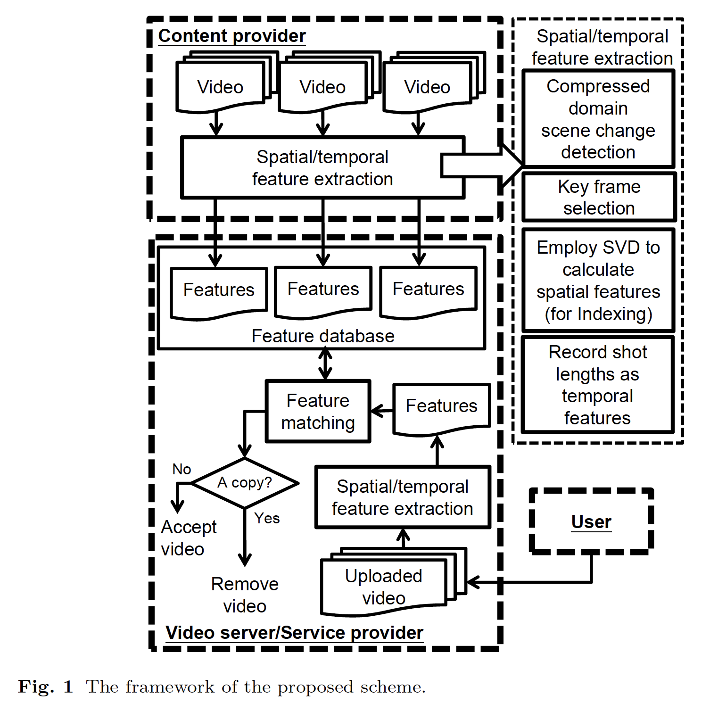

### 2.1 The Scene-change detection

​	콘텐츠 공급자 및 사용자가 소유한 비디오가 H.264/AVC에 의해 압축된다고 가정할 때 프레임의 코딩 모드를 먼저 검사하여 효율성을 달성합니다. 절대적으로 정확한 장면 변경 감지를 추구하는 대신, 원본 비디오와 변환 가능한 비디오에서 동일한 프레임을 선택하는 것이 목표입니다. 깨끗하고 날카로운 장면이 검색된 대상입니다. 제안된 계획은 기본적으로 압축된 비트스트림에서 직접 획득할 수 있는 프레임의 코딩 모드의 차이를 평가하여 후속 처리 대상을 선택합니다. 더 빠른 동작이 포함된 장면은 모호성을 유발할 수 있으므로 대신 무시됩니다. 인접한 그림 그룹(GOP), GOPi 및 GOPj 의 I-프레임 2개를 각각 검사하여 16×16 예측만 포함한 1) 16×8, 16×8 또는 8×8 예측을 포함한 3가지 유형 중 하나로 분류된 매크로블록의 내부 코딩 코드를 비교합니다. 일치하는 매크로 블록 유형의 수는 두 프레임의 대략적인 유사성 측정으로 간주되며 시각적으로 서로 다른 두 프레임이 한 샷으로 잘못 인식되지 않도록 상당히 엄격한 조건이 설정됩니다. 씬(scene)에는 촬영 프레임에서 서로 다른 코딩 모드를 생성할 수 있는 카메라 모션이 포함될 수 있으므로, 두 I 프레임은 Bhattacharyya 거리를 기준으로 휘도 히스토그램을 비교하기 위해 추출됩니다.

$$
D_s(I_i,I_j) = \sqrt{1-\frac{\sum_{k=0}^{255}\sqrt{H_i(k)\times H_j(k)}}{\sqrt{\sum_{k=0}^{255}H_i{(k)}\times\sum_{k=0}^{255}H_j(k)}}} \qquad (1)
$$

여기서 Hi(k)(Hj(k)는 프레임 Ii(Ij)의 휘도 히스토그램의 k번째 빈입니다. 경험적으로 0.25로 설정된 임계값 TI보다 큰 Ds(Ii, Ij )는 이 두 프레임이 상당히 다르고 Ii와 Ij 사이에 장면 변화가 발생할 수 있음을 나타냅니다. 장면 교환 프레임을 찾기 위해 GOPi의 모든 프레임에서 Pr(I) P로 표시된 내부 코딩된 매크로 블록의 백분율을 추가로 계산합니다. ̃ P로 표시된 가장 큰 Pr(I) P의 P 프레임이 선택되어 경험적으로 0.75로 설정된 다른 임계값 TP와 비교됩니다. Pr (I) ̃ P ≥ TP인 경우 ̃ P가 씬 변경 프레임으로 선택되며, 그렇지 않으면 Ij가 선택됩니다. Ii와 Ij가 멀리 떨어져 있는 경우, 특히 고정된 GOP 크기 대신 유연한 GOP 구조를 사용하는 경우, Pr (I) P ≥ TP가 있는 모든 P 프레임이 장면 교환 프레임으로 간주됩니다. 하지만 앞서 언급했듯이, 큰 움직임이 담긴 샷이 장면 변화로 잘못 식별될 수 있습니다. 이러한 경우를 제외하기 위해 TLM = 0.5보다 큰 Pr(I) P를 가진 후보자와 인접한 P 프레임이 두 개 이상 있는 경우 선택한 프레임을 무시합니다. 그림 2는 주어진 I 프레임, Ii 및 Ij에 대한 장면 변경 검출 프로세스의 흐름도를 보여줍니다.

​	이 압축 도메인 방법론의 단점은 장면 변경은 I 및 P 프레임에서만 탐지된다는 것입니다. B 프레임이 코덱에 사용되고 장면 변경 프레임이 B 프레임으로 인코딩되면 누락될 수 있습니다. 그러나 품질 저하 및 버퍼링 문제를 방지하기 위해 여러 개의 연속 프레임을 B 프레임으로 인코딩하는 것은 권장하지 않습니다. ". .BBPBP . . . ."는 가장 일반적으로 사용되는 구조이므로 제안된 계획에서 검출된 장면 변경 프레임의 차이와 정확한 것은 적어도 두 개일 수 있습니다. 따라서 누락은 발생하지 않을 수 있지만, 한 프레임 또는 두 프레임에 의한 정확성의 부족은 가능하므로 나중에 설명한 대로 해결해야 합니다. 

​	비디오 프레임의 활성 영역만 분석해야 합니다. 많은 비디오에서 문자 상자 또는 정적 경계가 겹칠 수 있으며 이러한 영역은 적절한 임계값 설정을 복잡하게 할 뿐만 아니라 불안정한 공간 기능을 발생시킬 수 있습니다. 이 기능은 나중에 설명합니다. 따라서 콘텐츠가 있는 활성 영역을 미리 파악해야 합니다. 간단한 방법은 서로 멀리 떨어져 있고 서로 다른 내용을 담고 있는 몇 개의 I-프레임을 추출하는 것입니다. 프레임의 차이가 계산되고 평균 프레임이 형성됩니다. 이 프레임의 수직 및 수평 투영에서는 정적 경계의 존재와 추가 분석할 활성 영역이 표시됩니다. 보다 정확한 탐지가 이루어질 수 있도록 TI 및 TP와 같은 임계값을 전체 프레임 대신 활성 영역과 연관시켜야 합니다.

### 2.2 The key-frame selection

​	추출된 장면 교환 프레임 중에서 비디오를 더 잘 나타낼 수 있는 키 프레임을 선택합니다. 저희 의견으로는 같은 장면이 연속 촬영으로 나타날 수도 있습니다. 예를 들어, 비디오에서 두 사람이 대화하는 동안, 각 사람의 얼굴에 있는 샷은 주기적으로 보여질 수 있습니다. 컨텐츠 매칭에 대한 계산을 줄일 수 있도록 이러한 샷 교환 프레임을 제거할 것입니다. 따라서 Si-2, Si-1, Si+1 및 Si+2와 함께 씬(scene) 변경 프레임의 거리가 계산됩니다. 거리가 모두 TI보다 큰 경우 Si가 키 프레임으로 선택됩니다. 또한 아래에 설명된 공간 기능 생성 프로세스에서 Si가 질감/정보를 적게 포함할 경우 Si를 추가로 제거할 수 있습니다.

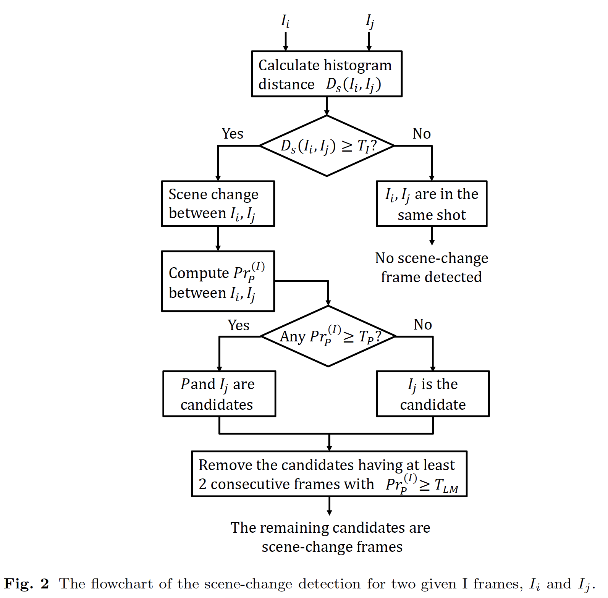

### 2.3 The spatial features

​	제안된 체계에서 콘텐츠 인덱싱 및 매칭에 대한 공간적 특성은 이전에 제안된 접근방식의 수정[24]에 기초하여 각 키 프레임에서 생성됩니다. 이 접근방식은 이러한 프레임의 대표 데이터를 추출하기 위해 SVD를 사용합니다. 기본 아이디어는 선택한 프레임을 고정된 크기의 작은 블록으로 확장하는 것입니다. 그런 다음 SVD를 블록에 적용하여 가장 큰 고유값에 해당하는 고유 벡터 쌍을 획득합니다. 이 쌍은 블록 또는 프레임 웰의 내용을 나타내는 중요한 특징으로 간주됩니다. 우리가 프레임에 대한 관심 지점 추출 방식을 채택하지 않기로 선택한 주된 이유는 높은 계산 복잡성에 대한 우려 때문입니다. 실시간 실행이 필요하지 않을 수도 있지만, 대형 비디오 데이터베이스가 있는 애플리케이션을 대상으로 한 연구이기 때문에 높은 효율성의 요구 사항은 여전히 매우 중요합니다. 또한, 앞에서 언급한 것처럼 제안된 계획의 공간적 특성은 시간적 특성의 계산을 위한 적절한 위치를 찾는 것입니다. 이는 나중에 논의할 것처럼 비디오 세그먼트에서 콘텐츠를 차별화하는 데 매우 효과적입니다. 공간적 특성의 합리적인 성능은 관련 목표를 달성하기에 충분해야 합니다. 따라서 로컬 관심 지점을 검색하는 대신 프레임의 글로벌 공간 기능이 계산됩니다. 제안된 계획에서 선택한 프레임은 먼저 노이즈를 제거하고 프레임의 활성 영역을 M×M 블록으로 확장하는 다운 샘플링을 용이하게 하기 위해 가우스 필터링에 의해 흐리게 됩니다. 사실 블록은 반드시 정사각형이 아니라 상당히 큰 직사각형이 작동할 수 있습니다. 그런 다음 SVD가 다음과 같이 평균 제거된 블록 X에 적용됩니다.

$$
X = \sum_{m=1}^M \lambda^\frac{1}{2}_{m}u_mv_m^T, \qquad (2)
$$

​	여기서 vm은 각각 XXT와 XTX의 고유 벡터이며, 는 대각선 선상에 고유값 1 2 ≥ ·  M이 있는 대각선 행렬입니다. 각각 M ×1 벡터인 첫 번째 및 두 번째 고유 벡터인 u1, v1, u2 및 v2가 추출된 기능으로 선택되어 피쳐 데이터베이스에 저장됩니다. 필요한 경우 M × 1 벡터를 N × 1 벡터로 하향 샘플링하여 형상의 크기를 더욱 줄일 수 있으며, 이 벡터는 단위 표준을 가지도록 표준화됩니다. 후속 SVD를 위해 선택한 프레임을 작은 블록으로 직접 확장하면 블록이 너무 흐릿해질 수 있기 때문에 성능이 저하될 수 있습니다. 공간 기능의 일치는 {U1,V1} 쌍 또는 {U2,V2} 쌍 사이의 상관 계수를 기반으로 합니다. 조사된 비디오의 프레임 A를 데이터베이스에 저장된 프레임 B와 비교하려는 경우 {UA 1 ,VA 1 }과(와) {UB 1 ,VB 1 } 사이의 유사성 측정 R1이 계산됩니다.

$$
R_1 = \frac{|\sum_{n=1}^8\{U_1^A(n) \times U_1^B(n) + V_1^A(n) \times V_1^B(n) \}| }{2} \qquad (3)
$$

R1이 임계값 TR(0.5로 설정)보다 큰 경우 프레임 A와 B의 일치가 할당됩니다. 양수 및 음수 {U,V} 쌍이 정확히 동일하기 때문에 절대값이 사용됩니다. 당사의 경험에 따르면 프레임 A가 트랜스코딩된 버전인 경우 {U1,V1}의 매칭은 실패하지만 {U2,V2}의 매칭은 작동할 수 있습니다. 따라서 R1을 기반으로 한 검색이 그다지 성공적이지 않을 경우 R2는 다음과 유사한 방식으로 추가로 계산됩니다.

$$
R_2 = \frac{|\sum_{n=1}^8\{U_2^A(n) \times U_2^B(n) + V_2^A(n) \times V_2^B(n) \}| }{2} \qquad (4)
$$

프레임 A와 B는 R2 > TR인 경우에도 일치하는 프레임으로 표시됩니다. 고유값인 1 및 2는 고유 벡터 쌍의 중요도 측정으로 볼 수 있습니다. 제안된 계획에서 1 또는 2는 관련된 고유 벡터 쌍이 유효한 공간적 특성이 되도록 하기 위해 경험적으로 128로 설정된 Tl보다 커야 합니다. 

​	데이터베이스에 저장된 피쳐의 수가 여전히 매우 크기 때문에 모든 피쳐를 비교하는 것은 비현실적입니다. 데이터베이스의 기능 하위 세트를 형성하는 것이 더 나은 전략입니다. 관련 하위 집합만 검색하여 더 편리하게 일치하는 항목을 찾을 수 있도록 피쳐를 적절하게 색인화해야 합니다. 형상이 벡터라는 점을 고려할 때 벡터 정량화(VQ)는 매우 적합한 접근 방식입니다. 트리 구조 VQ [25] 또는 최대 거리 방법 [26]의 알고리즘은 이러한 인덱싱 구조를 구성하는 데 도움이 될 수 있습니다. 그럼에도 불구하고, 서버에 큰 비디오 데이터베이스가 있고 각 인덱스에 많은 비트가 필요하기 때문에 다양한 프레임 컨텐츠에 대한 좋은 VQ 코드북을 교육하는 것은 그리 사소한 문제가 아닐 수 있습니다. 코드북의 성능은 교육 데이터에 따라 달라지므로 예측성이 떨어질 수 있습니다. 따라서 제안된 계획은 단순히 {U,V}의 구성 요소 기호를 인덱스로 사용하여 제품 VQ의 개념에 의존합니다. 한 키 프레임의 경우 해당 공간 기능은 {U1,V1}에서 인덱싱된 위치와 {U2,V2}에서 인덱싱된 두 개 이상의 데이터베이스에 저장됩니다. 각 {U,V}에는 N 값이 있으므로 인덱스의 비트 수는 2N과 같습니다. 형상 벡터의 일부 구성요소는 0에 가까울 수 있으며 특정 내용 보존 처리 후 표지가 안정적이지 않을 수 있습니다. 따라서 [- 1N ,+ 1 N] 내에서 해당하는 구성 요소 값이 작을 경우 인덱스 비트는 "상관 없음" 비트로 표시됩니다. d "상관 없음" 비트가 있을 경우 이 모든 d 비트는 "1" 및 "0"이 될 수 있으므로 기능이 2d 위치에 저장됩니다. 너무 많은 "상관 없음" 비트가 동일한 기능을 데이터베이스의 훨씬 더 많은 위치에 저장하게 된다는 것은 매우 명백한 사실입니다. 제안된 계획에서 이 기능을 저장하는 데 16개 이상의 위치가 필요하다는 것을 나타내는 "상관 없음" 비트가 4개 이상 있는 경우 관련 키 프레임 후보가 덜 적합하다고 간주되고 제거됩니다. 그림 3은 핵심 프레임을 선택하고 공간 형상을 색인화하는 절차를 요약한 것입니다.

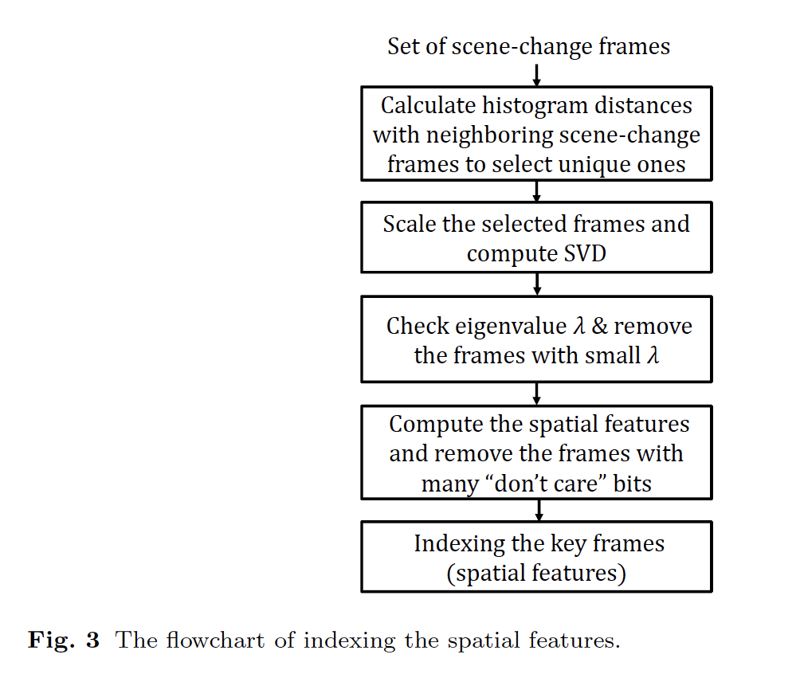

​	위의 논의를 통해 블록 크기, M, U 또는 V의 크기가 성능에 영향을 미칠 것으로 알고 있습니다. 기본적으로 M은 가능한 한 작아야 하지만 M ×M 블록은 여전히 프레임의 전망을 포함해야 합니다. 따라서 제안된 계획에서 M은 16으로 설정됩니다. 그러면 {U,V}에 대해 서로 다른 인덱스의 수가 최대 232개까지 됩니다. 이 인덱스는 너무 커 보이고 많은 인덱스가 완전히 사용되지 않을 수 있습니다. 따라서 하향 샘플링이 적용되어 N = 8이 되고 {U,V}에 대한 지수 수가 216으로 줄어듭니다. 앞에서 설명한 것처럼 프레임을 8×8 블록으로 직접 확장하면 컨텐츠의 세부 정보가 많이 손실되므로 다운 샘플링이 대신 고유 벡터에 적용됩니다. 제안된 체계는 4비트로 {U,V}의 각 값을 기록한 후 {U1,V1} 및 {U2,V2}의 비트를 포함하여 128비트를 사용하여 프레임을 나타냅니다.

### 2.4 The temporal features

샷 길이는 비디오의 고유한 특성을 효과적으로 보존할 수 있기 때문에 시간적 특성으로 사용됩니다. 
$$
L_i = t(S_i) - t(S_{i-1}) \qquad (5)
$$
시간적 특성은 t(S)가 샷 변경 프레임 S의 해당 "시간 단위"인 곳을 통해 계산됩니다. 입력 비디오의 경우 선택한 키 프레임과 모든 샷 길이가 기록됩니다. 그림 4는 씬(scene) 변경 프레임, S1, S3, Sq 및 Sq+3이 각각 첫 번째, 두 번째, pth 및 (p + 1) 번째 키 프레임인 구조를 나타냅니다. 키 프레임의 공간적 특성은 비디오의 위치와 함께 계산되고 기록됩니다. 간단한 구현은 모든 샷 길이를 비디오에 저장하는 파일을 유지하는 것입니다. 키 프레임에 해당하는 각 파일 오프셋이 공간 기능과 함께 기록됩니다. 테스트 비디오의 공간적 피쳐와 데이터베이스 비디오의 피쳐가 일치하는 경우, 파일 오프셋을 찾고 이후 처리를 위해 샷 길이를 검색하여 이 두 비디오의 시간적 피쳐를 효율적으로 획득할 수 있습니다.

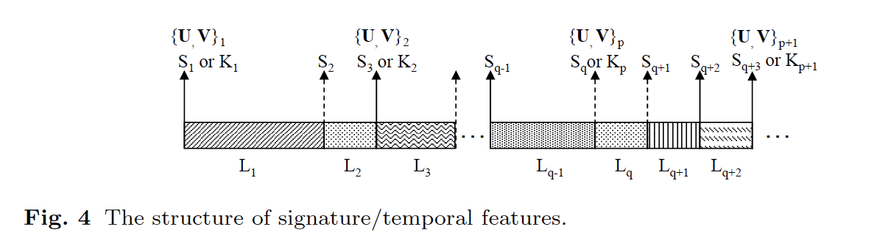

​	임시 피쳐 매칭의 기본 작동은 다음과 같습니다. 그림 4에서와 같이, 장면 변경 프레임에 해당하는 키 프레임인 Kp, Sq에 대해, 일치하는 프레임이 공간 형상에 기반한 후, 인접 샷 길이인 {. .Lq-1,Lq,Lq+1 .}이(가) 검색됩니다. 시간적 형상 스트림은 다음을 통해 함수 L(t)로 전송됩니다.

$$
L(t) = 
\begin{cases}
L_q, & L_q >  t \ge 0 \\
L_{q-1}, & 0 > t > -L_{q-1}\\
L_g, & otherwise,
\end{cases} \qquad (6)
$$

여기서 g는 다음 조건 중 하나를 충족합니다.

$$
L(t) = 
\begin{cases}
\sum_{j=q}^g L_j >t\ge\sum_{j=q}^{g-1}L_j, & t \ge L_q \\
\sum_{j=g}^{q-1} L_j >-t\ge\sum_{j=g-1}^{q-1}L_j, & -L_{q-1} \ge t
\end{cases} \qquad (7)
$$
L(t)의 구성은 그림 5의 그림을 통해 보다 쉽게 이해할 수 있습니다. 각 장면은 L(t)의 정사각형을 형성합니다. LA(t)와 LB(t)가 각각 비교해야 할 조사된 비디오와 원본 비디오의 시간적 기능인 경우, 다음과 같은 경우 일치한다고 합니다.

$$
\rho = \frac{1}{t_e - t_s} 	\int_{t_s}^{t_e} D_{L^{A},L^{B}}(t) dt \ge T_M \qquad (8)
$$
여기서 DLA,LB(t)는 차이 함수이고 TM은 일치함을 나타내는 임계값입니다. ts ≤ 0 및 te ≥ 0은 시작 시간과 종료 시간이며, 다음 두 가지 옵션에 따라 설정할 수 있습니다. 첫 번째 옵션은 t ≥ 0과 t < 0의 지속 시간 중 장면의 수가 충분히 길다면, 1분이라고 할 수 있는 고정된 시간에 가깝게 |ts|와 |te|te| 둘 다 두는 것입니다. 두 번째 옵션은 조사된 영상의 장면이 클 때 장면 수에 따라 |ts| 및 |te|를 결정하는 것입니다. 비교될 장면이 거의 없는 한 를 결정하기 위해 첫 번째 옵션을 사용합니다. 차이 함수 DLA,LB(t)는 다음과 같이 정의됩니다.

$$
D_{L^{A},L^{B}}(t) =
\begin{cases}
 1 , & |L^A(t) - L^B(t)| \le T_d \times L^A(t)  \\
 -1 , & |L^A(t) - L^B(t)| > T_d \times L^A(t),
\end{cases} \qquad (9)
$$
여기서 Td는 특정 부정확한 장면 변경 탐지를 수용하는 데 사용되며 1 8은 합리적인 선택입니다. 또한 도입된 Td는 앞에서 언급한 것처럼 B 프레임으로 인코딩된 장면 변경 프레임을 감지하는 정확도가 떨어지는 문제를 해결하는 데 도움이 될 수 있습니다. 일치하는 부분은 양의 값을 생성하는 반면 다른 부분은 음의 값을 생성합니다. TM을 0으로 설정했습니다. 잘못된 쌍은 대개 음의 를 발생시키기 때문입니다. 일반적으로 조사되는 비디오에는 몇 개의 키 프레임이 있으므로 일치 항목을 생성하는 소수의 키 프레임만 있으면 두 비디오가 연관되어 있음을 나타낼 수 있습니다. 실제로 0에서 te로, ts에서 0으로 각각 나누어서 ts에서 0으로 나누는 통합에 해당하는 두 값 +와 -을 계산합니다. 정규의 경우, 일치 결과를 결정하는 데 (8)의 를 사용합니다. 비디오의 시작 또는 끝에 있는 키 프레임의 경우 + 및 - 중 하나만 고려됩니다. 게다가, 특정 광고가 조사된 비디오에 삽입될 수 있고, +와 -를 별도로 고려하는 것은 그러한 경우를 식별하는 데 도움이 될 수 있습니다. 

​	시간적 특성과 일치하는 정확도는 씬(scene) 변경 검출 성능에 영향을 받습니다. 조사된 비디오에서 씬(scene) 변경 사항이 잘못 감지되거나 건너뛰어질 수 있습니다. 이는 변환된 버전 또는 처리된 버전입니다. 다양한 장면 길이가 컴퓨팅(8)에 음의 값을 제공하므로 더 낮은 을 얻을 수 있습니다. 일부 씬(scene) 변경 사항이 여전히 올바르게 감지될 수 있는 경우, + 또는 --이(가) 탐지를 선언할 수 있을 만큼 크지 않은 경우 일치 프로세스 중에 조정 절차가 적용됩니다. 그림 6은 작동을 보여줍니다. 공간 피쳐를 일치시킨 후, 조사된 비디오와 비교할 비디오의 시간적 피쳐가 LA 1과 LB 1에서 각각 시작됩니다. +를 재계산하려면 씬(scene) 길이가 두 비디오에 누적되고 그 차이는 다음과 같이 계산됩니다.
$$
L_{x,y}^{A,B} = | \sum_{a=1}^x L_a^A - \sum_{b=1}^y L_b^ B| \qquad (10)
$$
LA,B x,y가 1 10초로 설정된 Tj보다 작으면 임시 일치 항목이 할당됩니다. 그림 6, LA 1 + LA 2 LA LB 1 + LB 2 + LB 3에 표시된 예에서 첫 번째 일치 항목이 발견됩니다. 두 번째 일치는 P4 a=1 LAa≃ P4 b=1 LBb일 때 탐지됩니다. 일치하는 총 길이는 ̃L = P ̃x a=1 LAa이며, 여기서 ̃x는 LA,B x,y < Tj와 같이 가장 큰 x입니다. +를 계산하기 위해 조사된 비디오의 총 길이가 +L인 경우, 2 = 2 -L-̃L입니다. 잘못된 탐지를 방지하려면 +이 더 커야 하므로 0.75로 설정된 더 높은 임계값을 사용해야 합니다. 또한 LA,B x,y < Tj(또는 그림 6의 ̃Lk의 큰 k)와 같이 {x, y}개 이상의 조합이 있어야 합니다.

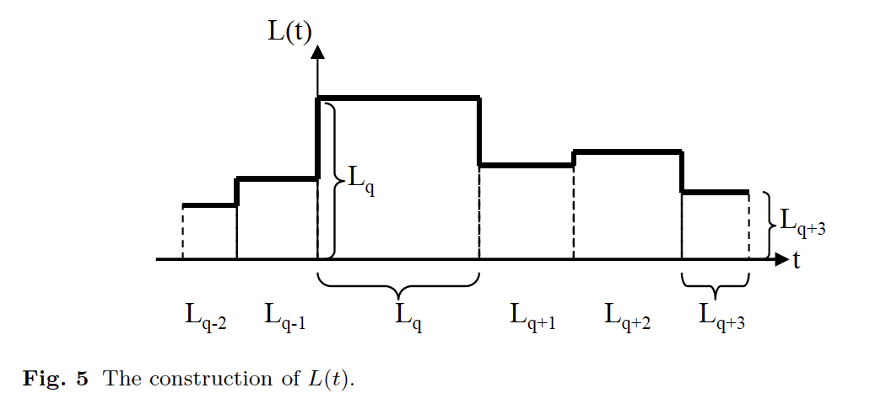

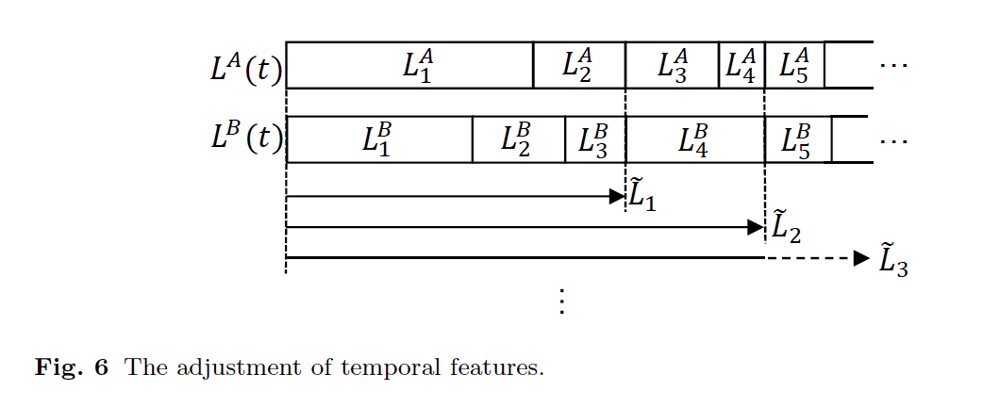

### 3. Experimental Results

제안된 체계는 장면 변경 프레임을 추출하며, 여기서 키 프레임을 선택하여 공간 피쳐를 인덱싱 도구로 구성합니다. 그런 다음 샷의 길이는 일치 항목을 보다 안정적으로 식별하기 위한 시간적 특징으로 작용합니다. 따라서, 장면 변경 감지 프로세스는 제안된 계획에서 확실히 중요한 역할을 합니다. 먼저 MUSCLE(MUSCLE-VCD2007)[27]의 비디오를 사용하여 제안된 장면 변경 감지 방법의 효과를 시연합니다. MUSCLE는 컨텐츠 기반 비디오 감지 시스템의 평가를 전담합니다. 테스트된 MUSCLE 비디오 세트에는 웹 비디오 클립, TV 아카이브 및 동영상을 포함하여 약 60시간 분량의 비디오 자료가 포함되어 있습니다. 다큐멘터리, 영화, 스포츠 이벤트, TV 쇼, 만화 등 다양한 콘텐츠가 포함되어 있습니다. 이 테스트에는 20개의 비디오가 포함되어 있으며 실제 장면 변경 사항은 검사로 식별됩니다. 결과는 표 1에 설명되어 있으며, 올바른 탐지 수(TP, True Positive), 거짓 탐지 수(FP, False Positive) 및 누락 수(FN, False Negative)가 나열되어 있습니다. 정밀도는 P = TP+FP로 계산하고 R = TP+FN에 따라 회수율을 계산합니다. 평균 회수율은 97.64%이고 평균 정밀도는 92.83%입니다. 특히 화질이 낮은 비디오에서 인접 장면의 색상이 유사할 때 일부 누락 현상이 발생합니다. 검정 프레임과 함께 몇 개의 테스트 비디오가 삽입되어 페이딩 효과가 감지되지 않은 상태에서 실제 장면이 변경될 수 있습니다. 마찬가지로 많은 잘못된 탐지는 여러 탐지가 이루어지는 페이딩 효과에서 발생합니다. 정확도는 여전히 향상될 수 있지만, 제안된 계획은 다양한 유형의 비디오에 대처하기 위해 예상보다 더 많은 장면 변화를 식별하는 경향이 있습니다. 제안 계획에서는 명확하거나 날카로운 장면 변화를 정확하게 인식하는 것이 더 중요합니다. 더 많은 장면 변화를 감지하는 이 전략이 시간 형상의 정확도에 영향을 줄 수 있지만, 그림 6 또는 (10)에 표시된 조정 절차는 결함을 보상하고 정확한 일치를 찾을 수 있을 만큼 여전히 시간 형상을 견고하게 만드는 데 매우 유용합니다. 이 시간적 기능 조정 단계는 또한 부드러운 장면 변화를 처리할 때 제안된 계획의 가능한 약점을 완화시킵니다. 

​	그림 7은 20개의 테스트 비디오 중 정밀도가 가장 낮은 표 1의 비디오 6의 예를 보여줍니다. 152개의 장면 교환 프레임이 확인되고 28개의 프레임은 왼쪽 상단에 녹색 ⊗로 표시된 거짓 검출로 간주됩니다. 거짓 탐지는 대개 대형 카메라 동작과 페이딩 효과가 있는 프레임에서 발생합니다. 키 프레임으로 선택된 씬(scene) 변경 프레임은 오른쪽 하단 모서리에 빨간색 ⊕로 표시됩니다. 이 예에서 씬(scene) 변경 프레임은 주로 인덱스에 너무 많은 "상관 없음" 비트가 존재하거나 SVD의 고유 값에 의해 결정된 중요한 텍스처가 부족하기 때문에 키 프레임을 고려하는 대상에서 제외됩니다. 다른 예(비디오 3)는 그림 8에 나와 있습니다. 9개의 잘못된 탐지가 확인되고 56개의 장면 변경 프레임 중 24개가 키 프레임으로 선택됩니다. 영상 초반의 얼굴 등 많은 장면 변경 프레임이 다른 것과 비슷하고 대표성이 떨어지는 것으로 판단되기 때문에 더 이상 고려하지 않는 것을 알 수 있습니다.

​	다음으로, 복사 검출 성능을 검토하여 제안된 계획의 타당성을 입증하고자 합니다. 피쳐 데이터베이스는 수집된 많은 비디오에서 관련 피쳐를 추출하여 구성됩니다. 그런 다음 이러한 비디오 중 몇 개가 무작위로 선택되어 많은 1분짜리 비디오 세그먼트를 조사된 비디오로 구성합니다. 테스트된 비디오 세그먼트의 기능을 피쳐 데이터베이스에 저장된 비디오 세그먼트와 일치시켜 세그먼트가 수집된 비디오 세트의 일부에서 복사되는지 확인합니다. 조사된 비디오 세그먼트는 제안된 계획의 견고성을 테스트하기 위해 왜곡될 수 있습니다. [28]의 정보 검색 평가 방법을 사용하여 단일 지표 F( )로 성능을 보여줍니다.

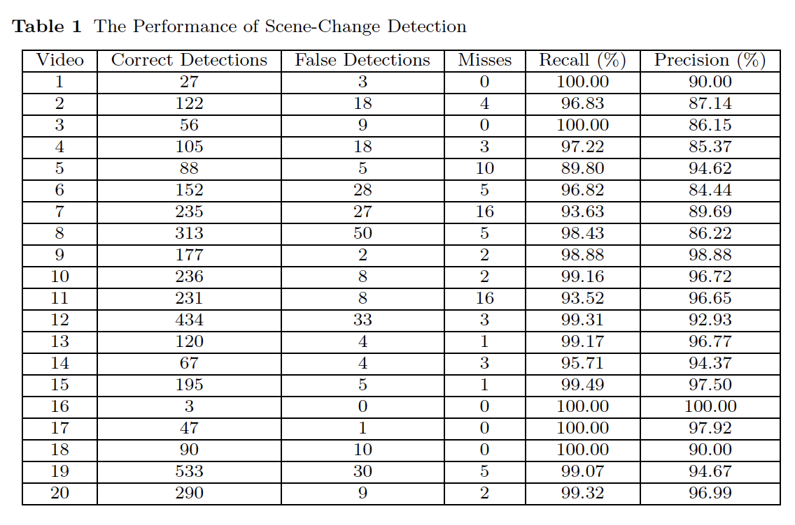

$$
F(\beta) = (1+\beta^2)\frac{P \times R}{\beta^2 \times P +R} \qquad (11)
$$
​	

​	여기서 P와 R은 앞에서 정의한 정밀도 및 회수율입니다. F()가 크면 강직성과 차별성이 모두 개선된다는 뜻입니다. 이 값은 [0, 1] 및 0.5이며, P가 R보다 두 배 더 중요하도록 선택됩니다. MUSCLE [27]의 비디오 외에 ReefVid (reefvid.org)[29]의 비디오도 제안된 프레임워크를 테스트하는 데 사용됩니다. 산호초의 풍경을 보여주는 리프Vid 비디오는 기존의 두 가지 방법, 즉 코스쿤 등에 의한 3D-DCT에 사용된 것과 동일한 테스트 비디오입니다. [13] 및 TIRI(임시 정보 대표 이미지)-에스매일리 외에서 DCT를 선택합니다. [30] 그러므로 보다 객관적인 비교를 할 수 있습니다. [13]과 [30]에서도 (11)의 지표 F()를 채택하고 있음을 유의할 필요가 있습니다. 각각 1분 이상 긴 200개의 비디오 클립이 선택되어 테스트된 비디오 세트를 형성합니다. 소음 추가, 밝기 조정, 프레임 회전, 시간 이동, 공간 이동 및 프레임 손실 등 6가지 유형의 왜곡이 적용되고 해당 파라미터가 표 2에 나열됩니다. 그 결과는 표 3에 나와 있습니다. 여기서 우리는 MUSCLE과 ReefVid 비디오에서 이 여섯 가지 왜곡에 따른 F 점수가 거의 1점에 가까워서 제안된 계획이 적절한 성능을 발휘한다는 것을 알 수 있습니다. FP FP+TN으로 정의된 호출 속도 또는 TPR(True Positive Rate) 및 FPR(False Positive Rate)도 표 3에 나와 있습니다. 노이즈 추가, 밝기 조정, 회전 및 공간 이동과 같은 공간 공격에 대한 좋은 성능은 제안된 공간 기능의 견고성을 보여줍니다. 컨텐츠 적응성 특성은 시간적 변화의 공격에서 계획이 훌륭하게 수행되도록 도와줍니다. 그러나 제안된 방법은 심각한 프레임 손실의 공격에 더 취약할 수 있으며, 이는 시간적 특징을 심각하게 변화시킬 수 있습니다. 이 계획은 (9)에서 유연성이 제공되었기 때문에 가벼운 프레임 손실에도 상당히 잘 견딜 수 있습니다. 비디오를 거의 볼 수 없게 만들 수 있는 보다 심각한 프레임 손실 공격에서는 프레임 손실률을 추정해야 합니다. 저희의 경험에 따르면, 프레임 손실률이 10% 미만일 때, 많은 단편 장면의 길이는 여전히 유지될 것입니다. 따라서 (9)의 씬(scene) 길이의 차이 함수를 계산할 때 씬(scene) 길이의 히스토그램도 추적합니다. (8)의 응답이 일치 항목을 주장할 만큼 크지 않지만 일치 프로세스 중에 몇 개의 유사한 길이의 장면을 관찰하는 경우, 이러한 근접 값은 프레임 손실률을 추정할 수 있도록 고정점으로 간주됩니다. 좀 더 구체적으로 말하자면, 조사된 비디오에서 두 개의 근접 촬영 길이와 데이터베이스에서 테스트된 비디오가 프레임 손실률을 평가하기 위해 프레임 손실 가능성을 조정하도록 트리거합니다. 이에 따라 시간적 특징을 조정한 후 제안된 체계는 표 3과 같이 이러한 공격에 잘 저항할 수 있습니다. 이 방법은 10%보다 높은 프레임 손실률에서 실패할 수 있으며, 이는 실제로 매우 제한적입니다. 또한 이러한 수중 비디오는 일반적으로 명확한 장면 변경을 포함하지 않으며 (10)의 시간적 기능을 조정하면 일부 잘못된 경보가 발생할 수 있으므로 ReefVid 비디오의 잘못된 양의 비율이 약간 더 높습니다. 씬(scene)이 변경되는 일반 비디오에 더 가까운 MUSCLE의 비디오에 대해 제안된 구성의 강력한 임시 기능은 내용을 정확하게 식별할 수 있으며 거짓 양성률은 테스트에서 0과 같습니다.

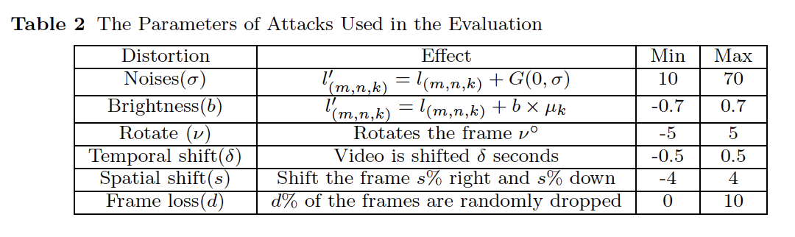

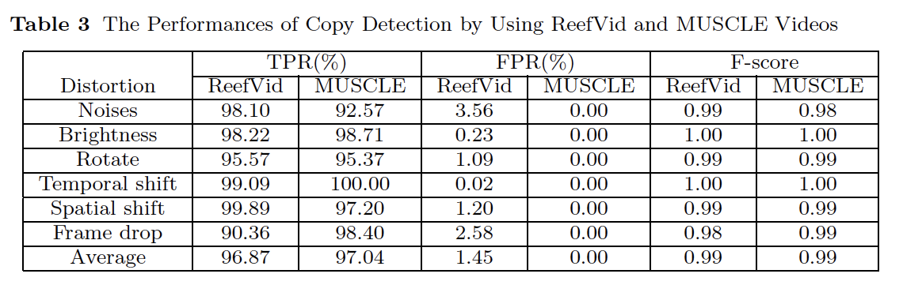

​	3D-DCT[13] 및 TIRI-DCT[30]와의 비교와 함께 실험 결과의 세부 사항은 그림 9에 나와 있습니다. 제안된 방식(△)에 의한 MUSCLE 비디오 테스트( (), 제안된 방식(◦), 3D-DCT(∗), TIRI-DCT() 등 각 사례에 4개의 라인이 표시됩니다. Y축은 F 점수를 표시하고 X축은 공격 매개변수를 나열합니다. 예상대로 왜곡이 클수록 해당 F 점수가 감소하고 세 가지 체계가 모두 비디오 복사 탐지 요구 사항을 충족할 수 있습니다. 제안된 계획의 F 점수는 더 심각한 왜곡을 테스트하더라도 0.95를 초과합니다. 유사한 성능에도 불구하고 제안된 방법의 주요 기여와 장점은 기능 데이터베이스의 컴팩트한 크기와 실행 효율입니다. 제안된 계획은 3D-DCT가 그림 9에서 TIRI-DCT를 약간 능가하지만, 더 나은 실현가능성으로 3D-DCT를 향상시키는 TIRI-DCT와 비교됩니다. MUSCLE 비디오의 경우 제안된 구성의 기능 크기는 471KB로 TIRI-DCT(3945KB)의 약 12%입니다. ReefVid 비디오에서 제안된 구성표의 피쳐 크기는 TIRI-DCT 크기의 약 10%입니다. 이러한 비디오는 씬(scene) 변경 사항이 적기 때문에 더 적은 양의 피쳐가 아카이브됩니다. TIRI-DCT에 비해 제안된 체계의 이점도 데이터베이스를 구성하는 시점부터 반영됩니다. 제안된 방법과 200개의 ReefVid 비디오 클립을 사용한 TIRI-DCT의 자세한 비교는 표 4에 나와 있습니다. C/C++를 사용하여 [30]에 지정된 4가지 크기의 비디오 세그먼트로 TIRI-DCT를 구현했습니다. 이 코드는 Intel Core2 Duo 2.83GHz CPU 및 8G RAM이 있는 시스템에서 실행됩니다. 제안된 구성표에서 형상을 준비하는 시간은 TIRI-DCT 시간의 12%~26%이며 형상 크기는 5%~17%에 불과합니다. 비록 그림 9가 3D-DCT가 최선의 방법이고 TIRI-DCT가 제안된 계획보다 뛰어나지만, 우리가 그림 9의 F-점수를 확인한다면 그 차이는 사실 매우 제한적이라는 것을 알아야 합니다. 그러나 형상 데이터베이스를 구성하는 시간적 측면에서의 타당성과 형상의 크기를 고려할 때 제안된 체계는 3D-DCT의 개선된 방법인 TIRI-DCT보다 확실히 우위에 있습니다. 

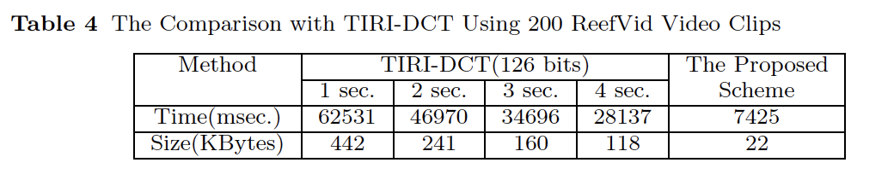

​	이 애플리케이션에서 고려하는 비디오의 수가 매우 많다는 점을 고려할 때 기능 크기를 제한하는 것이 매우 중요합니다. 3D-DCT와 TIRI-DCT는 모두 몇 초마다 콘텐츠 정보를 저장합니다. 이 전략은 시간 기반 공격을 처리할 필요 없이 컨텐츠 매칭에 도움이 되지만 더 긴 비디오에서는 기능 크기를 쉽게 제어할 수 없습니다. 의미 있는 콘텐츠가 있는 실제 비디오에서는 씬(scene) 변경 사항이 많이 발생할 것으로 예상되며 특정 프레임이 더 중요하거나 대표적이어야 이러한 데이터를 저장하는 것이 스토리지 요구 사항이 훨씬 적은 유사한 기능만 달성할 수 있습니다. 피쳐 데이터베이스를 구성하는 데 소요되는 시간이 더 적다는 장점 외에도 제안된 체계는 H.264/AVC에 구축되어 있기 때문에 더 효율적인 것으로 간주되므로 3D-DCT와 TIRI-DCT 모두에서 필요한 사전 처리 단계인 트랜스코딩의 필요성이 줄어들 수 있습니다. H.264/AVC로 압축된 비디오를 사용할 경우, 장면 변경 감지가 압축된 도메인에 적용되어 시간적 기능을 편리하게 획득할 수 있습니다. 또한 인코딩 프로세스가 유연한 GOP 구조를 채택하는 경우 대부분의 장면 변경 프레임은 I 프레임으로 인코딩되므로 키 프레임을 직접 디코딩하여 공간 기능을 계산할 수 있습니다. 따라서 주어진 비디오 세그먼트에 대한 조사도 매우 효율적인 방법으로 수행할 수 있습니다. 

​	우리는 더 실제적인 사례를 테스트하기 위해 더 큰 비디오 데이터베이스를 구축하려고 합니다. 6개의 비디오 세트가 표 5에 나와 있습니다. 세트 "영상-경쟁자"의 87개 비디오 목록은 [31]에서 찾을 수 있는데, 만화, 옛날 영화, 영화 예고편, 스포츠 비디오 등이 포함되어 있으며, 총 길이는 36시간 39분 22초입니다. 유사한 장면이 많이 포함된 토크쇼 동영상이 이 복사 탐지 어플리케이션에서 문제를 일으킬 수 있다는 점을 감안하여 Youtube에서 9시간 이상 지속되는 50개의 "David Letterman Shows" 비디오 클립을 수집하여 테스트합니다. 유투브에서 74시간 이상 떨어진 100개의 풀 프로그램을 찾을 수 있는 만다린 토크쇼 '강시가 온다'가 더 일반적인 사례로 꼽힙니다. '대장금'도 50시간 이상 전체 76개 프로그램을 수집하는 중국 TV 드라마입니다. 또한 유투브에서 31시간 27분 28초(31 : 27 : 28)의 기타 영상 200개를 수집합니다. 그런 다음 이 5개의 비디오 세트와 MUSCLE 비디오(58 : 44 : 02)로 데이터베이스가 형성되므로 데이터베이스의 비디오 총 길이는 250시간 이상입니다. 공간/임시 기능의 크기는 4113KB이며 이 기능 세트를 구성하는 시간은 1464초입니다.

​	우리는 더 실제적인 사례를 테스트하기 위해 더 큰 비디오 데이터베이스를 구축하려고 합니다. 6개의 비디오 세트가 표 5에 나와 있습니다. 세트 "영상-경쟁자"의 87개 비디오 목록은 [31]에서 찾을 수 있는데, 만화, 옛날 영화, 영화 예고편, 스포츠 비디오 등이 포함되어 있으며, 총 길이는 36시간 39분 22초입니다. 유사한 장면이 많이 포함된 토크쇼 동영상이 이 복사 탐지 어플리케이션에서 문제를 일으킬 수 있다는 점을 감안하여 Youtube에서 9시간 이상 지속되는 50개의 "David Letterman Shows" 비디오 클립을 수집하여 테스트합니다. 유투브에서 74시간 이상 떨어진 100개의 풀 프로그램을 찾을 수 있는 만다린 토크쇼 '강시가 온다'가 더 일반적인 사례로 꼽힙니다. '대장금'도 50시간 이상 전체 76개 프로그램을 수집하는 중국 TV 드라마입니다. 또한 유투브에서 31시간 27분 28초(31 : 27 : 28)의 기타 영상 200개를 수집합니다. 그런 다음 이 5개의 비디오 세트와 MUSCLE 비디오(58 : 44 : 02)로 데이터베이스가 형성되므로 데이터베이스의 비디오 총 길이는 250시간 이상입니다. 공간/임시 기능의 크기는 4113입니다. 

​	테스트에서 데이터베이스에서 처리된 원본 비디오의 해상도는 640×360입니다. 테스트되거나 조사된 비디오는 저분해능(426×240) 버전이며, Youtube에서도 직접 다운로드됩니다. MUSCLE 비디오의 경우, 더 낮은 비트 전송률의 원래 CIF 해상도로 자체에서 트랜스코딩합니다. 표 5에 표시된 행 "키 프레임"은 조사된 비디오에서 선택한 키 프레임의 수를 나타냅니다. 토크쇼와 같은 정적 비디오에서 이러한 값이 더 작다는 것을 알 수 있습니다. 행 "양도"는 이러한 테스트된 키 프레임에서 일치하는 공간/임시 기능의 수를 나타냅니다. 공간 및 시간적 기능의 조합으로 강력한 결과를 얻을 수 있기 때문에 각 일치 항목이 발견된 사본을 명확하게 신호할 수 있습니다. "Negatives" 행은 변환된 조사된 비디오의 키 프레임이 데이터베이스에서 해당 일치 항목을 찾을 수 없는 경우의 수를 나열합니다. 이러한 값은 표 5의 다음 두 행에서와 같이 "공간적 특징"을 사용하여 거부 횟수와 "시간적 특징"을 사용하여 두 부분으로 나눌 수 있습니다. TV 드라마와 같은 일반적인 경우, 공간적 특성은 부정확한 키 프레임이나 탐지를 대부분 거부하는 데 도움이 될 수 있습니다. 그럼에도 불구하고, 앞에서 언급했듯이, 토크쇼와 같은 프로그램의 많은 장면들이 비슷하거나 심지어 같기 때문에, 우리는 정확한 일치를 찾기 위해 시간적 특징에 의존해야 합니다. 잘못된 긍정 및 부정은 테스트에서 드문 경우입니다. 비디오 세트 "비디오-컴퍼너"에서 단 한 개의 누락만 발견됩니다. 누락 또는 거짓 음수는 조사된 전체 비디오에서 공간/임시 특성의 일치 항목을 찾을 수 없음을 의미합니다. 이 기능은 데이터베이스에 저장되어 있어야 합니다. 실제로 감지되지 않는 50분짜리 영상은 오래된 영화(Seven Sinners, 1936년)의 한 부문으로, 질이 매우 나쁩니다. 트랜스코딩된 비디오의 비트 전송률은 96Kbps에 불과하므로 장면 변경 감지 및 후속 키 프레임 선택이 영향을 받습니다. 또한 몇 개의 키 프레임이 올바르게 식별되었지만 공간 기능이 일치한다고 주장할 만큼 신뢰성이 떨어집니다. 따라서 추가 비교를 위해 시간적 특성은 추출되지 않으며 누락도 발생합니다. "매치 시간" 행은 이러한 비디오 테스트에 소요된 시간을 나열하며, 이는 키 프레임의 수 및 비디오 세트의 길이와 직접 관련이 있습니다. 마지막 행은 일치 시간을 키 프레임 수로 나눈 값을 기준으로 표시합니다. 실제 애플리케이션에서는 조사된 비디오에서 일치 항목이 발견되면 탐지 프로세스를 중지할 수 있습니다. 제안된 방법에서 조사된 비디오(및 원본 비디오)가 H.264/AVC 비디오 스트림인 한, 이 계획은 H.264/AVC에 따라 구현되고 추가 트랜스코딩이 필요하지 않으므로 처리가 매우 효율적일 수 있습니다. 

​	전체 트랜스코딩된 비디오를 조사 대상으로 사용하는 대신, 우리는 6개의 비디오 세트에서 각각 1분 길이의 120개의 비디오 세그먼트를 무작위로 잘라내어 매우 큰 데이터베이스에서 짧은 비디오 검색을 시뮬레이션합니다. 결과는 표 6에 나와 있습니다. 시간적 특성이 매우 안정적이기 때문에 예상대로 거짓 양성 감지가 없습니다. 하지만, 그 결과는 우리가 표 6의 행, 특히 토크쇼 비디오에서 일부 실수를 볼 수 있기 때문에 핵심 프레임을 사용하는 것의 가능한 약점 중 하나를 보여줍니다. 누락된 이유는 데이터베이스에서 계산된 키 프레임이 잘라낸 비디오 세그먼트에 포함되지 않기 때문입니다. 이 문제를 해결할 수 있는 해결책은 씬(scene) 변경 프레임을 긴 샷으로 고려하여 씬(scene) 변경 프레임 간의 차이를 비교하여 키 프레임 수를 늘리는 임계값을 조정하는 것입니다.

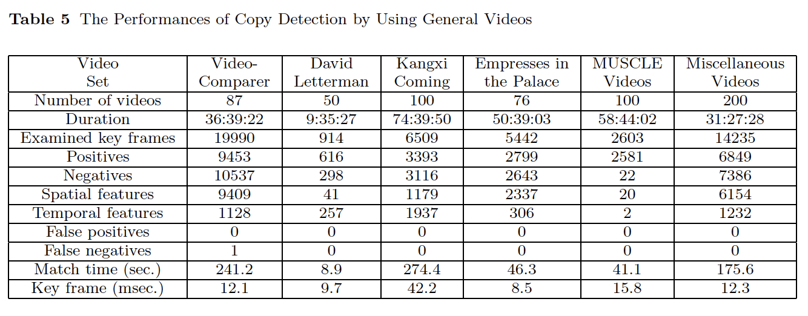

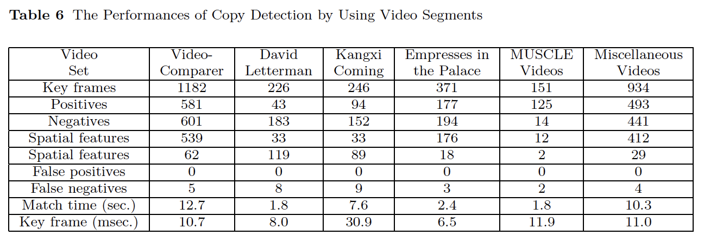

​	마지막으로, "강시가 온다"와 "궁전의 여파"라는 다양한 업로드된 프로그램이 있기 때문에, 제안된 방법을 테스트하기 위해 조사된 비디오로서 유투브의 다른 소스에서 이 두 TV 시리즈의 많은 동영상을 수집합니다. 업로드된 비디오의 해상도와 형식은 다를 수 있지만 프레임 품질이 합리적이고 충분히 길기만 하면 제안된 계획은 대부분의 테스트 비디오의 데이터를 일치시키는 데 아무런 문제가 없습니다. 탐지 결과에 영향을 줄 수 있는 몇 가지 문제는 다음과 같습니다. 첫째, 조사된 비디오가 심각하게 커져서 다른 가로 세로 비율이 발생할 수 있습니다. 제안 방법은 전체 프레임을 고정 크기 블록으로 확장하여 글로벌 공간 기능을 사용하기 때문에, 공간 기능이 전체 프레임에서 추출된 것과 다르기 때문에 대규모 잘라내기 때문에 공간 피쳐에 문제가 발생할 수 있습니다. 둘째, 테스트 비디오가 H.264/AVC 스트림이 아닌 경우, 시간적 형상에 특정 편차를 유발할 수 있는 트랜스코딩을 적용해야 합니다. 이는 시간적 피쳐 매칭의 복원력을 높이기 위해 (9)의 Td가 도입된 또 다른 이유입니다. 셋째, 일반적으로 업로드된 대부분의 비디오에 자막과 로고가 추가됩니다. 프레임의 영향을 받는 영역이 대개 작기 때문에 이러한 편집은 거의 중요한 요소가 되지 않습니다. 그럼에도 불구하고 로고가 프레임 주위의 큰 테두리처럼 겹칠 경우 공간적 특징에 영향을 미칠 수 있으며, 특히 제안된 계획의 활성 영역이 이러한 영역을 제거하지 못할 때 더욱 그렇습니다. 또한 테두리를 제거하는 것은 업로드된 특정 비디오에서 잘라내는 것과 같을 수 있습니다. 넷째, 일부 비디오 클립은 편집된 버전이기도 합니다. 때로는 동영상 예고편처럼 씬(scene) 변경 위치에 검은색 프레임이 삽입되고 이러한 프레임이 임시 피쳐를 변경합니다. 이러한 편집된 비디오 클립이 일치해야 할 대상인 경우 일시적 기능 일치 전에 검은색 프레임을 제거하는 것이 도움이 될 수 있습니다. 

​	제안된 계획에는 2항에 나열된 바와 같이 경험적으로 설정된 여러 임계값이 있으며, 이는 다른 방식으로 일치하는 콘텐츠의 성능에 영향을 미칠 수 있습니다. 실제로 다양한 종류의 비디오가 포함된 매우 많은 수의 비디오가 테스트되어야 하므로 이러한 임계값을 최적화된 방식으로 설정하는 것은 매우 어렵습니다. 우리는 제안된 계획의 설계를 더 쉽게 따르고, 가장 중요한 것은 그러한 설정을 통해 만족스러운 결과를 얻을 수 있도록 몇 가지 공통 값(예: 0.25, 0.5 또는 0.75)을 할당하는 간단한 접근 방식을 채택합니다. 이러한 임계값을 보다 세밀하게 결정하면 제안된 방법의 성능을 더욱 향상시킬 수 있습니다.
​	제안된 계획은 씬(scene) 변경 없이 비디오에서 시간적 기능 생성이 실패한다는 약점을 가질 수 있습니다. 인기 동영상의 상업적 가치나 실현 가능성을 고려해, 제안된 디자인에서는 이러한 동영상을 제외합니다. 이러한 정적 비디오의 탐지/조사가 필요하거나 동영상이 보관해야 할 귀중한 다큐멘터리 영화인 경우, 한 가지 해결책은 장면 변화가 감지되지 않은 고정된 긴 시간 동안 가장 큰 변형이 있는 프레임에 강제로 장면 변경을 삽입하거나 청구하는 것입니다. 이 전략은 일반적인 비디오에 부정적인 영향을 미칠 수 있으므로 비디오 분류를 다양한 방식으로 다른 유형의 비디오를 처리하기 위해 적용해야 할 수 있습니다. 또 동영상 분류 조건은 원본 영상과 조사된 영상이 동일한 절차로 처리되도록 최대한 유사해야 합니다.

### 4. Conclusion

​	이 연구에서는 공간 및 시간적 특성 추출 및 매칭에 기초한 효율적인 콘텐츠 기반 비디오 복사 탐지 방식을 제안합니다. 키 프레임은 공간 피쳐를 생성하기 위해 선택되며, 공간 피쳐는 임시 피쳐 일치를 위한 앵커 포인트로 사용됩니다. 설계에서는 비디오 코딩 구조를 고려하므로 형상 데이터베이스의 효율성과 콤팩트 크기가 제안된 프레임워크의 주요 기여입니다. 또한 실험 결과에 따르면 추출된 기능을 통해 가능한 복사본을 식별하기 위해 컨텐츠 매칭을 신속하게 수행할 수 있습니다. 따라서 제안된 방법은 매우 큰 비디오 데이터베이스의 콘텐츠를 일치시킬 수 있습니다. 업로드된 많은 비디오는 동일한 프로그램 시리즈의 서로 다른 에피소드일 수 있으며 유사한 장면이 포함될 수 있습니다. 따라서 공간적 특성과 시간적 특성의 조합은 이 복사 탐지 애플리케이션에서 이러한 사례를 식별하는 데 매우 적합한 접근 방식입니다.

### References

1. K. Kashino, T. Kurozumi, and H. Murase. A quick search method for audio and video
signals based on histogram pruning. IEEE Trans. Multimedia, 5:348–357, 2003.
2. A. Ferman, M. Tekalp, and R. Mehrotra. Robust color histogram descriptors for video
  segment retrieval and identification. IEEE Trans. on Multimedia, 11:497 – 508, 2002.
3. M. Swain and D. Ballard. Color indexing. Int. J. Comput. Vis, 7, 1991.
4. W. Hsu, T. S. Chua, and H. K. Pung. An integrated color-spatial approach to content-
  based image retrieval. in Proc. ACM Multimedia, 1995.
5. C. Cotsaces, N. Nikolaidis, and I. Pitas. Shot detection and condensed representation - a
  review. IEEE Signal Processing Magazine, 23:28–37, 2006.
6. Y. Zhuang, Y. Rui, T. S. Huang, and S. Mehrotra. Adaptive key frame extracting using
  unsupervised clustering. Proc. of IEEE Int Conf on Image Processing, pages 866–870,
  1998.
7. Wolf. Key frame selection by motion analysis. IEEE International Conference on Acous-
  tics, Speech and Signal Processing, pages 1228–1231, 1996.
8. Ting Wang, Yu Wu, and Long Chen. An approach to video key-frame extraction based
  on rough set. Multimedia and Ubiquitous Engineering, 2007. MUE ’07. International
  Conference on, pages 590–596, 2007.
9. Y. P. Tan, D. D. Saur, S. R. Kulkarni, and P. J. Ramadge. Rapid estimation of camera
  motion from compressed video with application to video annotation. IEEE Transactions
  on Circuits and Systems for Video Technology, pages 133–145, 2000.
10. Tianming Liu, Hong-Jiang Zhang, and Feihu Qi. A novel video key-frame-extraction
  algorithm based on perceived motion energy mode. IEEE Transactions on Circuits and
  Systems for Video Technology, 13:1006–1013, 2003.
11. Ping-Hao Wu, Tanaphol Thaipanich, and C.-C. Jay Kuo. A suffix array approach to video
   copy detection in video sharing social networks. In IEEE International Conference on
   Acoustics, Speech, and Signal Processing, Taipei, Taiwan, Apr. 2009.
12. Cedric De Roover, Christophe De Vleeschouwer, Frederic Lefebvre, and Benoit Macq.
   Robust video hashing based on radial projections of key frames. IEEE Transactions on
   Signal Processing, 2005.
13. B. Coskun, B. Sankur, and N. Memon. Spatio-temporal transform based video hashing.
   IEEE Transactions on Multimedia, 8:1190–1208, 2006.
14. F. Zargari, M. Mehrabi, and M. Ghanbari. Compressed domain texture based visual
   information retrieval method for I-frame coded pictures. IEEE Transactions on Consumer
   Electronics, 56:728–736, 2010.
15.  Jiajun Liu, Zi Huang, Hongyun Cai, Heng Tao Shen ChongWah Ngo, andWeiWang. Near-
   duplicate video retrieval: Current research and future trends. ACM Computing Surveys,
   45, 2013.
16.  George Awad, Paul Over, and Wessel Kraaij. Content-based video copy detection bench-
   marking at TRECVID. ACM Transactions on Information Systems, 32, 2014.
17. Hefei Ling, Hongrui Cheng, Qingzhen Ma, Fuhao Zou, and WeiQi Yan. Efficient image
   copy detection using multiscale fingerprints. IEEE MultiMedia, 19:60–69, 2012.
18. D. G. Lowe. Distinctive image features from scale-invariant keypoints. Int. J. of Computer
   Vision, 60:91–110, 2004.
19. Li-Wei Kang, Chao-Yung Hsu, Hung-Wei Chen, and Chun-Shien Lu. Secure SIFT-based
   sparse representation for image copy detection and recognition. In IEEE International
   Conference on Multimedia Exposition, pages 1248–1253, 2010.
20. Xiangmin Zhou, Xiaofang Zhou, Lei Chen, Athman Bouguettaya, Nong Xiao, and John A
   Taylor. An efficient near-duplicate video shot detection method using shot-based interest
   points. IEEE Transactions on Multimedia, 11:879–891, 2009.
21. Shiyang Lu, Zhiyong Wang, Tao Mei, Genliang Guan, and David Feng. A bag-of-
   importance model with locality-constrained coding based feature learning for video sum-
   marization. IEEE Transactions on Multimedia, 16:1497–1509, 2014.
22.  Jingkuan Song, Yi Yang, Zi Huang, Heng Tao Shen, and Jiebo Luo. Effective multi-
   ple feature hashing for large-scale near-duplicate video retrieval. IEEE Transactions on
   Multimedia, 15:1997–2008, 2013.
23. Hong Liu, Hong Lu, and Xiangyang Xue. A segmentation and graph-based video sequence
   matching method for video copy detection. IEEE Transactions on Knowledge and Data
   Engineering, 25:1706–1718, 2013.
24. Po-Chyi Su, Chun-Chieh Chen, and Hong-Min Chang. Towards effective content authenti-
   cation for digital videos by employing feature extraction and quantization. In IEEE Trans.
   on Circuits and Systems for Video Technology, volume 19, pages 668–677, May 2009.
25.  A. Gersho and R. M. Gray. Vector Quantization and Signal Compression. Kluwer Aca-
   demic Publishers, 1992.
26. I. Katsavounidis, C.-C. Kuo, and Z. Zhang. A new initialization technique for generalized
   Lloyd iteration. In IEEE Signal Processing Letters, volume 1, pages 144–146, Oct. 1994.
27. J. Law-To, A. Joly, and N. Boujemaa. Muscle-VCD-2007: a live benchmark for video copy
   detection, 2007. http://www-rocq.inria.fr/imedia/civr-bench/.
28. C. J. van Rijsbergen. Information Retrieval. Butterworth-Heinemann, London, UK, 1979.
29. ReefVid: A Resource of Free Coral Reef Video Clips for Educational Use [Online]. Avail-
   able: http://www.reefvid.org.
30. Mani Malek Esmaeili, Mehrdad Fatourechi, and Rabab Kreidieh Ward. A robust and fast
   video copy detection system using content-based fingerprinting. IEEE Transactions on
   Information Forensics and Security, 6:213–226, 2011.
31. Benchmark videos from Youtube [Online]. Available: http://www.video-
   comparer.com/product-benchmark-youtube-list.php.

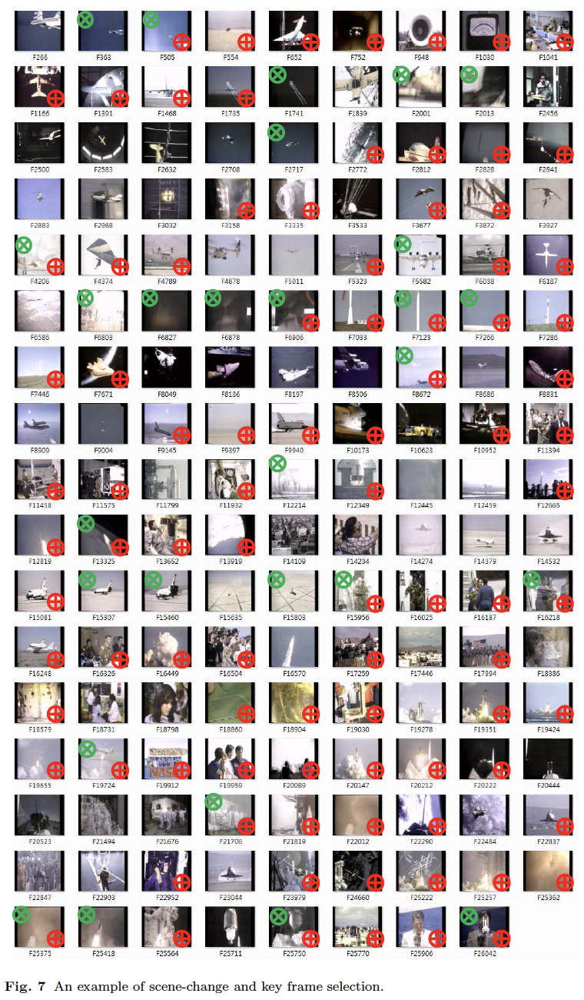

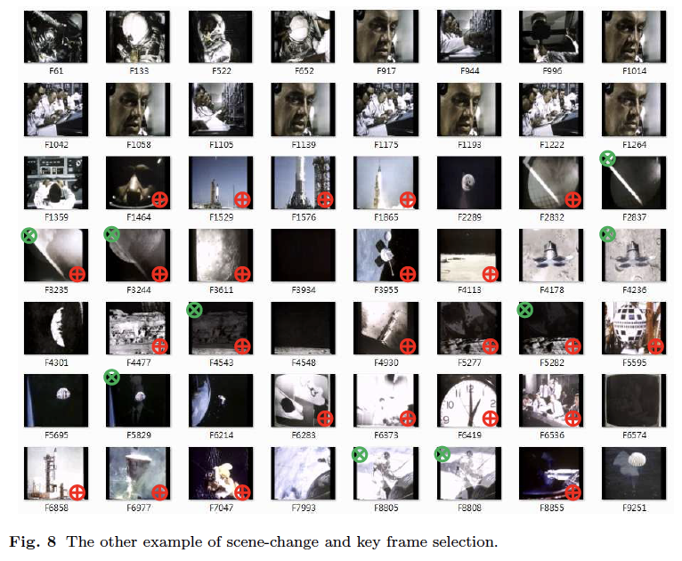

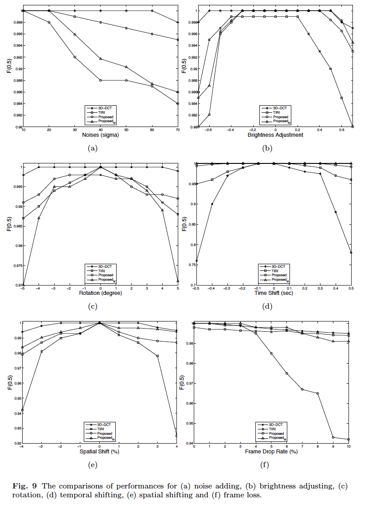