## Multimedia System

**주제** : Contents-based Near Duplicated Video Copy Detection 

**목표 ** : 저작권이 있는 원본 동영상을 불법 유통을 위하여 다양한 변형(좌우 변환, 밝기 조정, Caption 삽입, Picture to Picture, 좌우 flipping, 재인코딩 등)을 가한 동영상에 대하여 해당 원본 동영상을 검색할 수 있는 방법

**교과 내용** 

|  주  |                          수업 내용                           | 수업 방법 |
| :--: | :----------------------------------------------------------: | :-------: |
|  1   |   Contents-based Duplicated Video Copy Detection 주제 소개   |           |
|  2   | 전통적인 컴퓨터 비전 기반 방법들 : MPEG-7 Visual Signature 표준 (1) |           |
|  3   | 전통적인 컴퓨터 비전 기반 방법들 : MPEG-7 Visual Signature 표준 (2) |           |
|  4   |       전통적인 컴퓨터 비전 기반 방법들 : 최근 연구 (1)       |           |
|  5   |       전통적인 컴퓨터 비전 기반 방법들 : 최근 연구 (2)       |           |
|  6   |  빠른 Fingerprint 추출을 위한 압축 영역에서의 처리 방법 (1)  |           |
|  7   |  빠른 Fingerprint 추출을 위한 압축 영역에서의 처리 방법 (2)  |           |
|  8   |      성능 평가를 위한 공개 DBset들 및 정확도 측정 방법       |           |
|  9   |          Deep Learning 기반 방법들 : 최근 연구 (1)           |           |
|  10  |          Deep Learning 기반 방법들 : 최근 연구 (2)           |           |
|  11  |          Deep Learning 기반 방법들 : 최근 연구 (3)           |           |
|  12  | 빠른 검색을 위한 인덱싱 방법들 : Inverted File Indexing (1)  |           |
|  13  | 빠른 검색을 위한 인덱싱 방법들 : Inverted File Indexing (2)  |           |
|  14  |               GPU를 이용한 병렬 검색 방법 (1)                |           |
|  15  |               GPU를 이용한 병렬 검색 방법 (2)                |           |
|  16  |                      Team-Project 발표                       |           |

**선수 과목**

* 본 교과목은 압축되어 있는 동영상에 대하여 Compressed-Domain에서의 정보를 추출하여 CNN(Convolution Neural Network)를 이용하여 Fingerprint를 추출하는 방법에 대한 최근 논문 중심으로 세미나를 진행할 예정

**주요 논문**

* "The MPEG-7 Video Signature Tools for Content Identification" , IEEE TRANSACTIONS ON CIRCUITS AND SYSTEMS FOR VIDEO TECHNOLOGY, 2012
* Https://mpeg.chiariglione.org/standards/mpeg-7/visual
* "Partial-copy Detection of Non-simulated Videos using Learning at Decisiosn Level", Multimedia Tools Application, 2019
* "Near-Cuplicate Video Retrieval with Deep Metric Learning" , IEE International Conference on Computer Vision Workshops(ICCVW), 2017
* "Video Copy Detection by Conducting Fast Searching of INverted Files", Multimedia Tools and Application, 2019
* "Learning spatial-temporal features for video copy detection by the combination of CNN and RNN", 2018
* "Fast Thumbnail Generation in integer DCT Domain for H.264/AVC". IEEE Transaction on COnsumer Electronics, 2011
* "HEVC에서 부분 복호화를 통한 썸네일 추출 알고리즘" , 방송공학회, 2018년 5월 

### 수업 2.

디지털 비디오 Indexing : 샷(Shot), 씬(Scene)

샷(Shot) : 카메라 동작 단위

씬(Scene) : 의미를 가진 단위

Video Abstraction(비디오 추상화) : 긴 문서 내용의 콘텐츠를 요약, 필수적인 원본의 메세지는 보존

#### 유사 비디오 검색 처리과정

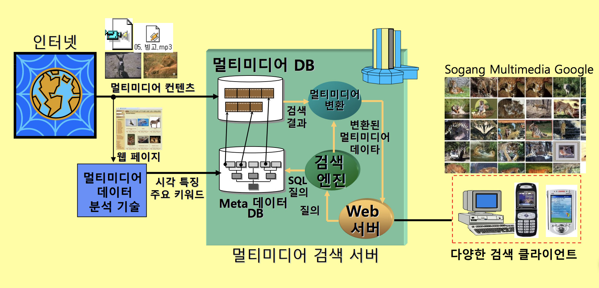

#### 비디오 copy detection

### CBCD vs. Watermarking

* **Content-Based video Copy Detection (CBCD**) : 비디오 고유의 형상은 fingerprint와 signature로 추출됨
  * "영상 자체가 워터마크"
  * 추출 + 비교
* **Watermarking** : 미디어 콘텐츠 자체에 무언가를 삽입하는 것
  * 검출 + 추출 + 비교

#### Video Fingerprinting ?

* Video fingerprinting은 비디오 콘텐츠로부터 fingerprint를 추출하는 과정

* watermark에 비해서, fingerprinting은 비디오 콘텐츠를 더하거나 변형하지 않는다.
* 연구문헌에서는 "Robust hashing", "perceptual hashing", "Content-Based Copy Detection(CBCD)" 로도 잘 알려져 있다.

### fingerprint가 추구하는 바

* Robust : 동일한 콘텐츠에 다양한 변형(변환 및 처리, 조작)이 있어도 불변하는 특성
* Discriminating : 다른 콘텐츠들과 확연히 구분
* Compact : 작은 데이터 용량
* Low complexity : 빠른 추출과 매칭
* Partial Matching : 중복되어있고 삽입된 콘텐츠의 정확한 시간적 위치 지정

### Video Fingerprint의 유형

* Spatial Signature : 하나의 frame에서 특징
* Temporal Signature : frame sequence에서 특징

### Fingerprinting의 구분

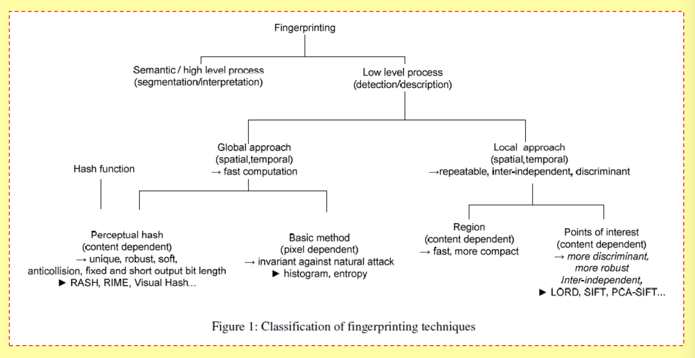

* 묘사나 검출과 같은 low level의 process에서는 Global한 접근과 Local한 접근이 있다.

### Spatial Signature의 변형

* 프레임 전체

  * 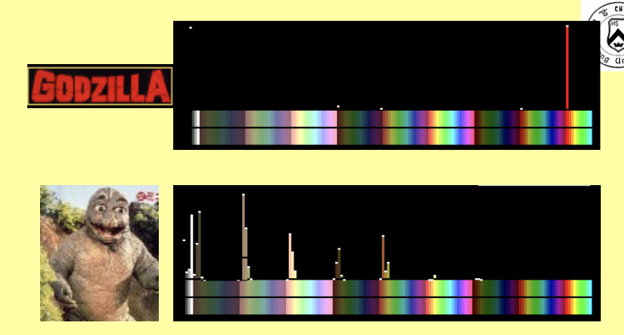
  * ex) Color histogram(색상 히스토그램)

* Block 기반

  * 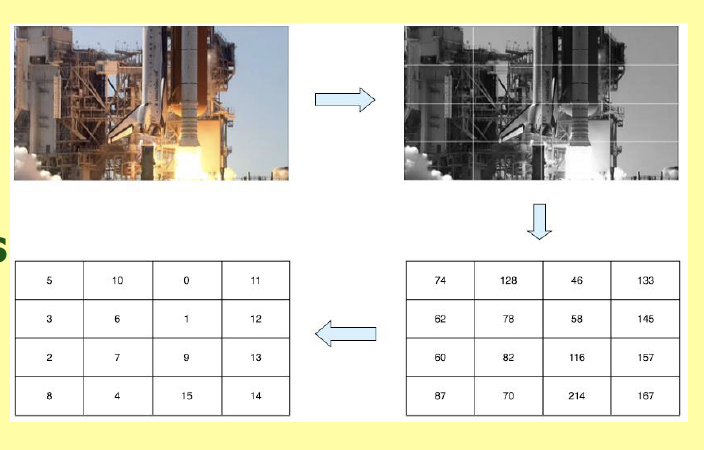

  1. Block 밝기값의 평균
  2. 평균 block강도의 순위(1,2,3,4,5....)
  3. Differential luminance block patterns

  

* 관심점(points of interest)

  * 
  * Corner Feature(Harris Corner Detector)
  * Scale-space feature
  * SIFT

### Spatial Signature의 비교

* 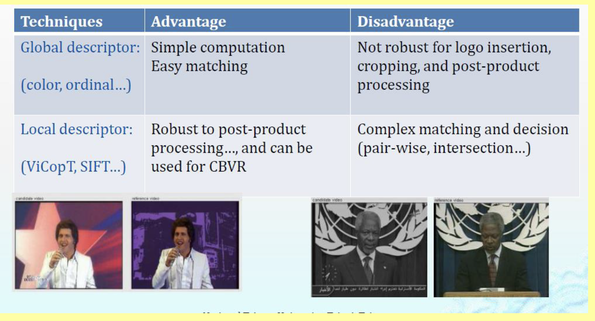

### fingerprint 검색의 복잡도

* 철저한 검색은 선형적으로 검색 or $$O(K*N)$$
  * 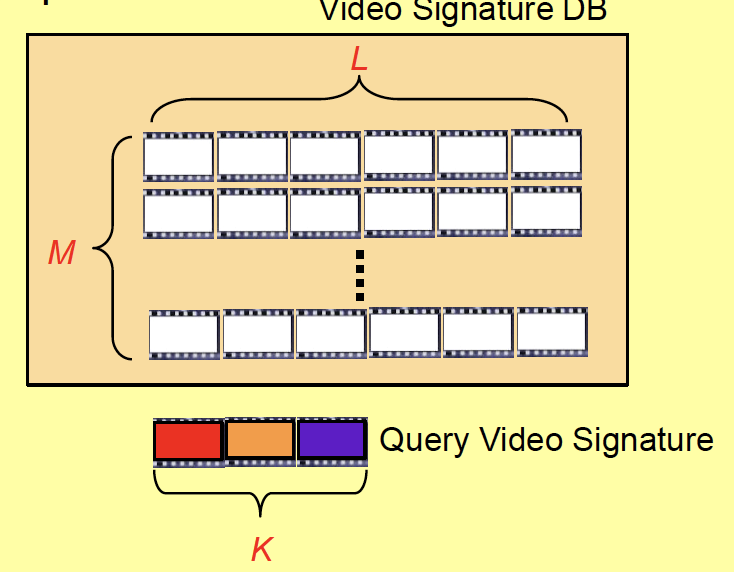
  * N = reference fingerprint DB
  * N = M*L로 분해될 수 있음
  * L = DB의 video fingerprint의 평균 길이
  * K = 쿼리 video 길이

* Sequence Matching의 예시
  * 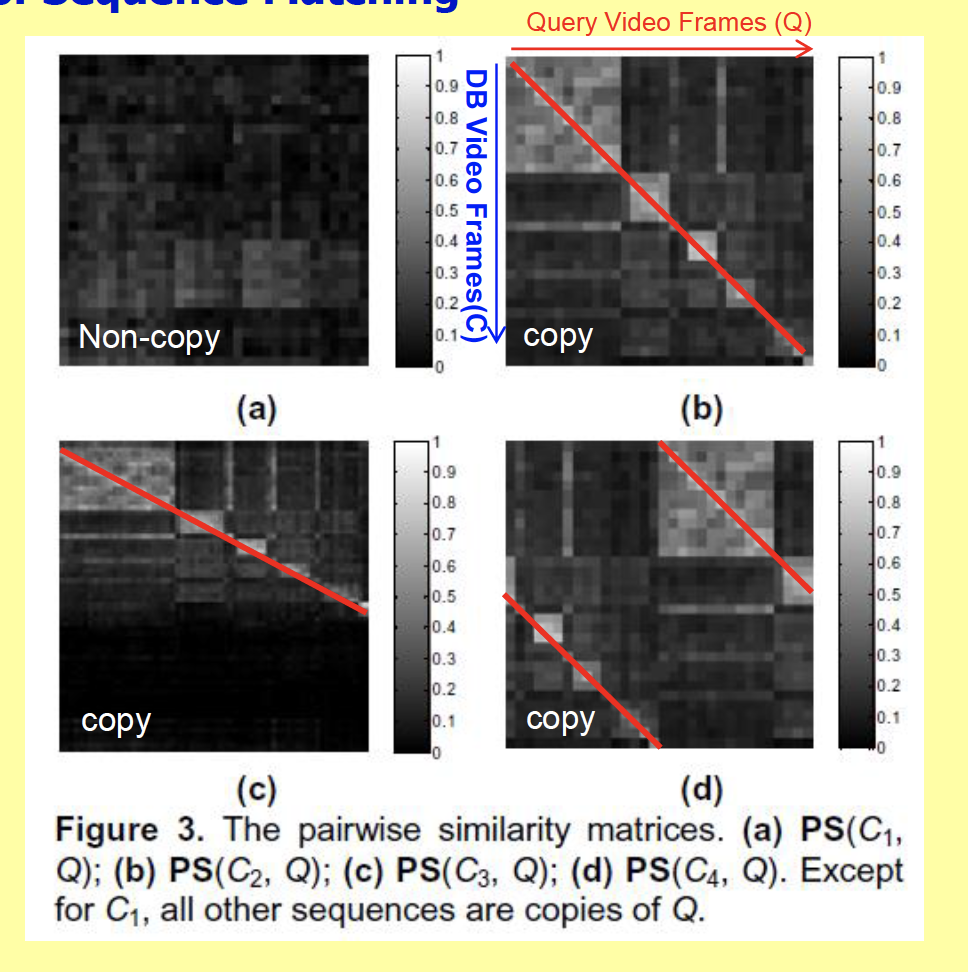

### MPEG-7 Visual signature Descriptor

* MPEG Family
  * MPEG-1 : VCR equivalent video and audio quality, 1.5 Mbit/s
  * MPEG-2 : variable purpose audio/video content, DVD quality
    scalable video (PAL, AC-3, 9.8 Mbit/s, VBR, 16:9)
  * MPEG-4 : scene decomposition, media object based hierarchy, added intelligence, interactivity, conformance testing, mobile application
  * MPEG-7 : multimedia content description interface(metadata, text, semantics, signal structure)
  * MPEG-21 : multimedia content access, digital rights
    management (DRM)
  * MPEG-A : 
    * Multimedia Application File Format
    * stores both of the multimedia data and its metadata represented in MPEG-7 together in MP4 (MPEG-4 System File)

### MPEG-7 ?

* 비디오 정보를 검색하기 용이하게 하기위해 등장
* 목표 : 압축을 유지한채로 콘텐츠 검색/필터/교환이 쉽게 하기 위함
  * MPEG-1, 2, 4 : 콘텐츠 표현
  * MPEG-7 : 콘텐츠에 대한 정보를 표현(검색을 위해서)

### MPEG-7 VIdeo Signature

* 고유 콘텐츠를 찾기위해 디자인되었음
* 높은 수준의 강인성을 갖고 있다.
* 96%의 검출율을 달성함
* 현재 사람들이 복제한 영상에 대해서는 80%대의 성능을 갖고 있음.

### 비디오 식별 방법과 실험 요약

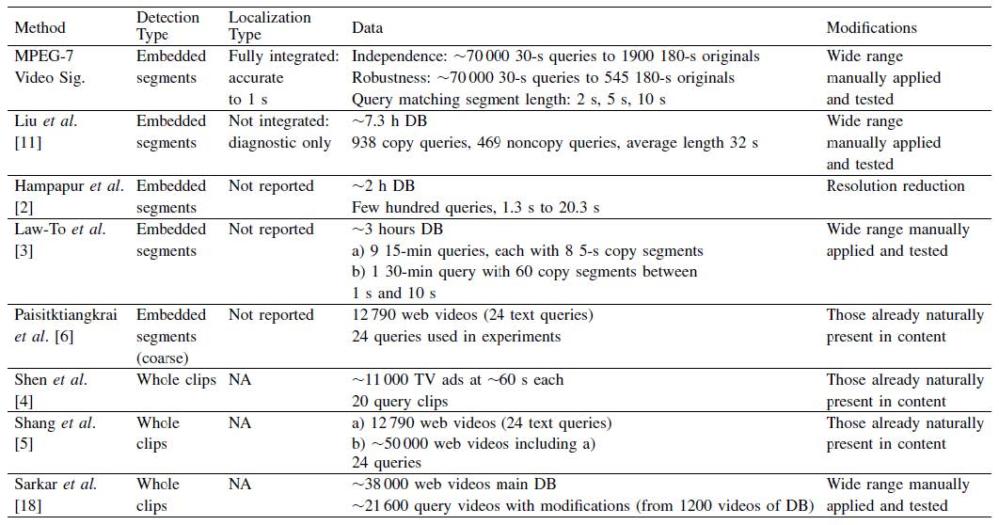

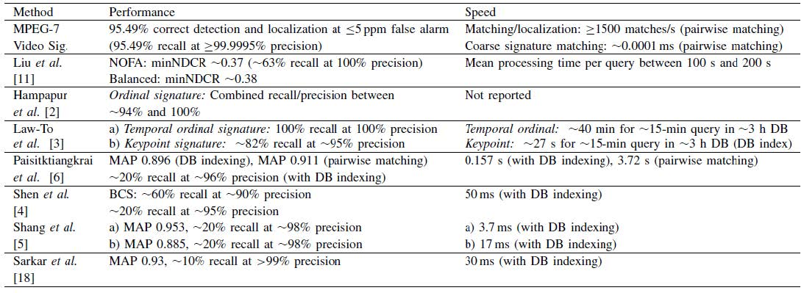

#### MPEG-7 Video Signature : 필요조건

1. Uniqueness
2. Robustness to editing operations
3. Independence
4. Fast matching
5. Fast Extraction
6. Compactness
7. Nonalteration of the content
8. Self-contrainment of the signatures
9. Coding independence
10. Partial Matching
11. Accurate Temporal Localization of duplicated and embedded content

* 논문을 쓸 때에 requirements을 먼저 정의하고 그 requirement를 충족시키는 solution이 얼만큼 그것을 충족시켰는지 파악하는게 중요하다.

### MPEG-7 Video Signature

* 두 부분으로 구성되어 있음
  1. Fine Signatures : individual video frame으로부터 추출
  2. Coarse Signatures : frame레벨 signature의 집합으로부터 추출(ex : Bag of Visual Words)

#### 1. Fine Signature(하나의 frame을 어떻게 추상화하는가?)

* 32x32 pixel 8-bit liminance 정보 -> 프레임의 luminance 채널의 평균블락(같은 길이 VS보장)
* 각 fine signature 구성:
  1. Local feature 집합, 'frame signature'
  2. local feature들의 작은 표현의 subset, 해당 frame의 다른 "words"로 구성됨
  3. Global "Frame confidence" 측정

* Frame Signature

  * local intensity content와 다른 영역의 intensity interrelation를 포착할 수 있도록 디자인 되어있고 luminance의 scale들
  * local 강도 내용과 강도의 상호 관련성 를 캡처하도록 설계되었습니다. 
  * local feature들의 표현
    * 평균강도와 차이점들
    * 380 차원들(32 평균 강도들 + 348 평균 차이들)
    * 3 level에 quantize함.

  

  

  

  

  

* Words

  * frame signature의 compact한 표현
    * Vector x의 작은 subset
  * 두 비디오 프레임에 대해 , 두 대응하는 단어들 사이의 거리는 frame signature 사이의 거리의 근사이다. 단어가 즉 차이
  * 계산
    * 380 차원 공간으로부터 5단계의 다른 투영
      * 5개의 subset, 각 subset당 5개의 elements
        * 380개 중에서 총 25개의 값을 선택

**학습을 통해서 Approximation 속도를 개선시키는 방법이 있는지에 대해 고민해볼 것** - Large-Image Search

* Confidence Value

  * Confidence(신뢰도) 측정 방법은 348개의 다른 element 차원의 $$Abs(V1_i-V2_i)$$  값의 중간값을 기반으로 계산된다.

    * 예를들어 정렬된 리스트의 174번째 element라면,

    * $$
      min(floor(d_{174}\times8),255)
      $$

    * 낮은 신뢰도 측정은 프레임이 거의 없거나 정보가 거의 없는 평평한 이미지임을 보여준다.

  

#### 2. Coarse Signature

* "Bag of visual word"의 접근에 기반한 Fine signature들의 집합으로부터 추출된 coarse signature들이다.

* **Bag of words** model

  * 순서가 없는(orderless) 문서 요약
  * 문서의 단어의 빈도 수, Salton $ McGill(1983)

  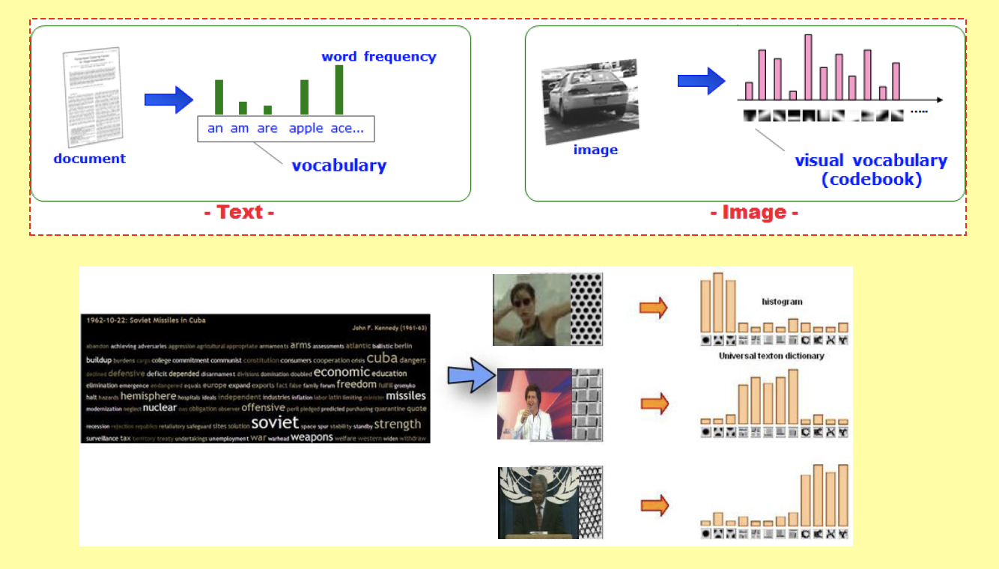

* "Bag of words"는 90개의 연속된 시퀀스의 시간 세그먼트(temporal segment)에 대해 추출됩니다.

* $$
  BagOfWords[j][a] = \begin{cases}
  1, & \mbox{if }h[j][a]\mbox{ > 0} \\
  0, & \mbox{  otherwise }
  \end{cases}
  $$

* 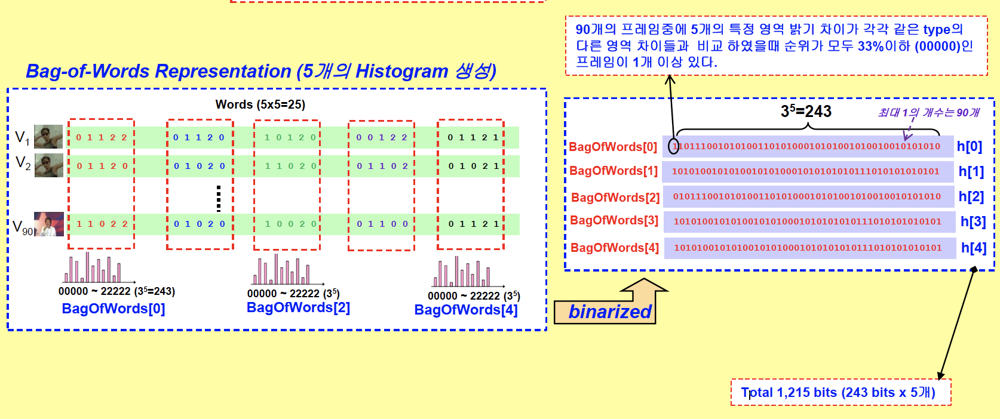

* Coarse signature들은 90-frame segment에 대해 생성되지만, 45-frame은 중복된다.
* 
* 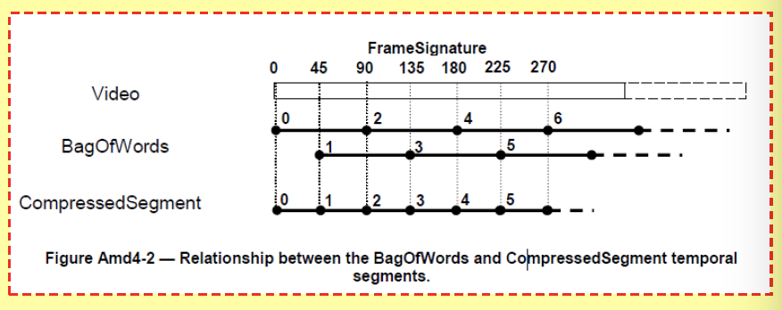

* 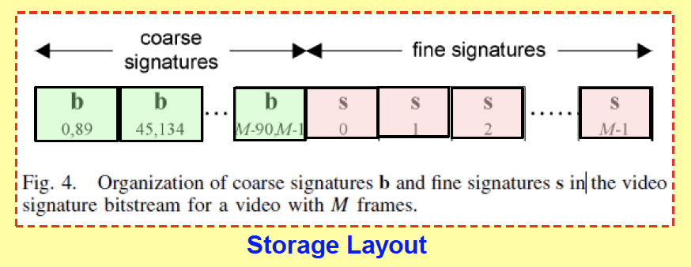

#### 3. Video Signature Matching and Localization

* Video Signature의 구성요소
  * Multiple temporal segments : Bag of Words Element로 표현
  * Multiple Frames : FrameSignature Element와 FrameConfidence Element로 표현
* 두 Video Signature 간의 매칭은 3단계로 수행됩니다.
  1. Coarse Signature : 후보군 segment를 식별하는데 사용
  2. Fine Signature : 후보군 segment사이의 temporal offset과 프레임 rate ratio의 파라미터 후보군을 식별하는데 사용(?)
  3. Frame-by-frame Matching : Frame by Frame Matching을 수행하여 fine Signature를 사용하여 후보 일치 간격을 결정하고, 각 일치 항목의 품질을 평가하며, 두 Video Signature 사이의 가장 일치한느 간격을 선택합니다.

* 매칭 3단계

  * 1단계 : Bag of Words를 사용한 Segment 매칭
    * video signature 하나의 모든 temporal segment들을 다른 하나의 Video Signature의 모든 temporal Segment와 비교합니다.
    * 두 세그먼트 f1과 f2에 대해서 각각의 BOW histogram를 비교하여 평가합니다. 평가방식은 Jaccard distance 입니다.

  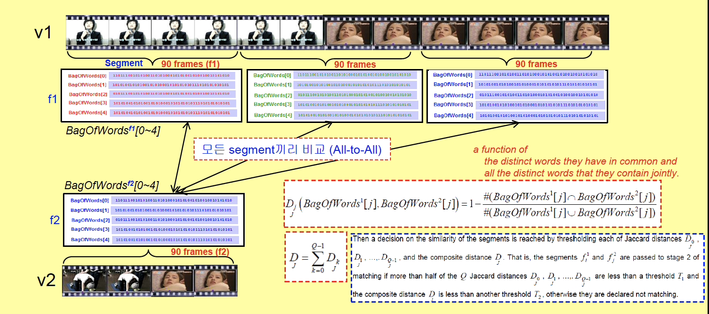

  

  * 2단계 : Temporal Segment 평가 
    * 간단히 말해 , Hough transform을 사용해서 Frame rate ratio 와 time shift 를 평가합니다. 
    * 자세히 말하면, 이 2 단계에서는 두 segment 쌍에 대해, 직선을 검출하는 Hough 변환을 사용합니다. Temporal parameter 차이점을 평가하기 위해서입니다. 

#### 