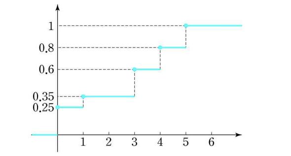

## 확률과 통계 HW2

이공계생을 위한 확률과 통계 - 강혜정 저

glee1228@naver.com

디지털콘텐츠학과 13 이동훈

### [연습문제 2.1-2.4]

8. 이산확률변수 X의 누적분포함수 $$F(x)$$ 의 그래프가 다음과 같을 때

   

   1. X의 확률질량함수를 구하여 확률분포표로 나타내시오.

      |  X   |        0        |        1         |  2   |        3        |        4        |        5        |  계  |
      | :--: | :-------------: | :--------------: | :--: | :-------------: | :-------------: | :-------------: | :--: |
      | P(X) | $$\frac{1}{4}$$ | $$\frac{1}{10}$$ |  0   | $$\frac{1}{4}$$ | $$\frac{1}{5}$$ | $$\frac{1}{5}$$ |  1   |

   2. $$P(1\le X\le 4)$$ 를 구하시오.
      $$
      P(X=1)+P(X=3)+P(X=4)=\frac{1}{10}+\frac{1}{4}+\frac{1}{5}=0.55
      $$
      

   3. 이산확률변수 X의 기댓값 E(X)와 분산 Var(X)를 구하시오.
      $$
      E(x) = \sum_{x=0}^5x\cdot p(x) = \sum_{x=0}^5x\cdot P(X=x) 
      \\= 1\cdot \frac{1}{10} + 3\cdot \frac{1}{4}+4\cdot \frac{1}{5}+5\cdot \frac{1}{5}=\frac{1}{10}+\frac{3}{4}+\frac{4}{5}+\frac{5}{5}
      \\=2.65
      $$

      $$
      V(x) = E(x^2)-(E(x))^2
      \\= 1^2\cdot \frac{1}{10} + 3^2\cdot \frac{1}{4}+4^2\cdot \frac{1}{5}+5^2\cdot \frac{1}{5} - (E(x))^2
      \\= \frac{1}{10}+\frac{9}{4}+\frac{16}{5}+\frac{25}{5}- (E(x))^2
      \\=10.55 - 7.0225
      \\=3.5275
      $$

      

   4. 이산확률변수 X의 중앙값 m을 구하시오.
      $$
      P(X\le m)=\frac{1}{2}, P(X\ge m)=\frac{1}{2}
      $$
      위의 식을 만족하는 m은 3이다.

27. 연속확률변수 $$X$$의 누적분포함수 $$F(x)$$가 다음과 같다.
    $$
    F(n)=
    \begin{cases}
    0, & x<0 \\
    x(2-x), & 0\le x \le k \\
    1, & x > k
    \end{cases}
    $$

    1. 상수 k를 구하시오.
       $$
       k(2-k)=1
       2k-k^2=1
       \\
       k^2-2k+1=0
       \\
       \therefore k=1
       $$
       

    2. X의 확률밀도함수 f(x)를 구하시오.

       누적분포함수와 확률밀도함수의 관계는 

       $$f(x),F(x)$$ 가 각각 연속확률변수 X의 확률밀도함수, 누적분포함수이면
       $$
       F(x) = \int_{-\infty}^{\infty} f(t)\, dt , F'(x) = f(x)
       $$
       이다. 따라서
       $$
       f(x) = (2k-k^2)'
       \\= 2-2k
       $$
       

    3. $$P(X\ge \frac{1}{2})$$ 를 구하시오.
       $$
       F(x) = 2x-x^2 (0\le x \le 1)
       \\f(x) = 2-2x
       \\ P(X\ge \frac{1}{2}) 
       = \int_{\frac{1}{2}}^{\infty} f(x)\, dx
       \\= \int_{\frac{1}{2}}^{\infty} 2-2x\, dx
       \\=\left[2x-x^2 \right]_\frac{1}{2}^1
       \\=2-1-1+\frac{1}{4} = \frac{1}{4}
       $$

    4. 연속확률변수 X의 기댓값 $$E(X)$$과 분산 $$V(X)$$를 구하시오
       $$
       E(X) =\int_0^1 x(2-2x)\, dx
       \\=\left[x^2-\frac{2}{3}x^3\right]_0^1
       \\=1-\frac{2}{3} = \frac{1}{3}
       $$

       $$
       V(X) = E(X^2)-(E(X))^2
       \\=\int_0^1 x^2f(x)\, dx - \left(\int_0^1 xf(x)\, dx\right)^2
       \\=\int_0^1 2x^2-2x^3\, dx - \left( \int_0^1 2x-2x^2\, dx\right)^2
       \\=\left[ \frac{2}{3}x^3-\frac{2}{4}x^4\right]_0^1 - \left(\left[ x^2-\frac{2}{3}x^3\right]_0^1\right)^2
       \\=\frac{2}{3}-\frac{1}{2} - \left( 1-\frac{2}{3}\right)^2
       \\=\frac{1}{18}
       $$

    5. 연속확률변수 X의 중앙값 $$m$$ 을 구하시오
       $$
       P(X\le m) = P(X\ge m) = \frac{1}{2}
       $$

       $$
       P(X\ge m) = \int_m^\infty f(x)\,dx = \frac{1}{2}
       \\=\int_m^\infty2-2x\,dx 
       \\=\left[ 2x-x^2\right]_m^1
       \\=2-1-2m+m^2
       \\ \therefore m = \frac{2-\sqrt2}{2}
       $$

    6. 연속확률변수 X의 제 1사분위수를 구하시오.
       $$
       \int_0^{Q_{1}}2-2x\, dx = \frac{1}{4}
       \\=\left[2x-x^2\right]_0^{Q_1}=2Q_1-(Q_1)^2
       \\(Q_1)^2-2Q_1+\frac{1}{4} = 0
       \\ \therefore Q_1 = 1-\frac{\sqrt3}{2}
       $$
       

